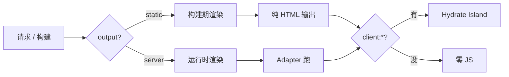

<div class="flex justify-center items-center gap-4">
  <logos:astro-icon class="text-7xl" />
</div>

<br/>

## Astro：内容驱动的元框架

Islands Architecture + Multi-Framework，默认零 JS、按需 hydrate 的现代内容站方案

<div @click="$slidev.nav.next" class="mt-12 py-1" hover:bg="white op-10">
  Press Space for next page <carbon:arrow-right />
</div>

<div class="abs-br m-6 text-xl">
  <a href="https://github.com/IllegalCreed/SlideStack" target="_blank" class="slidev-icon-btn">
    <carbon:logo-github />
  </a>
</div>

<!--
今天聊 Astro 5。

跟 Next / Nuxt / SvelteKit 这种「应用框架」不太一样，Astro 是「内容驱动元框架」：
默认输出零 JavaScript 的静态 HTML，只在你显式声明的地方加载组件交互（Islands Architecture）。
最大的特色是可以混用 React / Vue / Svelte / Solid —— 同一个项目里几种框架的组件可以共存。
Astro 5 把 Content Layer 和 Server Islands 推到稳定，是当下内容站 / 文档 / 营销页 / 博客的事实选择。
-->

---
transition: fade-out
---

# 什么是 Astro？

面向内容站的元框架，把"默认零 JS"和"多框架混搭"做成一等公民

<v-click>

- **Islands Architecture**：默认输出静态 HTML，只在显式标注的组件加载 JS
- **多框架混用**：同一个项目可以同时用 React + Vue + Svelte + Solid + Preact + Lit + Alpine
- **`.astro` 组件**：HTML 超集 + frontmatter，模板侧用 JSX-like 表达式但**不写 React/Vue 模板**
- **File-based 路由**：`src/pages/` 映射 URL，`[slug].astro` 是动态段，`[...rest].astro` 是 catch-all
- **Content Collections / Content Layer**：内容 schema 化 + Zod 校验 + 类型推断
- **多渲染模式**：每个路由独立设置 SSG / SSR / Hybrid，Server Islands 局部 SSR
- **Adapter 模型**：Vercel / Netlify / Cloudflare / Node 一份代码多平台
- **View Transitions 内建**：`<ClientRouter />` 一行启用 SPA 风格导航

</v-click>

<br>

<div v-click text-xs>

_Read more about_ [_Astro_](https://docs.astro.build)

</div>

<style>
h1 {
  background-color: #ff5d01;
  background-image: linear-gradient(45deg, #ff5d01 10%, #b04cf3 60%, #4f39fa 90%);
  background-size: 100%;
  -webkit-background-clip: text;
  -moz-background-clip: text;
  -webkit-text-fill-color: transparent;
  -moz-text-fill-color: transparent;
}
</style>

---
transition: slide-up
level: 2
---

# 定位与生态

Astro 在元框架圈的位置 + 与 Next / Nuxt / SvelteKit 的本质区别

<v-clicks>

- **谁在用**：The Guardian、Cloudflare 文档、Trivago、Firebase Docs、Google Cloud、NordVPN、Porkbun、IKEA Newsroom
- **背后团队**：Astro 独立开源团队（Fred K. Schott 为 CTO），开源 + 商业 SaaS 双轨
- **生态位**：内容站元框架，跟 Hugo / Eleventy / Next 静态部分竞争
- **不是 SPA 框架**：默认零 JS，不适合做交互密集的 SaaS 仪表盘 / 后台
- **是 BYO Framework**：你想用啥框架自带，Astro 只管 SSR + 路由 + 内容 + Islands 编排
- **学习路径**：HTML / CSS → `.astro` 模板 → 路由 + Content Collections → Islands + 集成框架
- **适合做**：博客 / 文档 / 营销 / 电商 / 个人作品集 / 媒体站
- **不适合**：交互密集 SaaS（用 Next / Nuxt / SvelteKit）/ 强 RSC 模式

</v-clicks>

---
transition: slide-up
---

# 版本里程碑

| 版本       | 时间    | 关键特性                                                                              |
| ---------- | ------- | ------------------------------------------------------------------------------------- |
| **1.0**    | 2022.8  | 切到 Vite，正式 1.0                                                                   |
| **2.0**    | 2023.1  | Content Collections（v2 API）、Hybrid 模式                                            |
| **3.0**    | 2023.8  | View Transitions Beta、Image 服务                                                     |
| **4.0**    | 2023.12 | Dev Toolbar、`i18n` 路由、内置 Image                                                  |
| **5.0**    | 2024.12 | **Content Layer API stable**、**Server Islands stable**、**`astro:env`**、CSRF 默认开 |
| **5.x 后** | 2025    | Live Content Collections、`<ClientRouter />` 重命名、Actions 增强                     |

<v-click>

**今天主要讲 Astro 5+**。`<ViewTransitions />` → `<ClientRouter />`、Content v2 → Content Layer、Hybrid 合并入 `static`，老项目升级看 Migration Guide。

</v-click>

---
transition: slide-up
---

# 心智模型：一句话总结

**静态 HTML 优先 + 显式 Islands 加 JS + Content Schema 强类型 + Adapter 多平台部署**



---
transition: slide-up
---

# 对比 Next.js / Nuxt / SvelteKit

| 维度     | Astro 5             | Next.js 16    | Nuxt 4         | SvelteKit 2     |
| -------- | ------------------- | ------------- | -------------- | --------------- |
| 默认组件 | `.astro`（零 JS）   | RSC           | SSR Vue        | Svelte SSR      |
| 多框架   | ✅（React/Vue/...） | ❌（仅 React） | ❌（仅 Vue）   | ❌（仅 Svelte） |
| 默认 JS  | **0KB**             | RSC + hydrate | 全 hydrate     | 全 hydrate      |
| 数据     | Content Collections | RSC + fetch   | useFetch       | load()          |

<v-click>

**核心差异**：Astro 默认零 JS HTML，框架们默认全 hydrate。
内容站选 Astro，交互密集应用回 Next/Nuxt/SvelteKit。

</v-click>

---
transition: slide-up
---

# 项目结构速览

```
my-astro-site/
├── src/
│   ├── pages/                    ← 文件路由
│   │   ├── index.astro           ← /
│   │   ├── about.astro           ← /about
│   │   ├── blog/
│   │   │   ├── index.astro       ← /blog
│   │   │   └── [slug].astro      ← /blog/hello
│   │   └── api/posts.json.ts     ← /api/posts.json
│   ├── components/               ← 任意框架组件（.astro/.tsx/.vue/.svelte）
│   ├── layouts/                  ← 页面布局复用
│   ├── content/                  ← 内容集合（md / mdx / json）
│   ├── content.config.ts         ← Content Collections 定义
│   ├── middleware.ts             ← onRequest 钩子
│   └── env.d.ts                  ← astro:env 类型
├── public/                       ← 原样输出（robots.txt / favicon）
├── astro.config.mjs              ← 主配置（integrations / adapter / output）
└── tsconfig.json
```

---
transition: slide-up
---

# 快速开始

```bash
# 官方脚手架
npm create astro@latest my-astro-site
cd my-astro-site
pnpm install
pnpm dev
```

<v-clicks>

`create-astro` 交互式选项：

- **Template**：Empty / Blog / Portfolio / Docs / Minimal
- **TypeScript**：Strict / Strictest / Relaxed
- **Install deps**：自动 install
- **Git init**：可选

```bash
# 加集成（一条命令安装 + 配 config + 改 tsconfig）
npx astro add react vue svelte tailwind mdx
npx astro add vercel       # 加 adapter，自动切到 server mode
```

后续 demo 默认 TypeScript Strict + Tailwind + Vercel adapter 这个组合。

</v-clicks>

---
transition: slide-up
---

# `.astro` 模板语法（一）：frontmatter + HTML

```astro
---
// Component Script —— 只在服务端 / 构建期跑
import Layout from "../layouts/Base.astro";
import { getCollection } from "astro:content";

const posts = await getCollection("blog");
const title = "首页";
---

<!-- Component Template —— HTML 超集 + {表达式} -->
<Layout title={title}>
  <h1>{title}</h1>
  <ul>{posts.map((post) => <li>{post.data.title}</li>)}</ul>
</Layout>
```

<v-click>

**关键点**：

- frontmatter 用 `---` 围栏，只在**服务端 / 构建期**执行
- 模板里 `{expr}` 是表达式，不是 JSX —— 但写起来像
- 顶层 `await` 合法，`Astro.props` 拿属性，`Astro.params` 拿路由参数

</v-click>

---
transition: slide-up
---

# `.astro` 模板语法（二）：Props + Slots

```astro
---
// src/components/Card.astro
interface Props { title: string; href?: string; }
const { title, href = "#" } = Astro.props;
---

<article class="card">
  <a {href}><h2>{title}</h2></a>
  <slot />                                <!-- 默认插槽 -->
  <slot name="footer">没有 footer</slot>  <!-- 命名插槽 + fallback -->
</article>
```

```astro
<!-- 调用方 -->
<Card title="Hello" href="/hello">
  <p>这里走默认插槽</p>
  <small slot="footer">2026-05-18</small>
</Card>
```

<v-click>

**关键差异**：`interface Props` 自动识别；Slot 是 HTML 原生语义（不是函数）；简写 `{href}` 等价于 `href={href}`。

</v-click>

---
transition: slide-up
---

# 路由约定：file-based

```
src/pages/
├── index.astro                    → /
├── about.astro                    → /about
├── about/index.astro              → /about      （效果一样）
├── blog/[slug].astro              → /blog/:slug 动态段
├── docs/[...path].astro           → /docs/* catch-all
├── shop/[category]/[id].astro     → /shop/:category/:id
├── _hidden.astro                  → 下划线开头不生成路由
└── api/posts.json.ts              → /api/posts.json （endpoint）
```

<v-clicks>

**路由优先级**（命中冲突时）：

1. 保留路由（`_astro/` / `_server_islands/` / `_actions/`）
2. 静态路由 > 动态路由
3. 命名参数 `[slug]` > rest 参数 `[...path]`
4. 预渲染路由 > 服务端路由
5. Endpoint > 页面

</v-clicks>

---
transition: slide-up
---

# 动态路由：`getStaticPaths`

```astro
---
// src/pages/blog/[slug].astro
import { getCollection, render } from "astro:content";

export async function getStaticPaths() {
  const posts = await getCollection("blog");
  return posts.map((post) => ({
    params: { slug: post.id },
    props: { post },
  }));
}

const { post } = Astro.props;
const { Content } = await render(post);
---

<article>
  <h1>{post.data.title}</h1>
  <Content />
</article>
```

<v-click>

**关键点**：构建期跑一次返回所有路径；`params` 进 URL，`props` 进组件（避免重复查 DB）；SSR 模式不需要 `getStaticPaths`，直接读 `Astro.params.slug`；跟 Next.js `generateStaticParams` 同概念。

</v-click>

---
transition: slide-up
---

# Islands Architecture（一）：默认零 JS

> 💡 **核心理念**
>
> Astro 默认把所有组件**当静态 HTML 渲染**，包括 React/Vue/Svelte 组件 —— 输出 HTML 后**丢弃 JS**。
> 要交互？显式加 `client:*` 指令告诉 Astro「这个组件要在浏览器里 hydrate」。

```astro
---
import Header from "../components/Header.astro";        // 永远零 JS
import Counter from "../components/Counter.tsx";        // React 组件
import Cart from "../components/Cart.vue";              // Vue 组件
---

<Header />                          <!-- 静态 HTML，0 JS -->
<Counter />                          <!-- 也是静态 HTML！React 组件被当 SSR 渲染 -->
<Counter client:load />              <!-- 这次才会 hydrate 成可交互 -->
<Cart client:visible />              <!-- 进入视口才 hydrate -->
```

<v-click>

跟 Next.js / Nuxt 的关键差异：**它们默认全 hydrate**，Astro 默认**不 hydrate**。
你不写 `client:*`，那个 React 按钮在浏览器里就是一坨死 DOM —— 这是有意的，省 JS。

</v-click>

---
transition: slide-up
---

# Islands Architecture（二）：5 种 client 指令

```astro
<NavBar client:load />                                     <!-- 1. 立即 hydrate -->
<NewsletterForm client:idle />                             <!-- 2. 浏览器空闲时 -->
<CommentSection client:visible />                          <!-- 3. 进入视口时 -->
<MobileMenu client:media="(max-width: 768px)" />           <!-- 4. 媒体查询匹配 -->
<MapWidget client:only="react" />                          <!-- 5. 跳过 SSR -->
```

<v-clicks>

**选型决策树**：

- 首屏可见 + 关键交互（导航、登录按钮）→ `client:load`
- 首屏可见 + 不那么紧急（订阅表单、tab 切换）→ `client:idle`
- 滚动后才能看到（评论、相关推荐）→ `client:visible`
- 仅移动端 / 仅桌面端用（汉堡菜单、侧栏）→ `client:media`
- 用了浏览器 API（`window`、`document`）不能 SSR → `client:only="react"`

</v-clicks>

---
transition: slide-up
---

# Content Collections（一）：定义集合

```ts
// src/content.config.ts
import { defineCollection, z } from "astro:content";
import { glob, file } from "astro/loaders";

const blog = defineCollection({
  loader: glob({ pattern: "**/*.md", base: "./src/content/blog" }),
  schema: z.object({
    title: z.string(),
    pubDate: z.coerce.date(),
    tags: z.array(z.string()).default([]),
    draft: z.boolean().default(false),
  }),
});

const authors = defineCollection({
  loader: file("./src/data/authors.json"),
  schema: z.object({ id: z.string(), name: z.string() }),
});

export const collections = { blog, authors };
```

<v-click>

**5.x Content Layer 关键升级**：loader 解耦「数据从哪来」—— glob 只是其中之一，还能写自定义 loader 从 CMS / DB / API 拉。

</v-click>

---
transition: slide-up
---

# Content Collections（二）：查询 + 渲染

```astro
---
// src/pages/blog/index.astro —— 拉全量 + 过滤草稿
import { getCollection } from "astro:content";
const posts = (await getCollection("blog", ({ data }) => !data.draft))
  .sort((a, b) => b.data.pubDate.getTime() - a.data.pubDate.getTime());
---

<ul>{posts.map((post) => (
  <li><a href={`/blog/${post.id}`}>{post.data.title}</a></li>
))}</ul>
```

```astro
---
// src/pages/blog/[slug].astro —— 渲染 Markdown 正文
import { getEntry, render } from "astro:content";

const post = await getEntry("blog", Astro.params.slug);
if (!post) return Astro.redirect("/404");
const { Content, headings } = await render(post);
---

<h1>{post.data.title}</h1>
<Content />          <!-- 编译后的 HTML 组件 -->
```

---
transition: slide-up
---

# Content Layer：自定义 loader

```ts
// src/content.config.ts
import { defineCollection, z } from "astro:content";
import type { Loader } from "astro/loaders";

// 从 Hashnode GraphQL API 拉文章
const hashnode: Loader = {
  name: "hashnode",
  load: async ({ store, parseData }) => {
    const res = await fetch("https://gql.hashnode.com/...");
    const { data } = await res.json();
    for (const post of data.publication.posts.edges) {
      const parsed = await parseData({ id: post.node.slug, data: post.node });
      store.set({ id: parsed.id, data: parsed });
    }
  },
};

const posts = defineCollection({
  loader: hashnode,
  schema: z.object({ slug: z.string(), title: z.string() }),
});
export const collections = { posts };
```

<v-click>

社区已有 loader：Notion / Sanity / Contentful / Storyblok / RSS / WordPress / Strapi。

</v-click>

---
transition: slide-up
---

# 多框架混用：`astro add` 一条命令

```bash
npx astro add react vue svelte solid    # 一次装多个
npx astro add tailwind mdx              # 加样式 + 内容
```

```astro
---
// 同一个页面可以混用多种框架的组件
import ReactCounter from "../components/Counter.tsx";
import VueChart from "../components/Chart.vue";
import SvelteForm from "../components/Form.svelte";
import SolidWidget from "../components/Widget.tsx";
---

<main>
  <ReactCounter client:load count={0} />
  <VueChart client:visible data={chartData} />
  <SvelteForm client:idle />
  <SolidWidget client:only="solid-js" />
</main>
```

<v-clicks>

**官方支持**：`@astrojs/react` / `vue` / `svelte` / `solid-js` / `preact` / `alpinejs`

**限制**：只有 `.astro` 能嵌套多框架。React 组件里不能 import Vue 组件，反之亦然。

</v-clicks>

---
transition: slide-up
---

# 多框架的状态共享：Nano Stores

> 💡 Islands 之间隔离：React Counter 的 `useState` Vue 看不见。跨 Island 共享状态用**框架无关的小型 store**，Nano Stores 是 Astro 官方推荐。

```ts
// src/stores/cart.ts
import { atom } from "nanostores";
export const $cart = atom<{ id: string; qty: number }[]>([]);
export const addItem = (id: string) => $cart.set([...$cart.get(), { id, qty: 1 }]);
```

```tsx
// React Island
import { useStore } from "@nanostores/react";
import { $cart, addItem } from "../stores/cart";

export function AddBtn({ id }: { id: string }) {
  return <button onClick={() => addItem(id)}>加入购物车</button>;
}
```

```vue
<!-- Vue Island -->
<script setup>
import { useStore } from "@nanostores/vue";
import { $cart } from "../stores/cart";
const cart = useStore($cart);
</script>
<template><span>购物车 ({{ cart.length }})</span></template>
```

---
transition: slide-up
---

# SSR / SSG / Hybrid：output 选项

```js
// astro.config.mjs —— 'static' (默认) | 'server'
import { defineConfig } from "astro/config";
import vercel from "@astrojs/vercel";

export default defineConfig({ output: "server", adapter: vercel() });
```

```astro
---
// 单页覆盖：server 模式下强制 SSG
export const prerender = true;
---
```

<v-clicks>

| 场景         | output     | 单页 prerender   |
| ------------ | ---------- | ---------------- |
| **纯静态站** | `"static"` | 不需要           |
| **混合站**   | `"static"` | 个别页 `false`   |
| **全 SSR**   | `"server"` | 默认全 on-demand |

**经验**：内容站默认 `static`，user-specific 的几页 `prerender = false`。

</v-clicks>

---
transition: slide-up
---

# Adapter 模型

```bash
# 一条命令搞定（修改 config + 装包 + 改 output）
npx astro add vercel    # 或 netlify / cloudflare / node
```

<v-clicks>

| Adapter                 | 平台               | 特性                                  |
| ----------------------- | ------------------ | ------------------------------------- |
| **@astrojs/vercel**     | Vercel             | ISR / Image / Edge / Speed Insights   |
| **@astrojs/netlify**    | Netlify Functions  | Forms / Identity / On-Demand Builders |
| **@astrojs/cloudflare** | CF Workers / Pages | 全球边缘 + KV / R2 / D1 / Workers AI  |
| **@astrojs/node**       | 自有 Node / Docker | `standalone` 或 `middleware` 模式     |

```js
// astro.config.mjs
import node from "@astrojs/node";
export default defineConfig({ output: "server", adapter: node({ mode: "standalone" }) });
```

</v-clicks>

---
transition: slide-up
---

# Server Islands（5.x stable）

> 💡 整页 prerender（CDN 秒回），但有**用户特有的小区域**（头像、购物车、推荐位）需要动态。传统做法整页改 SSR —— Astro 给了第三选择：**Server Islands**。

```astro
---
// src/pages/products/[id].astro
import Layout from "../../layouts/Base.astro";
import Avatar from "../../components/Avatar.astro";
import Reviews from "../../components/Reviews.astro";

export const prerender = true;   // 整页 SSG
---

<Layout>
  <!-- 个性化区域，请求时才渲染 -->
  <Avatar server:defer>
    <GenericAvatar slot="fallback" />
  </Avatar>

  <ProductInfo id={Astro.params.id} />   <!-- 静态部分 -->

  <Reviews server:defer>
    <p slot="fallback">评论加载中...</p>
  </Reviews>
</Layout>
```

---
transition: slide-up
---

# Server Islands：工作原理

<v-clicks>

- 构建期：`server:defer` 组件**被抽成独立路由**（`/_server_islands/Avatar`）
- 主页面渲染：组件位置塞 `<script>` + fallback slot 内容
- 浏览器加载后：脚本 GET 请求那个独立路由，拿到 HTML 后替换 fallback
- Props 通过 URL query 加密传（自动），超 2048 字节自动转 POST
- 多个 Server Island **并行 fetch**，互不阻塞

```bash
# 多区域 / 滚动部署需要稳定加密 key
astro create-key
# 然后设 ASTRO_KEY 环境变量
```

**适合**：用户头像 / 购物车数量 / 推荐位 / 通知中心 / A-B 实验

**不适合**：影响主要 LCP 的关键内容（用 SSR 主页面更稳）

</v-clicks>

---
transition: slide-up
---

# View Transitions：`<ClientRouter />`

```astro
---
// src/layouts/Base.astro
import { ClientRouter } from "astro:transitions";
---

<html>
  <head>
    <ClientRouter />     <!-- 一行启用 SPA 风格导航 -->
  </head>
  <body><slot /></body>
</html>
```

<v-clicks>

```astro
<!-- 共享元素 morph -->

<!-- 自定义动画 -->
<main transition:animate="slide" />
<!-- 跨页保留状态（video / form / 第三方 widget）-->
<video src="bg.mp4" autoplay loop transition:persist />
<!-- 强制整页刷新 -->
<a href="/legacy" data-astro-reload>Legacy</a>
```

5.0 起 `<ViewTransitions />` 重命名为 `<ClientRouter />`。

</v-clicks>

---
transition: slide-up
---

# View Transitions：navigate API + 生命周期

```ts
import { navigate } from "astro:transitions/client";

// 编程式导航
await navigate("/dashboard", { history: "push" });
await navigate("/login", { history: "replace" });
```

```ts
// 生命周期事件（按发生顺序）
document.addEventListener("astro:before-preparation", (e) => {
  console.log("即将加载:", e.to);
});
document.addEventListener("astro:after-preparation", () => { /* 内容已 fetch */ });
document.addEventListener("astro:before-swap", () => { /* 即将换 DOM */ });
document.addEventListener("astro:after-swap", () => { /* DOM 已换 */ });
document.addEventListener("astro:page-load", () => { /* 脚本已跑 */ });
```

<v-click>

**易踩坑**：

- `<script>` 标签默认只跑一次，跨页导航不会重跑 → 用 `astro:page-load` 重新初始化第三方库
- 框架 Islands 的状态默认会丢，要保留得用 `transition:persist` + 命名

</v-click>

---
transition: slide-up
---

# Image Optimization

```astro
---
import { Image, Picture } from "astro:assets";
import cover from "../../assets/cover.jpg";
---

<!-- 基础用法：自动 width/height、防 CLS -->
<Image src={cover} alt="封面" width={1200} format="webp" quality={80} />

<!-- 响应式（多 width / 多密度）-->
<Image src={cover} alt="" widths={[400, 800, 1200]} sizes="(max-width: 600px) 100vw, 50vw" />

<!-- Picture：多 format 自动 fallback -->
<Picture src={cover} formats={["avif", "webp"]} fallbackFormat="jpg" />

<!-- 远程图片需先在 config 白名单 -->
<Image src="https://images.unsplash.com/xxx.jpg" inferSize alt="" />
```

```js
// astro.config.mjs
export default defineConfig({
  image: { domains: ["images.unsplash.com"], remotePatterns: [{ protocol: "https" }] },
});
```

---
transition: slide-up
---

# Astro Actions：类型安全的 RPC

```ts
// src/actions/index.ts
import { defineAction, ActionError } from "astro:actions";
import { z } from "astro:schema";

export const server = {
  like: defineAction({
    input: z.object({ postId: z.string() }),
    handler: async ({ postId }, ctx) => {
      if (!ctx.locals.user) throw new ActionError({ code: "UNAUTHORIZED" });
      return await db.likes.create({ userId: ctx.locals.user.id, postId });
    },
  }),

  signup: defineAction({
    accept: "form",                    // 接受 FormData
    input: z.object({ email: z.string().email(), password: z.string().min(8) }),
    handler: async ({ email, password }) => {
      const user = await db.users.create({ email, password });
      return { id: user.id };
    },
  }),
};
```

---
transition: slide-up
---

# Actions：客户端调用 + Form 集成

```tsx
// React Island 里调用
import { actions } from "astro:actions";

export function LikeButton({ postId }: { postId: string }) {
  const handleClick = async () => {
    const { data, error } = await actions.like({ postId });  // safe 模式
    if (error) return console.error(error.code, error.message);
  };
  return <button onClick={handleClick}>👍</button>;
}
```

```astro
---
// HTML form 直接绑定
import { actions, isInputError } from "astro:actions";
const result = Astro.getActionResult(actions.signup);
const inputError = result?.error && isInputError(result.error) ? result.error.fields : null;
---

<form method="POST" action={actions.signup}>
  <input name="email" type="email" />
  {inputError?.email && <p class="err">{inputError.email}</p>}
  <input name="password" type="password" />
  <button>注册</button>
</form>
```

---
transition: slide-up
---

# Middleware：onRequest + sequence

```ts
// src/middleware.ts
import { defineMiddleware, sequence } from "astro:middleware";

// 鉴权中间件
const auth = defineMiddleware(async (ctx, next) => {
  const token = ctx.cookies.get("session")?.value;
  ctx.locals.user = token ? await getUser(token) : null;
  return next();
});

// 国际化 rewrite
const i18n = defineMiddleware(async (ctx, next) => {
  if (ctx.url.pathname.startsWith("/zh")) {
    return ctx.rewrite(ctx.url.pathname.replace("/zh", ""));
  }
  return next();
});

export const onRequest = sequence(auth, i18n);
```

<v-click>

`ctx.locals` 是 per-request 容器，下游 `Astro.locals.user` 直接读。类型在 `App.Locals` 声明。

</v-click>

---
transition: slide-up
---

# Endpoints：API 路由

```ts
// src/pages/api/posts.json.ts —— 静态 endpoint
import type { APIRoute } from "astro";

export const GET: APIRoute = async () => {
  return Response.json(await db.posts.findMany());
};
```

```ts
// src/pages/api/posts/[id].ts —— 动态 + 全 HTTP 方法
export const GET: APIRoute = async ({ params }) => {
  const post = await db.posts.findUnique({ where: { id: params.id! } });
  if (!post) return new Response(null, { status: 404 });
  return Response.json(post);
};

export const DELETE: APIRoute = async ({ params, locals }) => {
  if (!locals.user) return new Response(null, { status: 401 });
  await db.posts.delete({ where: { id: params.id! } });
  return new Response(null, { status: 204 });
};
```

<v-click>

支持 `GET` / `POST` / `PUT` / `PATCH` / `DELETE` / `OPTIONS` / `HEAD` / `ALL`（兜底）。基于 Web 标准 Request / Response，跟 SvelteKit `+server.ts` 同思路。

</v-click>

---
transition: slide-up
---

# `astro:env`（5.x stable）

```js
// astro.config.mjs
import { defineConfig, envField } from "astro/config";

export default defineConfig({
  env: {
    schema: {
      // 4 个象限
      PUBLIC_API_URL: envField.string({ context: "client", access: "public" }),
      PORT:           envField.number({ context: "server", access: "public", default: 3000 }),
      DATABASE_URL:   envField.string({ context: "server", access: "secret" }),
    },
    validateSecrets: true,
  },
});
```

```ts
// 客户端 Island / .astro
import { PUBLIC_API_URL } from "astro:env/client";

// 服务端 / endpoint / middleware
import { DATABASE_URL, getSecret } from "astro:env/server";
const stripeKey = getSecret("STRIPE_KEY");      // schema 外的 secret
```

<v-click>

**关键**：secret 永远不会出现在客户端 bundle 里 —— 不靠 `PUBLIC_` 前缀约定，而是 schema 强制。

</v-click>

---
transition: slide-up
---

# 生态对比：决策矩阵

| 维度       | Astro 5             | Next.js 16       | Nuxt 4              | SvelteKit 2     |
| ---------- | ------------------- | ---------------- | ------------------- | --------------- |
| 基础       | 多框架混搭          | React 19         | Vue 3               | Svelte 5        |
| 默认输出   | **零 JS HTML**      | RSC + hydrate    | SSR Vue + hydrate   | SSR + hydrate   |
| 数据       | Content Collections | RSC + fetch      | `useFetch`          | `load()`        |
| 部署       | Adapter 多平台      | Vercel-first     | Nitro 30+ preset    | Adapter 多平台  |
| 包体积     | **最小**            | 大               | 中                  | 小              |
| 内容站     | ⭐⭐⭐⭐⭐           | ⭐⭐⭐         | ⭐⭐⭐           | ⭐⭐⭐⭐        |
| SaaS 应用  | ⭐⭐              | ⭐⭐⭐⭐⭐      | ⭐⭐⭐⭐          | ⭐⭐⭐⭐        |

---
transition: slide-up
---

# 选型决策矩阵

| 场景                              | 推荐                |
| --------------------------------- | ------------------- |
| **博客 / 文档 / 营销页**          | **Astro 5**         |
| **电商展示 + 局部动态**           | Astro + Server Islands |
| **复杂 SaaS / 多人协作仪表盘**    | Next.js / SvelteKit |
| **重 RSC / Cache Components**     | Next.js 16          |
| **Vue 圈强 SSR + 自动导入**       | Nuxt 4              |
| **极致包体积 / Svelte 圈**        | SvelteKit 2         |

<v-click>

> 💡 主轴：**内容占比 vs 交互占比**。内容驱动选 Astro 没竞品；交互密集回到 Next/Nuxt/SvelteKit；电商等模糊场景首选 Astro + Server Islands。

</v-click>

---
transition: slide-up
---

# Astro 5 升级要点（从 4.x 来）

<v-clicks>

- **`<ViewTransitions />` 重命名为 `<ClientRouter />`**：import 路径不变，组件名要改
- **Content Layer API stable**：老 v2 API 还能用但 deprecated，新项目用 `loader` + `defineCollection`
- **Server Islands stable**：`server:defer` 直接用，不用 experimental flag
- **`astro:env` stable**：4 象限类型安全环境变量
- **`astro:i18n` 新模块**：内置路由 + locale 检测 + redirect
- **CSRF 默认开**：`security.checkOrigin: true` 是新默认，POST 跨源会拒
- **`output: 'hybrid'` 合并入 `'static'`**：旧配置自动迁移，但建议手动改 + 给 dynamic 页加 `prerender = false`
- **`compiledContent()` 改成 async**：Markdown 渲染 API 加 `await`
- **`<script>` 标签不再 hoist**：默认 inline，老依赖全局 script 的代码要检查
- **Vite 6 / Node 18.17.1+**：依赖升级

</v-clicks>

---
transition: slide-up
---

# 常见踩坑（一）：`.astro` 不能用 hooks

> 💡 `.astro` frontmatter **只在服务端 / 构建期跑**，没有 React hooks / Vue Composition API。想要响应式状态？用 framework component + `client:*` 指令。

```astro
---
// ❌ 完全错的，根本没有 useState
import { useState } from "react";
const [count, setCount] = useState(0);
---
```

<v-clicks>

```astro
---
// ✅ 正确：.astro 只算静态值；交互交给框架组件
import Counter from "../components/Counter.tsx";
---
<Counter client:load initialCount={0} />
```

```tsx
// src/components/Counter.tsx —— 这里才是 React 世界
import { useState } from "react";
export default function Counter({ initialCount }: { initialCount: number }) {
  const [count, setCount] = useState(initialCount);
  return <button onClick={() => setCount(count + 1)}>{count}</button>;
}
```

`.astro` 是「模板 + 数据准备」层，**不是组件运行时**。

</v-clicks>

---
transition: slide-up
---

# 常见踩坑（二）：Islands 状态隔离

<v-clicks>

```astro
<!-- 两个 React Counter 实例，状态完全独立 -->
<Counter client:load />
<Counter client:load />
```

- **每个 Island 是独立 React 树**：useState 不共享、Context Provider 不跨 Island
- **不能在 `.astro` 里包 `<Provider>`**：因为 `.astro` 没有 React 运行时
- **跨 Island 状态用 Nano Stores**（前面讲过）—— 框架无关的极小 store
- **同框架内想共享 Context**：把多个组件合成一个大 Island（一个根组件 + 子组件树）

```astro
<!-- ❌ 不行：Provider 和 Consumer 在不同 Island -->
<ThemeProvider client:load>
  <Header client:load />
  <Footer client:load />
</ThemeProvider>

<!-- ✅ 改成：整个 App 是一个 Island -->
<App client:load />     <!-- App 内部自己挂 ThemeProvider + Header + Footer -->
```

</v-clicks>

---
transition: slide-up
---

# 常见踩坑（三）：`client:only` + Hydration

<v-clicks>

- **`client:only` 必须指定框架**：`client:only="react"` / `"vue"` / `"svelte"` / `"solid-js"`
- **typo 会沉默失败**：写错框架名 Astro 不会报，组件就是空白
- **`client:only` 没有 SSR HTML 输出**：首屏会看到一段空白 → fallback 用 `<Fragment slot="fallback">` 占位
- **用 `window` / `document` 的组件必须 `client:only`**：SSR 阶段没有这俩对象，会 build 失败
- **Hydration mismatch**：服务端用 `Date.now()` / `Math.random()` / `localStorage` 会和客户端不一致
  - 修法 1：把动态部分挪到 `useEffect` / `onMounted`
  - 修法 2：组件改 `client:only` 直接跳过 SSR
- **第三方库依赖 `globalThis`**：很多 React/Vue 库 SSR 不友好，必要时 `client:only`

</v-clicks>

---
transition: slide-up
---

# 常见踩坑（四）：路由 + 内容

<v-clicks>

- **`getStaticPaths` 只在 build 跑**：动态 SSR 路由直接读 `Astro.params.slug`，不用 `getStaticPaths`
- **`getStaticPaths` 必须导出 + 必须 async return**：忘了 `return []` 会 build 失败
- **rest 参数 `[...path]`**：值是字符串（含 `/`），手动 `params.path.split("/")`
- **静态路由优先级高于动态**：`pages/blog/new.astro` 永远先于 `pages/blog/[slug].astro` 匹配
- **Content Collections 改 schema 后**：删 `.astro/` 缓存或重启 dev，否则类型不刷新
- **Markdown frontmatter 必须满足 schema**：少字段 build 报错（生产前要全量过一遍）
- **`render(entry)` 是 async**：Astro 5 起强制 await，`{ Content } = await render(post)` 写成同步会 silent fail

</v-clicks>

---
transition: slide-up
---

# 常见踩坑（五）：部署 / Adapter

<v-clicks>

- **`output: 'static'` 不能用 `Astro.cookies` / `Astro.request.headers`**：构建期没有请求对象
- **改成 SSR 后**：所有用 `getStaticPaths` 的页面要么删 `getStaticPaths`，要么改运行时拉
- **Cloudflare Workers CPU 限制**：单次 50ms（免费）/ 30s（付费），大 SSR 计算超时 → 用 KV / D1 / R2 卸载
- **Vercel Edge Functions 不能用 Node API**：`fs` / `path` / `crypto.createHash` 部分不可用 → 用 Web Crypto API
- **adapter-node `standalone` vs `middleware`**：standalone 自带 server，middleware 嵌到 Express/Hono 里
- **Server Islands 需要稳定 `ASTRO_KEY`**：多区域 / rolling deploy 必须，否则解密失败
- **`<script>` 不 hoist 后**：依赖全局变量的脚本要全部检查，老依赖可能 break
- **CSRF 默认开**：POST 跨域被拒，外部站点提交要白名单 `security.checkOrigin`

</v-clicks>

---
transition: slide-up
---

# 性能优化清单

<v-clicks>

- **能 `output: 'static'` 就 static**：所有页面 prerender，CDN 秒回
- **个别动态页面用 `prerender = false`**：保留全站 SSG，少数 SSR
- **首屏关键交互用 `client:load`**：其他用 `client:idle` / `client:visible`
- **`client:only` 避免双重渲染**：纯客户端组件直接跳过 SSR
- **Server Islands 卸载个性化**：CDN 缓存主体 + 边缘 fetch 动态片段
- **`<Image>` 强制 width/height**：防 CLS，自动 webp/avif，按需 widths
- **Content Collections 全部 schema 化**：build 期发现数据问题，type 自动
- **`getCollection` 加 filter 函数**：不要拉全量再 JS filter（O(n) 浪费）
- **CSS scoped + 全局 split**：`.astro` 默认 scoped，大公共样式抽 `src/styles/global.css`
- **View Transitions 替代 SPA 路由**：感官上 SPA + 实际全 SSG 的最佳平衡
- **`@astrojs/sitemap` + `@astrojs/rss`**：内容站 SEO 必装

</v-clicks>

---
transition: slide-up
---

# 测试

```bash
pnpm add -D vitest @testing-library/react happy-dom playwright
```

```ts
// vitest.config.ts
import { defineConfig } from "vitest/config";
import { getViteConfig } from "astro/config";

export default getViteConfig(
  defineConfig({
    test: { environment: "happy-dom", include: ["src/**/*.test.{ts,tsx}"] },
  }),
);
```

<v-clicks>

**层次划分**：

- **纯函数 / utils**：Vitest 直接跑
- **Framework 组件**：Vitest + Testing Library
- **`.astro` 组件**：`experimental_AstroContainer` API（5.x 起）渲染后断言 HTML
- **E2E**：Playwright（官方推荐），跑构建后 preview server
- **Content schema**：Zod 本身即运行时校验，build 失败即 schema 测试

</v-clicks>

---
transition: slide-up
---

# 集成生态

<v-clicks>

**官方核心集成**（`npx astro add` 一键装）：

- **UI 框架**：`@astrojs/react` / `vue` / `svelte` / `solid-js` / `preact` / `alpinejs`
- **样式**：`@astrojs/tailwind`（Tailwind 3）/ Vite 原生 Tailwind 4
- **内容**：`@astrojs/mdx` / `@astrojs/markdoc` / `@astrojs/db`
- **SEO**：`@astrojs/sitemap` / `@astrojs/rss` / `@astrojs/partytown`
- **Adapter**：`@astrojs/vercel` / `netlify` / `cloudflare` / `node`

**社区热门**（`astro.build/integrations` 搜）：

- **CMS loader**：Notion / Sanity / Storyblok / Contentful / Strapi / Hashnode
- **图标**：`astro-icon`（用 Iconify 海量图标）
- **图片**：`astro-imagetools` / unpic
- **i18n**：`astro-i18next` / `paraglide`（5.x 后内建 `astro:i18n` 替代部分场景）
- **OG image**：`@vercel/og` / `astro-og-canvas`

</v-clicks>

---
transition: slide-up
---

# 何时不选 Astro

<v-clicks>

- **重交互 SaaS / 仪表盘** → Next.js / Nuxt / SvelteKit（全 hydrate 模式更顺手）
- **重 RSC / Cache 范式** → 只有 Next.js 16 有等价能力
- **依赖 React Native 跨端** → Expo + Next.js 链路最顺
- **强后端 + WebSocket / 实时** → Nest.js / Hono / Elysia + 前端框架分离
- **大型企业 + Angular / DI 强约定** → Angular 18 在电信 / 银行仍主流
- **GraphQL-first 全栈** → Remix / Next + Apollo / Houdini + SvelteKit
- **App-shell 必须 SPA** → Vite + 框架自己起更简单（Astro 也能但不是它强项）
- **组件库重度依赖整页 Provider 树** → 设计上跟 Islands 冲突，要么大改要么换框架

</v-clicks>

---
transition: slide-up
---

# 经验法则

<v-clicks>

- **能不写 JS 就不写**——Astro 的核心卖点，组件优先 `.astro`，交互再上框架
- **`client:visible` 是默认首选**——首屏可见再 hydrate，省最多 JS
- **多框架混用要节制**——每加一个框架，bundle 多一份运行时（React + Vue ~ 100KB+）
- **Content Collections schema 必写**——Zod 校验 + 类型推断双赢
- **Server Islands 卸载个性化**——主体 SSG + 边缘 fetch 动态片段，CDN 缓存命中率最大化
- **`output: 'static'` 优于 `'server'`**——能不 SSR 就不 SSR，按页 `prerender = false` 局部开
- **`<Image>` 强制 width/height**——防 CLS + 自动 webp/avif + 按需 widths
- **`astro:env` schema 化**——比 `process.env` 类型安全得多
- **Sentry / Plausible 第一天装**——构建期错误 + 用户行为都要监控
- **VS Code 装 Astro 扩展**——`.astro` 语法高亮 + 类型 + Emmet 都靠它

</v-clicks>

---
transition: slide-up
---

# 学习路径

<v-clicks>

**第 1-2 周：基础 + 内容**

- `.astro` 语法 + 文件路由 + Layout
- Content Collections + 5 种 client 指令 + 跟 [Astro Tutorial](https://docs.astro.build/en/tutorial/0-introduction/) 做完一个博客

**第 3 周：渲染 + 部署**

- `output: 'static' | 'server'` + `prerender` 控制
- Adapter 选型 + Vercel / Netlify / Cloudflare 部署
- View Transitions + `<ClientRouter />`

**第 4 周+：进阶**

- Server Islands + Astro Actions + Middleware + `astro:env`
- Content Layer 自定义 loader + 性能优化 + Playwright E2E

</v-clicks>

---
layout: center
class: text-center
---

# 总结

适合：内容驱动站（博客 / 文档 / 营销 / 电商展示） + 多框架混搭 + 极致包体积

不适合：交互密集 SaaS（用 Next / Nuxt / SvelteKit）+ 重 RSC（用 Next）

<div class="mt-8 text-2xl">
  <carbon:document /> <a href="https://docs.astro.build" target="_blank">docs.astro.build</a>
</div>

<div class="mt-4">
  <carbon:logo-github /> <a href="https://github.com/withastro/astro" target="_blank">withastro/astro</a>
</div>

<div class="mt-4">
  <carbon:play /> <a href="https://astro.new" target="_blank">astro.new</a>
</div>
