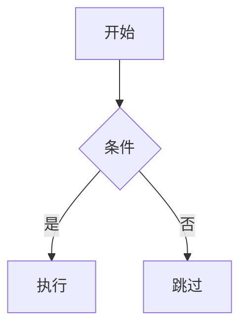

<div class="flex justify-center text-9xl">
  🦖
</div>

<br/>

## Docusaurus —— React 文档站事实标准

由 Meta 出品，React / React Native / Jest 自家文档站都用它（基于 v3.x）

<div @click="$slidev.nav.next" class="mt-12 py-1" hover:bg="white op-10">
  Press Space for next page <carbon:arrow-right />
</div>

<div class="abs-br m-6 text-xl">
  <a href="https://github.com/IllegalCreed/SlideStack" target="_blank" class="slidev-icon-btn">
    <carbon:logo-github />
  </a>
</div>

<!--
今天讲 Docusaurus —— Meta 开源的 React-based 文档站生成器。
最早服务于 React 生态自家项目，现在已经是 React 圈文档站的事实标准：
React / React Native / Jest / Babel / Redux / Prettier 自家文档站都用它。
3.x 升级到 MDX 3 + React 18 + Node 20+，是这次讲解的目标版本。
-->

---
transition: fade-out
---

# 什么是 Docusaurus？

Meta 出品，专注「文档驱动型」站点的 React 静态站生成器

<v-click>

- **三件套统一**：docs（多版本文档）/ blog（RSS + 作者 + 标签）/ pages（独立 React 页面）
- **MDX 3 一等公民**：Markdown 中直接 `import` React 组件，写 JSX 表达式
- **多版本文档**：一行 `docs:version 1.0` 命令快照当前文档为新版本
- **i18n 完整工作流**：`write-translations` 提取 + `i18n/{locale}/` 组织翻译
- **classic preset**：一行启用 docs / blog / theme / sitemap 等十多个插件
- **Swizzle 机制**：wrap 或 eject 任何主题组件，定制深度无上限

</v-click>

<br>

<div v-click>

```bash
npx create-docusaurus@latest my-website classic --typescript
```

</div>

<div v-click text-xs>

_Read more about_ [_What is Docusaurus?_](https://docusaurus.io/docs)

</div>

<style>
h1 {
  background-color: #2E8555;
  background-image: linear-gradient(45deg, #2E8555 10%, #3ECC5F 90%);
  background-size: 100%;
  -webkit-background-clip: text;
  -moz-background-clip: text;
  -webkit-text-fill-color: transparent;
  -moz-text-fill-color: transparent;
}
</style>

<!--
[click] Docusaurus 不是通用 SSG —— 它是「文档驱动」站点框架。
docs / blog / pages 三个一等公民由 classic preset 一并交付。
MDX 3 让 Markdown 中可以直接复用 React 组件；多版本文档是它最差异化的特性。

[click] 安装一条命令搞定 —— TypeScript 模板强烈推荐，配置文件全程类型提示。
-->

---
transition: fade-out
---

# Docusaurus 的定位与生态

为什么 React 圈不约而同选它？

<v-click>

| 维度 | Docusaurus 3 | VitePress 1 | Starlight | Nextra 3 | MkDocs |
| --- | --- | --- | --- | --- | --- |
| 渲染框架 | React 18 + SSR | Vue 3 + Vite | Astro Island | Next.js 15 | Python + Jinja |
| 内容格式 | **MDX 3** | Markdown + Vue | Markdown + MDX | MDX 3 | Markdown |
| 多版本文档 | **✅ 一等公民** | ❌ | ❌ | ❌ | mike 插件 |
| 博客系统 | **✅ RSS / 作者 / 标签** | ❌ | ✅ | ❌ | ❌ |
| 构建速度 | 中（Webpack 5）| **极快**（Vite）| 快 | 中 | 快 |
| 首屏 JS | ~200KB+ gzip | ~80KB | ~0KB | ~150KB | ~30KB |
| 典型用户 | React Native / Jest | Vue / Vite / Pinia | Astro / Tauri | tRPC | FastAPI |

</v-click>

<div v-click text-xs text-right>

_Read more about_ [_Showcase_](https://docusaurus.io/showcase)

</div>

<style>
h1 {
  background-color: #2E8555;
  background-image: linear-gradient(45deg, #2E8555 10%, #3ECC5F 90%);
  background-size: 100%;
  -webkit-background-clip: text;
  -moz-background-clip: text;
  -webkit-text-fill-color: transparent;
  -moz-text-fill-color: transparent;
}
</style>

<!--
[click] 五大同类对比一目了然 ——
Docusaurus 的护城河是「多版本 + 博客」开箱即用；其他四款要么没有要么要插件。
代价是 Webpack 5 + React 全家桶 ⇒ 构建慢 + 首屏 200KB+。
所以选型逻辑很清晰：
- 要多版本 + 博客 + 文档一体化 ⇒ Docusaurus
- 极快构建 + Vue 生态 ⇒ VitePress
- 零 JS 性能极致 ⇒ Starlight
- 已经在 Next.js 项目里 ⇒ Nextra
-->

---
transition: fade-out
---

# 知名用户：React 生态文档圈的事实标准

<v-click>

**Meta 自家项目**

- React / React Native / Jest / Babel / Redux / Prettier

**主流开源库**

- Algolia DocSearch / Supabase / Hasura / CodeSandbox / Replay
- Bun / Astro（早期）/ MongoDB / Stripe（部分）

**企业产品文档**

- Meta Open Source / Tencent Cloud / Apache 多个项目

</v-click>

<div v-click>

> 💡 **观察**：选择 Docusaurus 的项目几乎都有共同特征 —— 需要 **多版本文档** + **博客** + **i18n** + **Algolia 搜索** 一站式解决。

</div>

<div v-click text-xs text-right>

_Read more about_ [_Docusaurus Showcase_](https://docusaurus.io/showcase)

</div>

<style>
h1 {
  background-color: #2E8555;
  background-image: linear-gradient(45deg, #2E8555 10%, #3ECC5F 90%);
  background-size: 100%;
  -webkit-background-clip: text;
  -moz-background-clip: text;
  -webkit-text-fill-color: transparent;
  -moz-text-fill-color: transparent;
}
</style>

<!--
[click] Docusaurus 在 React 生态的地位类似 VitePress 在 Vue 生态。
Meta 自家项目几乎全用它；外部主流开源库也大量选择它。

[click] 这些项目的共同特征非常一致：
要么发版本多（要 versioning），要么团队大（要博客 + 多作者 + i18n），
要么需要 Algolia 搜索 —— Docusaurus 把这套全装好了。
-->

---
layout: two-cols-header
transition: fade-out
layoutClass: gap-x-16
---

# 创建项目

Node 20+，一条命令完成脚手架

::left::

<v-click>

**前置 + 安装**

```bash
# Node.js 20+ 必须
node -v

# 一行命令初始化（推荐 TypeScript）
npx create-docusaurus@latest my-website classic --typescript
```

**启动 / 构建 / 预览**

```bash
cd my-website
npm run start         # http://localhost:3000
npm run build         # 输出 build/
npm run serve         # 预览生产构建
```

</v-click>

::right::

<v-click>

**模板选项**

```bash
# 不要 TypeScript
npx create-docusaurus@latest my-website classic

# 用 pnpm 安装
npx create-docusaurus@latest my-website classic \
  --package-manager pnpm

# 跳过依赖安装
npx create-docusaurus@latest my-website classic \
  --skip-install
```

`classic` 是目前**几乎唯一**的官方模板，含 docs + blog + pages + theme + sitemap 全套。

</v-click>

<style>
h1 {
  background-color: #2E8555;
  background-image: linear-gradient(45deg, #2E8555 10%, #3ECC5F 90%);
  background-size: 100%;
  -webkit-background-clip: text;
  -moz-background-clip: text;
  -webkit-text-fill-color: transparent;
  -moz-text-fill-color: transparent;
}
</style>

<!--
[click] Node 必须 20+，比 VitePress 还高一个版本要求。
`classic` 模板包含 `@docusaurus/preset-classic`，把 docs / blog / pages / theme / sitemap 一次性装好。

[click] `--typescript` 强烈推荐 —— 生成 .ts 配置 + 完整类型推断。
配置错了 IDE 直接红线提示，省得跑构建才发现拼错字段名。
-->

---
transition: fade-out
---

# 项目结构

classic + TypeScript 模板生成的标准目录

<v-click>

```text
my-website/
├── blog/                       # 📝 博客系统
│   ├── 2026-05-18-welcome/
│   │   └── index.mdx
│   ├── authors.yml             # 作者档案
│   └── tags.yml                # 标签声明
├── docs/                       # 📚 文档系统
│   ├── intro.md
│   └── tutorial-basics/
│       ├── _category_.json     # 目录元数据
│       └── create-a-page.md
├── src/
│   ├── components/             # 自定义 React 组件
│   ├── css/custom.css          # 全局样式 + Infima 变量
│   └── pages/                  # 独立页面 (.tsx / .md)
├── static/                     # 📦 原样拷贝到 build/
├── docusaurus.config.ts        # ⚙️ 站点配置
└── sidebars.ts                 # 📑 文档侧边栏
```

</v-click>

<div v-click text-xs text-right>

_Read more about_ [_Project Structure_](https://docusaurus.io/docs/installation#project-structure)

</div>

<style>
h1 {
  background-color: #2E8555;
  background-image: linear-gradient(45deg, #2E8555 10%, #3ECC5F 90%);
  background-size: 100%;
  -webkit-background-clip: text;
  -moz-background-clip: text;
  -webkit-text-fill-color: transparent;
  -moz-text-fill-color: transparent;
}
</style>

<!--
[click] 四个核心一等公民目录：
- `docs/` 由 plugin-content-docs 读取
- `blog/` 由 plugin-content-blog 读取
- `src/pages/` 由 plugin-content-pages 读取（文件路径直接映射 URL）
- `static/` 原样拷贝到 build/（常放图片 / favicon）

配置入口两份：docusaurus.config.ts（站点级）+ sidebars.ts（文档侧边栏）。
-->

---
transition: fade-out
---

# 核心配置 docusaurus.config.ts

站点元数据 + 主题 + 插件，一份文件全搞定

<v-click>

```ts {1-3|5-12|14-25|27-40}
import { themes as prismThemes } from 'prism-react-renderer'
import type { Config } from '@docusaurus/types'
import type * as Preset from '@docusaurus/preset-classic'

const config: Config = {
  title: '我的文档站',
  url: 'https://my-site.com',
  baseUrl: '/',
  organizationName: 'my-org',     // GitHub Pages 用
  projectName: 'my-site',
  onBrokenLinks: 'throw',
  i18n: { defaultLocale: 'zh-Hans', locales: ['zh-Hans', 'en'] },

  presets: [
    [
      'classic',
      {
        docs: { sidebarPath: './sidebars.ts' },
        blog: { showReadingTime: true, feedOptions: { type: 'all' } },
        theme: { customCss: './src/css/custom.css' },
      } satisfies Preset.Options,
    ],
  ],

  themeConfig: {
    navbar: { /* ... */ },
    footer: { /* ... */ },
    prism: { theme: prismThemes.github, darkTheme: prismThemes.dracula },
  } satisfies Preset.ThemeConfig,
}

export default config
```

</v-click>

<style>
h1 {
  background-color: #2E8555;
  background-image: linear-gradient(45deg, #2E8555 10%, #3ECC5F 90%);
  background-size: 100%;
  -webkit-background-clip: text;
  -moz-background-clip: text;
  -webkit-text-fill-color: transparent;
  -moz-text-fill-color: transparent;
}
</style>

<!--
[click] 分四步看：
1. 类型导入 —— Config + Preset 类型，satisfies 关键字配合用，享受推断又限制结构。
2. 站点元数据 —— url 无尾斜杠，baseUrl 必须以 / 结尾。i18n 即使单语言也要配。
3. presets —— classic 一行启用 docs + blog + theme + sitemap 五大子配置。
4. themeConfig —— navbar / footer / prism / colorMode 都在这里。

整套结构非常一致：站点根级 + presets + themeConfig 三层。
-->

---
layout: two-cols-header
transition: fade-out
layoutClass: gap-x-16
---

# 文档系统：docs/ 目录

每个 .md / .mdx 自动成为路由

::left::

<v-click>

**文件 → URL 映射**

```text
docs/intro.md
  → /docs/intro

docs/tutorial-basics/create-a-page.md
  → /docs/tutorial-basics/create-a-page

docs/api/server/auth.md
  → /docs/api/server/auth
```

**Frontmatter 常用字段**

```md
---
sidebar_position: 1
sidebar_label: 介绍
slug: /
description: SEO 描述
tags: [tutorial, beginner]
hide_table_of_contents: false
draft: false
---
```

</v-click>

::right::

<v-click>

**`_category_.json`：目录元数据**

```json
{
  "label": "基础教程",
  "position": 2,
  "link": {
    "type": "generated-index",
    "slug": "/category/basics"
  },
  "collapsible": true,
  "collapsed": false
}
```

`link.type` 三种：

- `generated-index`：自动生成索引页
- `doc`：指定 doc id 作为主页
- 省略：点击不跳转

</v-click>

<style>
h1 {
  background-color: #2E8555;
  background-image: linear-gradient(45deg, #2E8555 10%, #3ECC5F 90%);
  background-size: 100%;
  -webkit-background-clip: text;
  -moz-background-clip: text;
  -webkit-text-fill-color: transparent;
  -moz-text-fill-color: transparent;
}
</style>

<!--
[click] 文档发现是「文件即路由」—— 跟 VitePress / Nextra 一致。
路径推断 id：docs/tutorial-basics/foo.md 的 id 就是 "tutorial-basics/foo"。
Frontmatter 控制 sidebar 排序、URL、SEO、标签、是否草稿等。

[click] _category_.json 是 Docusaurus 独有的目录元数据 ——
控制 sidebar 中该 category 的 label / 排序 / 是否默认展开 / 点击是否跳转索引。
generated-index 类型很实用：自动给该目录生成一个含子文档卡片的索引页。
-->

---
transition: fade-out
---

# sidebars.ts：侧边栏配置

`autogenerated` 一行覆盖 90% 场景

<v-click>

**全自动模式（推荐起步）**

```ts
import type { SidebarsConfig } from '@docusaurus/plugin-content-docs'

const sidebars: SidebarsConfig = {
  tutorialSidebar: [
    { type: 'autogenerated', dirName: '.' },
  ],
}

export default sidebars
```

排序规则：`sidebar_position` > `_category_.json.position` > 文件名字典序

</v-click>

<div v-click>

**手写模式（精细控制）**

```ts
const sidebars: SidebarsConfig = {
  tutorialSidebar: [
    'intro',                                    // doc id 简写
    {
      type: 'category',
      label: '基础',
      link: { type: 'generated-index' },
      items: [
        'basics/install',
        { type: 'autogenerated', dirName: 'advanced' },
      ],
    },
    { type: 'link', label: '外部', href: 'https://example.com' },
    { type: 'html', value: '<hr />' },
  ],
}
```

</div>

<div v-click text-xs text-right>

_Read more about_ [_Sidebar_](https://docusaurus.io/docs/sidebar)

</div>

<style>
h1 {
  background-color: #2E8555;
  background-image: linear-gradient(45deg, #2E8555 10%, #3ECC5F 90%);
  background-size: 100%;
  -webkit-background-clip: text;
  -moz-background-clip: text;
  -webkit-text-fill-color: transparent;
  -moz-text-fill-color: transparent;
}
</style>

<!--
[click] autogenerated 是开箱即用最强选项 ——
一行配置自动扫描 docs/ 所有内容，按 frontmatter 排序生成 sidebar。
新项目几乎不用改 sidebars.ts。

[click] 手写模式 6 种 item 类型覆盖所有场景：
- 字符串简写、doc、link、category、autogenerated、html、ref。
ref 类型可以跨 sidebar 引用其他 doc，又不会计入「上一篇/下一篇」。
-->

---
layout: two-cols-header
transition: fade-out
layoutClass: gap-x-16
---

# 博客系统：blog/

文章 / 作者 / 标签 / RSS / 归档 一体化

::left::

<v-click>

**文件命名（三选一）**

```text
blog/
├── 2026-05-18-hello.mdx           # 平铺
├── 2026/05/18/world.mdx           # 嵌套
└── 2026-04-20-tutorial/           # ⭐ 推荐
    ├── index.mdx
    └── cover.jpg
```

**文章 Frontmatter**

```md
---
slug: my-first-post
title: 我的第一篇博客
authors: [yangerxiao]
tags: [hello, docusaurus]
date: 2026-05-18T10:00:00
image: /img/blog/cover.jpg
---
```

</v-click>

::right::

<v-click>

**authors.yml**

```yaml
yangerxiao:
  name: 杨二小
  title: 全栈开发
  url: https://github.com/yangerxiao
  image_url: https://github.com/yangerxiao.png
  page: true              # 生成作者归档页
  socials:
    github: yangerxiao
    x: yangerxiao
```

**Truncate Marker（摘要截断）**

```mdx
摘要内容…

{/* truncate */}        ← MDX

<!-- truncate -->       ← MD

正文…
```

</v-click>

<style>
h1 {
  background-color: #2E8555;
  background-image: linear-gradient(45deg, #2E8555 10%, #3ECC5F 90%);
  background-size: 100%;
  -webkit-background-clip: text;
  -moz-background-clip: text;
  -webkit-text-fill-color: transparent;
  -moz-text-fill-color: transparent;
}
</style>

<!--
[click] 推荐 `2026-05-18-name/index.mdx` 形式 ——
可以把图片视频跟文章放一起（co-located assets），引用时 ``。
日期前缀会被自动提取为发布时间；frontmatter 的 date 字段可显式覆盖。

[click] authors.yml 集中管理作者档案；多作者用 `authors: [a, b]` 数组引用。
tags.yml 集中声明标签 + 配 onInlineTags: 'throw' 可阻止标签泛滥。
Truncate marker 控制列表页摘要边界 —— MDX 用 JSX 注释、MD 用 HTML 注释。
-->

---
transition: fade-out
---

# 博客高级配置 + RSS

Blog 不只是简单文章列表

<v-click>

```ts {2-7|9-14|16-20|all}
blog: {
  blogTitle: 'Docusaurus 博客',
  blogSidebarCount: 5,                   // 'ALL' 显示全部
  postsPerPage: 10,                      // 'ALL' 全部一页
  showReadingTime: true,
  sortPosts: 'descending',
  editUrl: 'https://github.com/.../edit/main/',

  feedOptions: {
    type: 'all',                         // rss | atom | json | all | null
    copyright: `Copyright © ${new Date().getFullYear()}`,
    language: 'zh-CN',
    limit: 20,
  },

  authorsMapPath: 'authors.yml',
  tags: 'tags.yml',
  onInlineTags: 'warn',                  // ignore | warn | throw
  onInlineAuthors: 'warn',
}
```

</v-click>

<div v-click>

构建后自动生成 `/blog/rss.xml` / `/blog/atom.xml` / `/blog/feed.json`，navbar 自动加 RSS 按钮。

</div>

<div v-click text-xs text-right>

_Read more about_ [_Blog Plugin_](https://docusaurus.io/docs/blog)

</div>

<style>
h1 {
  background-color: #2E8555;
  background-image: linear-gradient(45deg, #2E8555 10%, #3ECC5F 90%);
  background-size: 100%;
  -webkit-background-clip: text;
  -moz-background-clip: text;
  -webkit-text-fill-color: transparent;
  -moz-text-fill-color: transparent;
}
</style>

<!--
[click] 分四块看：
1. 标题 / 分页 / 阅读时间 / 编辑链接等基础配置
2. feedOptions —— Docusaurus 自动生成 RSS / Atom / JSON 三种 feed
3. authorsMapPath / onInlineTags —— 控制标签 / 作者的规范度
4. 构建产物 —— /blog/rss.xml 等自动可用，无需手写

`onInlineTags: 'throw'` 是大型项目避免标签泛滥的关键配置：
没在 tags.yml 中声明的标签会构建失败。
-->

---
transition: fade-out
---

# MDX 3：Markdown 中的 React 表达力

import / export / JSX 表达式 全员上场

<v-click>

```mdx
---
title: MDX 示例
---

import HelloComponent from '@site/src/components/Hello'
import Tabs from '@theme/Tabs'
import TabItem from '@theme/TabItem'

export const version = '1.0.0'

# MDX 完整能力

当前版本：{version}

<HelloComponent name="Docusaurus" />

<Tabs>
  <TabItem value="npm" label="npm" default>
    npm install docusaurus
  </TabItem>
  <TabItem value="pnpm" label="pnpm">
    pnpm add docusaurus
  </TabItem>
</Tabs>
```

</v-click>

<div v-click>

> ⚠️ **MDX 3 严格规则**：`{` 字符会被识别为 JSX 表达式开始。要显示字面 `{` 用 `&#123;` 转义或代码块包裹。

</div>

<div v-click text-xs text-right>

_Read more about_ [_MDX_](https://docusaurus.io/docs/markdown-features/react)

</div>

<style>
h1 {
  background-color: #2E8555;
  background-image: linear-gradient(45deg, #2E8555 10%, #3ECC5F 90%);
  background-size: 100%;
  -webkit-background-clip: text;
  -moz-background-clip: text;
  -webkit-text-fill-color: transparent;
  -moz-text-fill-color: transparent;
}
</style>

<!--
[click] MDX 3 是 Docusaurus 3.x 的核心升级 —— `.md` / `.mdx` 都按 MDX 编译（除非 markdown.format: 'md'）。
import 任意 React 组件、export 局部变量、JSX 表达式插值，全都能用。
@site 是项目根别名，@theme 是主题别名。

[click] MDX 3 严格性是升级最大坑 ——
v2 中合法的 `{ "key": "value" }` 这种字面 JSON，在 v3 会被识别为 JSX 表达式开始。
解决：用 `&#123;` 转义、反引号包裹、或者干脆放代码块。
-->

---
transition: fade-out
---

# 自定义全局 MDX 组件

让所有 MDX 文件都能直接用某组件，不必每次 import

<v-click>

**Step 1：Swizzle MDXComponents**

```bash
npm run swizzle @docusaurus/theme-classic MDXComponents -- --wrap --typescript
```

</v-click>

<div v-click>

**Step 2：注入全局组件**

```tsx
// src/theme/MDXComponents.tsx
import MDXComponents from '@theme-original/MDXComponents'
import Highlight from '@site/src/components/Highlight'
import Badge from '@site/src/components/Badge'

export default {
  ...MDXComponents,
  Highlight,
  Badge,
  // 也可以覆盖原生 HTML 标签
  h1: (props) => <h1 {...props} style={{ color: 'red' }} />,
}
```

</div>

<div v-click>

**Step 3：直接使用（无需 import）**

```mdx
<Highlight color="#25c2a0">高亮文本</Highlight>

<Badge>New</Badge>
```

</div>

<style>
h1 {
  background-color: #2E8555;
  background-image: linear-gradient(45deg, #2E8555 10%, #3ECC5F 90%);
  background-size: 100%;
  -webkit-background-clip: text;
  -moz-background-clip: text;
  -webkit-text-fill-color: transparent;
  -moz-text-fill-color: transparent;
}
</style>

<!--
[click] 一个超有用的 Swizzle 案例 —— 全局注入 MDX 组件。

[click] @theme-original/MDXComponents 是关键 —— 表示「未被覆盖的原始 MDXComponents」。
spread 进对象再加自己的组件，就完成了「扩展」而不是「替换」。
也可以覆盖原生 HTML 标签（如 h1 / table），实现全站统一样式。

[click] 一次配置，全站 MDX 文件都能直接用 —— 比每个文件都 import 高效得多。
适合 Highlight / Badge / Alert 这类设计系统组件。
-->

---
transition: fade-out
---

# Multi-Versioning：Docusaurus 的招牌

一行命令快照当前文档为新版本

<v-click>

```bash
npm run docusaurus docs:version 1.0.0
```

执行后目录变化：

```text
my-website/
├── docs/                              # ← 当前开发版（next）
├── versioned_docs/
│   └── version-1.0.0/                 # ⭐ 新建：1.0.0 快照
├── versioned_sidebars/
│   └── version-1.0.0-sidebars.json    # ⭐ sidebar 快照
└── versions.json                      # ["1.0.0"]
```

</v-click>

<div v-click>

**URL 映射**

| 路径 | URL |
| --- | --- |
| `docs/intro.md` | `/docs/next/intro`（开发版） |
| `versioned_docs/version-1.0.0/intro.md` | `/docs/intro`（默认） |
| `versioned_docs/version-0.9.0/intro.md` | `/docs/0.9.0/intro` |

最新已发布版本占据 `/docs/`，开发版（next）推到 `/docs/next/`。

</div>

<div v-click text-xs text-right>

_Read more about_ [_Versioning_](https://docusaurus.io/docs/versioning)

</div>

<style>
h1 {
  background-color: #2E8555;
  background-image: linear-gradient(45deg, #2E8555 10%, #3ECC5F 90%);
  background-size: 100%;
  -webkit-background-clip: text;
  -moz-background-clip: text;
  -webkit-text-fill-color: transparent;
  -moz-text-fill-color: transparent;
}
</style>

<!--
[click] Docusaurus 最差异化的功能 ——
一行 `docs:version 1.0.0` 把当前 docs/ 快照成 versioned_docs/version-1.0.0/，
同时 sidebars.ts 也快照到 versioned_sidebars/。

[click] URL 规则：
- 最新已发布版本（lastVersion）占据 `/docs/<id>` 路径
- 开发版（next）推到 `/docs/next/<id>`
- 旧版本带版本号前缀

React Native / Jest / Babel 这种发版多的项目，选 Docusaurus 主要就是看这个。
-->

---
transition: fade-out
---

# 版本配置 + Dropdown

精细控制每个版本的标签、路径、横幅

<v-click>

```ts {2-3|5-21|all}
docs: {
  lastVersion: 'current',                  // 哪个版本占据默认路径
  includeCurrentVersion: true,             // 是否构建开发版

  versions: {
    current: {
      label: 'Next 🚧',
      path: 'next',
      banner: 'unreleased',                // none | unreleased | unmaintained
    },
    '2.0.0': {
      label: '2.0.0',
      path: '',                            // 默认版本路径为空
      banner: 'none',
      badge: true,
    },
    '1.0.0': {
      label: '1.0.0',
      path: '1.0.0',
      banner: 'unmaintained',
    },
  },
}
```

</v-click>

<div v-click>

**navbar 加版本切换器**

```ts
navbar: {
  items: [
    { type: 'docsVersionDropdown', position: 'right' },
  ],
}
```

</div>

<style>
h1 {
  background-color: #2E8555;
  background-image: linear-gradient(45deg, #2E8555 10%, #3ECC5F 90%);
  background-size: 100%;
  -webkit-background-clip: text;
  -moz-background-clip: text;
  -webkit-text-fill-color: transparent;
  -moz-text-fill-color: transparent;
}
</style>

<!--
[click] 分三块：
1. lastVersion 决定哪个版本占 /docs/ 路径；includeCurrentVersion 控制是否构建开发版。
2. versions 表给每个版本配元数据 ——
   - label：dropdown 显示名
   - path：URL 路径前缀
   - banner：3 种 —— unreleased（开发中）/ unmaintained（旧版本）/ none
   - badge：是否显示版本徽标
3. docsVersionDropdown 自动渲染版本切换 UI。

[click] 大型项目最佳实践：
- 只在破坏性 API 变更时打版本，不要每个小版本都 version
- onlyIncludeVersions 在 CI 中限制构建版本（如 PR 预览只构建 next）
-->

---
transition: fade-out
---

# i18n 国际化

按 locale 拆目录，开箱即用的多语言

<v-click>

```ts
i18n: {
  defaultLocale: 'zh-Hans',
  locales: ['zh-Hans', 'en', 'ja'],
  localeConfigs: {
    'zh-Hans': { label: '简体中文', htmlLang: 'zh-CN' },
    en: { label: 'English', htmlLang: 'en-US' },
    ja: { label: '日本語', htmlLang: 'ja-JP' },
  },
}
```

</v-click>

<div v-click>

**翻译流程**

```bash
# Step 1：提取所有可翻译字符串
npm run write-translations -- --locale en

# Step 2：复制文档到对应 i18n 目录
docs/intro.md
  → i18n/en/docusaurus-plugin-content-docs/current/intro.md

# Step 3：navbar / footer / theme 翻译写到 JSON
i18n/en/docusaurus-theme-classic/navbar.json
i18n/en/code.json                # <Translate> 字符串
```

</div>

<div v-click>

**URL 规则**：`zh-Hans`（默认无前缀）/ `/en/docs/intro` / `/ja/docs/intro`

</div>

<div v-click text-xs text-right>

_Read more about_ [_i18n_](https://docusaurus.io/docs/i18n/introduction)

</div>

<style>
h1 {
  background-color: #2E8555;
  background-image: linear-gradient(45deg, #2E8555 10%, #3ECC5F 90%);
  background-size: 100%;
  -webkit-background-clip: text;
  -moz-background-clip: text;
  -webkit-text-fill-color: transparent;
  -moz-text-fill-color: transparent;
}
</style>

<!--
[click] i18n 即使只用一种语言也要配 —— 这是 Docusaurus 的硬要求。
defaultLocale 决定根目录归属（无路径前缀），其他 locale 路径前缀为 locale 名。

[click] 翻译三步：
1. write-translations 自动扫描所有 <Translate> 提取字符串
2. 文档级翻译复制文件到 i18n/{locale}/.../ 下
3. 主题 / navbar / footer 翻译写 JSON

多版本时变成 version-1.0.0/intro.md；React 代码用 <Translate id="..." />。

[click] URL 规则：默认 locale 占根，其他 locale 加路径前缀。
-->

---
transition: fade-out
---

# Swizzle：主题深度定制

wrap（推荐）/ eject（终极手段）

<v-click>

**列出可定制组件**

```bash
npm run swizzle @docusaurus/theme-classic -- --list
```

输出按「安全程度」分类：

- ✅ **Safe**：稳定 API，主版本内不破坏
- ⚠️ **Unsafe**：内部实现，小版本可能变化
- ❌ **Forbidden**：不允许 swizzle

</v-click>

<div v-click>

**Wrap：包装增强（推荐）**

```bash
npm run swizzle @docusaurus/theme-classic Footer -- --wrap --typescript
```

```tsx
// src/theme/Footer/index.tsx
import Footer from '@theme-original/Footer'

export default function FooterWrapper(props) {
  return (
    <>
      <div className="custom-banner">额外横幅</div>
      <Footer {...props} />
    </>
  )
}
```

原组件升级时自动跟随，比 eject 安全得多。

</div>

<div v-click text-xs text-right>

_Read more about_ [_Swizzling_](https://docusaurus.io/docs/swizzling)

</div>

<style>
h1 {
  background-color: #2E8555;
  background-image: linear-gradient(45deg, #2E8555 10%, #3ECC5F 90%);
  background-size: 100%;
  -webkit-background-clip: text;
  -moz-background-clip: text;
  -webkit-text-fill-color: transparent;
  -moz-text-fill-color: transparent;
}
</style>

<!--
[click] Swizzle 让你「定制任意主题组件」—— 这是 Docusaurus 跟其他 SSG 拉开差距的特性。
--list 会按官方维护承诺把组件分三档：
Safe（稳定 API）/ Unsafe（内部实现，小版本可能变）/ Forbidden（绝对不允许）。

[click] wrap 是最常用方式 —— 用 @theme-original/X 引用原组件，外面套自己的逻辑。
原组件升级时跟随升级，零维护成本。
eject 是终极手段 —— 拷贝整段源码，自己改自己维护。慎用。

定制优先级：CSS 变量 > themeConfig 字段 > 翻译 > Swizzle wrap > Swizzle eject。
-->

---
transition: fade-out
---

# Swizzle 进阶：Root 组件与全局 Context

整个应用永不卸载的特殊组件

<v-click>

`Root` 组件包裹整个应用 —— **路由切换时保持挂载**，适合放：

- React Context Provider
- Global state (Redux / Zustand)
- 第三方库初始化 (Sentry / Posthog)
- 全局事件监听

</v-click>

<div v-click>

```bash
npm run swizzle @docusaurus/theme-classic Root -- --wrap --typescript
```

```tsx
// src/theme/Root.tsx
import React from 'react'
import { ThemeProvider } from './ThemeProvider'
import { UserProvider } from './UserProvider'

export default function Root({ children }) {
  return (
    <ThemeProvider>
      <UserProvider>
        {children}
      </UserProvider>
    </ThemeProvider>
  )
}
```

</div>

<div v-click>

> 💡 **典型场景**：登录态、主题切换、全局数据请求、监控埋点 —— 一次接入，全站可用。

</div>

<style>
h1 {
  background-color: #2E8555;
  background-image: linear-gradient(45deg, #2E8555 10%, #3ECC5F 90%);
  background-size: 100%;
  -webkit-background-clip: text;
  -moz-background-clip: text;
  -webkit-text-fill-color: transparent;
  -moz-text-fill-color: transparent;
}
</style>

<!--
[click] Root 是特殊组件 —— 永不卸载、不参与路由切换。
这是「全应用级别状态」的完美挂载点：
登录态、主题、Redux store、Sentry 初始化、Posthog 埋点……

[click] 用 swizzle Root -- --wrap 创建，children 就是 Docusaurus 默认渲染的内容。
外面套任意 Provider 即可让全站访问。

[click] 真实项目里这是最常用的 swizzle 目标 —— 比改 Footer / Navbar 更频繁。
-->

---
transition: fade-out
---

# Plugin 系统

所有功能都是 plugin，包括内置 docs / blog / pages

<v-click>

**常用官方插件**

| 插件 | 用途 |
| --- | --- |
| `@docusaurus/plugin-content-docs` | 文档系统（preset-classic 已含） |
| `@docusaurus/plugin-content-blog` | 博客系统（preset-classic 已含） |
| `@docusaurus/plugin-google-gtag` | Google Analytics |
| `@docusaurus/plugin-sitemap` | sitemap.xml |
| `@docusaurus/plugin-ideal-image` | 图片优化（懒加载 / WebP） |
| `@docusaurus/plugin-pwa` | PWA 支持 |
| `@docusaurus/plugin-client-redirects` | 客户端重定向 |

</v-click>

<div v-click>

**接入示例**

```ts
plugins: [
  [
    '@docusaurus/plugin-google-gtag',
    { trackingID: 'G-XXXXXXXXXX', anonymizeIP: true },
  ],
  '@docusaurus/plugin-ideal-image',
  [
    '@docusaurus/plugin-client-redirects',
    { redirects: [{ from: '/old-path', to: '/new-path' }] },
  ],
]
```

</div>

<div v-click text-xs text-right>

_Read more about_ [_Plugins_](https://docusaurus.io/docs/using-plugins)

</div>

<style>
h1 {
  background-color: #2E8555;
  background-image: linear-gradient(45deg, #2E8555 10%, #3ECC5F 90%);
  background-size: 100%;
  -webkit-background-clip: text;
  -moz-background-clip: text;
  -webkit-text-fill-color: transparent;
  -moz-text-fill-color: transparent;
}
</style>

<!--
[click] Docusaurus 的「一切皆 plugin」思想：
docs / blog / pages 都是独立的 content plugin，theme 也是 plugin，
classic preset 只是把它们打包到一起。

常用扩展插件：
- google-gtag：GA 接入
- ideal-image：图片懒加载 + WebP 自动转换
- pwa：渐进式 Web App 支持
- client-redirects：客户端重定向（重命名 URL 后保留旧链接）

[click] 接入语法两种：
- 字符串：用默认配置
- [name, options]：传配置
官方插件命名约定 @docusaurus/plugin-* ，社区插件无固定前缀。
-->

---
transition: fade-out
---

# 自定义 Plugin

加载远程数据 + 动态生成路由

<v-click>

```ts
plugins: [
  async function myPlugin(context, options) {
    return {
      name: 'my-plugin',

      async loadContent() {
        return {
          posts: await fetch('https://api.example.com/posts')
            .then(r => r.json()),
        }
      },

      async contentLoaded({ content, actions }) {
        const { addRoute, createData } = actions
        const dataPath = await createData(
          'posts.json',
          JSON.stringify(content.posts),
        )
        content.posts.forEach((post) => {
          addRoute({
            path: `/posts/${post.slug}`,
            component: '@site/src/theme/PostPage',
            modules: { data: dataPath },
          })
        })
      },
    }
  },
]
```

</v-click>

<div v-click>

**生命周期 Hooks**：`loadContent` → `contentLoaded` → `postBuild` / `configureWebpack` / `injectHtmlTags` / `getClientModules` …

</div>

<style>
h1 {
  background-color: #2E8555;
  background-image: linear-gradient(45deg, #2E8555 10%, #3ECC5F 90%);
  background-size: 100%;
  -webkit-background-clip: text;
  -moz-background-clip: text;
  -webkit-text-fill-color: transparent;
  -moz-text-fill-color: transparent;
}
</style>

<!--
[click] 自定义 plugin 最常见用法：从外部 API 拉数据 + 生成路由。
loadContent → 加载数据（构建期一次性）
contentLoaded → 拿到数据后调 addRoute / createData
组件路径用 @site/src/... 别名，modules 把数据注入组件。

这是 Docusaurus 实现「Headless CMS 数据 → 静态页面」的标准模式。

[click] 完整 hook 列表：
- 数据：loadContent / contentLoaded
- 构建：postBuild / postStart
- 资源：configureWebpack / configurePostCss
- HTML：injectHtmlTags / getClientModules
-->

---
transition: fade-out
---

# Markdown 增强：Admonitions

5 种内置类型 + 可自定义

<v-click>

````md
:::note
普通注记
:::

:::tip
小贴士
:::

:::info
信息提示
:::

:::warning
警告
:::

:::danger
危险（红色）
:::
````

</v-click>

<div v-click>

**带标题 + 嵌套**

````md
:::note[补充说明]
有标题的 note
:::

:::::info[父级]
父级内容

::::danger[子级]
冒号数量增加表示嵌套层级
::::
:::::
````

</div>

<div v-click>

**自定义类型**：在 `config.markdown.admonitions.keywords` 加新关键字。

</div>

<style>
h1 {
  background-color: #2E8555;
  background-image: linear-gradient(45deg, #2E8555 10%, #3ECC5F 90%);
  background-size: 100%;
  -webkit-background-clip: text;
  -moz-background-clip: text;
  -webkit-text-fill-color: transparent;
  -moz-text-fill-color: transparent;
}
</style>

<!--
[click] Admonitions 是 Docusaurus 标志性的内容容器 ——
5 种内置语义（note / tip / info / warning / danger）覆盖技术文档 90% 场景。

[click] 带标题用方括号；嵌套用「增加冒号数量」表示层级 ——
这是 MDX 3 的语法约定，避免外层 ::: 被内层 ::: 提前关闭。

[click] 还可以在 config 里自定义新类型（如 `:::custom-warning`），
让团队约定的语义化标签融入文档。
-->

---
transition: fade-out
---

# Markdown 增强：Tabs + 代码块

同步切换 + 行高亮 + 标题

<div v-click>

**Tabs 同步切换**

```mdx
<Tabs groupId="os">
  <TabItem value="mac" label="macOS">Command + C</TabItem>
  <TabItem value="win" label="Windows">Ctrl + C</TabItem>
</Tabs>
```

同一页面所有 `groupId="os"` 的 Tabs 会同步选择 —— 完美适合「按操作系统」/「按包管理器」教程。

</div>

<div v-click>

**代码块行高亮（Magic Comments）**

````md
```ts title="hello.ts" showLineNumbers
function add(a: number, b: number) {
  // highlight-next-line
  return a + b
  // highlight-start
  console.log('start')
  console.log('end')
  // highlight-end
}
```
````

</div>

<div v-click>

**npm2yarn 自动多包管理器**

````md
```bash npm2yarn
npm install docusaurus
```
````

自动渲染为 4 个 Tab：npm / yarn / pnpm / bun，加 `sync: true` 全页面同步。

</div>

<style>
h1 {
  background-color: #2E8555;
  background-image: linear-gradient(45deg, #2E8555 10%, #3ECC5F 90%);
  background-size: 100%;
  -webkit-background-clip: text;
  -moz-background-clip: text;
  -webkit-text-fill-color: transparent;
  -moz-text-fill-color: transparent;
}
</style>

<!--
[click] Tabs 的 groupId 是杀手锏 ——
让同一页面里所有 macOS / Windows 的 Tab 同步切换，用户读一遍全篇都按自己平台显示。
queryString 选项还能把选择持久化到 URL。

[click] Magic Comments 比 VitePress 的 `// [!code ...]` 还直观 ——
`// highlight-next-line` / `// highlight-start` / `// highlight-end`，可读性极强。
showLineNumbers 启用行号；title="..." 加文件名标题。

[click] @docusaurus/remark-plugin-npm2yarn 是社区开发者最爱的插件 ——
一个 npm 命令自动生成 4 个 Tab，sync: true 全页同步。
-->

---
transition: fade-out
---

# Markdown 增强：Mermaid + KaTeX

流程图 + 数学公式

<v-click>

**Mermaid 流程图**

```bash
npm install --save @docusaurus/theme-mermaid
```

```ts
themes: ['@docusaurus/theme-mermaid'],
markdown: { mermaid: true }
```

````md

````

</v-click>

<div v-click>

**KaTeX 数学公式**

```bash
npm install --save remark-math@6 rehype-katex@7
```

```ts
docs: {
  remarkPlugins: [remarkMath],
  rehypePlugins: [rehypeKatex],
}
stylesheets: [
  { href: 'https://cdn.jsdelivr.net/npm/katex@0.13.24/dist/katex.min.css' },
]
```

行内公式 `$E = mc^2$`，块公式用 `$$ ... $$`。

</div>

<div v-click text-xs text-right>

_Read more about_ [_Mermaid_](https://docusaurus.io/docs/markdown-features/diagrams) · [_Math_](https://docusaurus.io/docs/markdown-features/math-equations)

</div>

<style>
h1 {
  background-color: #2E8555;
  background-image: linear-gradient(45deg, #2E8555 10%, #3ECC5F 90%);
  background-size: 100%;
  -webkit-background-clip: text;
  -moz-background-clip: text;
  -webkit-text-fill-color: transparent;
  -moz-text-fill-color: transparent;
}
</style>

<!--
[click] Mermaid 是 Docusaurus 官方 theme 的形式接入 ——
themes 中加 @docusaurus/theme-mermaid + markdown.mermaid = true 即可。
代码块 ```mermaid 自动渲染为图。

[click] KaTeX 走 remark/rehype 插件路线：
- remark-math 解析 $...$ 语法
- rehype-katex 把 LaTeX AST 渲染为 HTML
- 别忘了加 KaTeX 的 CSS（不然字体不对）
-->

---
transition: fade-out
---

# 搜索：Algolia DocSearch

业界标准方案，免费申请

<v-click>

**Step 1：申请 DocSearch**

1. 访问 [docsearch.algolia.com/apply](https://docsearch.algolia.com/apply)
2. 填写域名 / 维护者邮箱 / 技术栈（Docusaurus）
3. 1-2 周内通过，收到 `appId` / `apiKey` / `indexName`

</v-click>

<div v-click>

**Step 2：配置 themeConfig**

```ts
themeConfig: {
  algolia: {
    appId: 'YOUR_APP_ID',
    apiKey: 'YOUR_PUBLIC_API_KEY',         // ⚠️ search-only key
    indexName: 'YOUR_INDEX_NAME',
    contextualSearch: true,                // 按 locale + version 过滤
    searchPagePath: 'search',
  },
}
```

</div>

<div v-click>

**Step 3：自动可用**

DocSearch 自动渲染 navbar 搜索框 + `/search` 独立搜索页 + 键盘快捷键 `Cmd+K`。

</div>

<div v-click>

> 💡 **离线方案**：不想申请 DocSearch 可以用 `@easyops-cn/docusaurus-search-local` 社区插件，构建期生成索引、浏览器侧加载。

</div>

<style>
h1 {
  background-color: #2E8555;
  background-image: linear-gradient(45deg, #2E8555 10%, #3ECC5F 90%);
  background-size: 100%;
  -webkit-background-clip: text;
  -moz-background-clip: text;
  -webkit-text-fill-color: transparent;
  -moz-text-fill-color: transparent;
}
</style>

<!--
[click] Algolia DocSearch 是「文档搜索黄金标准」——
React / Vue / TailwindCSS 等大型项目几乎都用它。
申请要求：开源项目 + 公开访问 + 有真实流量，免费提供。
个人项目通常 1-2 周内审批通过。

[click] 三个字段：appId / apiKey / indexName。
apiKey 必须是 search-only key（不要传 admin key）—— 这个 key 是会暴露在前端的。
contextualSearch: true 是多语言 / 多版本必开 —— 否则用户搜出的结果可能是其他 locale / version。

[click] 一旦配好，navbar 自动有搜索框 + Cmd+K 快捷键 + /search 独立页面。
零额外代码。

[click] 离线方案 @easyops-cn/docusaurus-search-local 小站点完美适用。
-->

---
layout: two-cols-header
transition: fade-out
layoutClass: gap-x-16
---

# 部署：GitHub Pages

一行命令 or GitHub Actions

::left::

<v-click>

**配置 + 一行部署**

```ts
// docusaurus.config.ts
{
  url: 'https://my-org.github.io',
  baseUrl: '/my-site/',
  organizationName: 'my-org',
  projectName: 'my-site',
  trailingSlash: false,
}
```

```bash
GIT_USER=my-username npm run deploy
# 构建 + 推送到 gh-pages
```

> 推荐 SSH：`USE_SSH=true GIT_USER=... npm run deploy`

</v-click>

::right::

<v-click>

**GitHub Actions 自动化**

```yaml
- uses: actions/checkout@v4
- uses: actions/setup-node@v4
  with:
    node-version: 20            # 必须 20+
    cache: npm
- run: npm ci
- run: npm run build
- uses: actions/upload-pages-artifact@v3
  with:
    path: build
- uses: actions/deploy-pages@v4
```

</v-click>

<style>
h1 {
  background-color: #2E8555;
  background-image: linear-gradient(45deg, #2E8555 10%, #3ECC5F 90%);
  background-size: 100%;
  -webkit-background-clip: text;
  -moz-background-clip: text;
  -webkit-text-fill-color: transparent;
  -moz-text-fill-color: transparent;
}
</style>

<!--
[click] 一行部署：GIT_USER + npm run deploy。
内部就是 docusaurus build + 推送到 gh-pages 分支。
GitHub 现在不允许密码登录，必须配 SSH key 或 PAT —— 推荐 SSH。

[click] GitHub Actions 是更推荐的方式 ——
每次 push 自动构建 + 部署，零手动操作。
注意：
- Node 必须 20+
- upload-pages-artifact 的 path 是 build/，不是 .docusaurus/dist
-->

---
transition: fade-out
---

# 部署：Vercel / Netlify / Cloudflare Pages

零配置自动识别

<v-click>

**Vercel**

直接在 Dashboard 导入 GitHub 仓库 —— Build Command + Output Directory 自动检测，每个 PR 自动生成 Preview 部署。

</v-click>

<div v-click>

**Netlify**

```toml
# netlify.toml
[build]
  publish = "build"
  command = "npm run build"
```

> ⚠️ 站点设置中**关闭 Pretty URLs** —— 否则会和 Docusaurus 的 `trailingSlash` 冲突。

</div>

<div v-click>

**Cloudflare Pages**

直接导入仓库，零配置。Build Command `npm run build`，Output `build`。

</div>

<div v-click>

**自定义 Nginx**

```nginx
location / {
  try_files $uri $uri/ /index.html;
}
```

</div>

<style>
h1 {
  background-color: #2E8555;
  background-image: linear-gradient(45deg, #2E8555 10%, #3ECC5F 90%);
  background-size: 100%;
  -webkit-background-clip: text;
  -moz-background-clip: text;
  -webkit-text-fill-color: transparent;
  -moz-text-fill-color: transparent;
}
</style>

<!--
[click] Vercel 零配置 —— Vercel 内置 Docusaurus 模板识别，连 build 目录都不用配。
每个 PR 自动生成 Preview Deployment 是协作神器。

[click] Netlify 也是零配置（自动检测），但有个坑 ——
默认开启的 Pretty URLs 会跟 Docusaurus trailingSlash 配置冲突，要在 Site Settings 关掉。

[click] Cloudflare Pages 跟 Vercel 类似 —— 直接导入仓库 + 自动识别。

[click] 自定义服务器（nginx / caddy）也行 —— 静态站点核心是 try_files 兜底到 index.html。
-->

---
transition: fade-out
---

# 客户端 API

React 组件中用的钩子和组件

<v-click>

```tsx {1-7|9-15|17-22|all}
// Link / BrowserOnly / Head
import Link from '@docusaurus/Link'
import BrowserOnly from '@docusaurus/BrowserOnly'
import Head from '@docusaurus/Head'

<Link to="/docs/intro" activeClassName="active">文档</Link>
<BrowserOnly fallback={<div>Loading...</div>}>
  {() => <HeavyComponent />}
</BrowserOnly>

// Hooks
import { useDocusaurusContext } from '@docusaurus/useDocusaurusContext'
import { useColorMode } from '@docusaurus/theme-common'
import useBaseUrl from '@docusaurus/useBaseUrl'

const { siteConfig, i18n } = useDocusaurusContext()
const { colorMode, setColorMode } = useColorMode()
const logoPath = useBaseUrl('/img/logo.png')

// ExecutionEnvironment
import ExecutionEnvironment from '@docusaurus/ExecutionEnvironment'

if (ExecutionEnvironment.canUseDOM) {
  window.someAPI()    // SSR 时跳过
}
```

</v-click>

<style>
h1 {
  background-color: #2E8555;
  background-image: linear-gradient(45deg, #2E8555 10%, #3ECC5F 90%);
  background-size: 100%;
  -webkit-background-clip: text;
  -moz-background-clip: text;
  -webkit-text-fill-color: transparent;
  -moz-text-fill-color: transparent;
}
</style>

<!--
[click] Docusaurus 客户端 API 分三类：

1. 组件 —— Link / BrowserOnly / Head / Redirect
   - Link 自带 prefetch + 当前路由高亮
   - BrowserOnly 处理依赖 window / document 的 SSR 不兼容组件

2. Hooks —— useDocusaurusContext / useColorMode / useBaseUrl / useLocation
   - useDocusaurusContext 拿站点配置 + i18n
   - useColorMode 暗黑模式切换
   - useBaseUrl 自动加 baseUrl 前缀

3. ExecutionEnvironment —— SSR 判定环境
   - canUseDOM / canUseEventListeners / canUseViewport
-->

---
transition: fade-out
---

# Faster 模式：性能跃迁

Rspack + SWC + Lightning CSS 全员替换 Webpack 默认链

<v-click>

```ts
// docusaurus.config.ts
future: {
  faster: {
    swcJsLoader: true,                  // SWC 替代 Babel
    swcJsMinimizer: true,               // SWC 压缩 JS
    swcHtmlMinimizer: true,             // SWC 压缩 HTML
    lightningCssMinimizer: true,        // Lightning CSS
    rspackBundler: true,                // Rspack 替代 Webpack
    rspackPersistentCache: true,        // Rspack 持久化缓存
    ssgWorkerThreads: true,             // 多线程 SSG
    mdxCrossCompilerCache: true,        // MDX 编译缓存
  },
}
```

</v-click>

<div v-click>

**效果**

- 大型站点（千级文档）构建时间可减少 **50%-70%**
- 第二次构建（命中持久化缓存）可减少到 **数十秒**
- Dev server 启动从 5-10s 降到 **1-2s**

</div>

<div v-click>

> ⚠️ **现状**：3.x 实验特性，4.x 计划默认启用。生产用前建议 `npm run build` 对比一次确认无回归。

</div>

<style>
h1 {
  background-color: #2E8555;
  background-image: linear-gradient(45deg, #2E8555 10%, #3ECC5F 90%);
  background-size: 100%;
  -webkit-background-clip: text;
  -moz-background-clip: text;
  -webkit-text-fill-color: transparent;
  -moz-text-fill-color: transparent;
}
</style>

<!--
[click] Faster 模式是 Docusaurus 3.6+ 引入的「下一代构建工具链」开关 ——
全员从 Babel / Webpack / Terser 切到 SWC / Rspack / Lightning CSS。

8 个开关可以独立开关：
- JS 编译：swcJsLoader
- JS 压缩：swcJsMinimizer
- HTML 压缩：swcHtmlMinimizer
- CSS 压缩：lightningCssMinimizer
- Bundler：rspackBundler + rspackPersistentCache
- SSG：ssgWorkerThreads（多线程并行渲染页面）
- MDX：mdxCrossCompilerCache（编译缓存）

[click] 大型站点收益巨大 —— React 自家文档站启用后构建时间砍半以上。
ssgWorkerThreads 对 多 locale × 多 version 站点提速最明显。

[click] 现在还是 experimental，4.x 计划默认开启。
生产用前跑一次 build 对比 build/ 文件数和首屏，确认没有渲染差异。
-->

---
transition: fade-out
---

# 生态对比：四款主流 SSG

按「场景诉求」选型

<v-click>

| 诉求 | 首选 | 理由 |
| --- | --- | --- |
| 多版本文档 + 博客 + i18n | **Docusaurus** | 一等公民全套，React Native / Jest 同款 |
| 极快构建 + Vue 生态 | **VitePress** | Vite 驱动，Vue 文档站事实标准 |
| 零 JS + 性能极致 | **Starlight** | Astro Island，首屏 0KB JS |
| 已经在 Next.js 项目 | **Nextra** | Next 15 + Tailwind 风格 |

</v-click>

<div v-click>

**额外维度**

- **Docusaurus**：重量级、功能最全、生态最成熟、构建最慢
- **VitePress**：轻量、Vue 友好、Data Loader 灵活、无多版本
- **Starlight**：现代设计、零依赖、社区小、无多版本
- **Nextra**：React 新秀、文件路由灵活、功能不及 Docusaurus 全面

</div>

<div v-click>

> 💡 **决策路径**：先看「需不需要多版本 + 博客」—— 要 → Docusaurus；不要 → 按技术栈选 VitePress / Starlight / Nextra。

</div>

<style>
h1 {
  background-color: #2E8555;
  background-image: linear-gradient(45deg, #2E8555 10%, #3ECC5F 90%);
  background-size: 100%;
  -webkit-background-clip: text;
  -moz-background-clip: text;
  -webkit-text-fill-color: transparent;
  -moz-text-fill-color: transparent;
}
</style>

<!--
[click] 四款 SSG 各有定位 —— 不是「谁更好」，是「谁更适合什么场景」。

[click] Docusaurus 的护城河：
- 多版本（versioning）开箱即用 —— 唯一
- 博客系统完整 —— 唯一（Starlight 有 blog plugin 但功能少）
- i18n 工作流完善
代价：构建慢、首屏 200KB+ JS。

VitePress 是 Vue 生态首选 —— Vue / Vite / Pinia 自家文档都用它。
Starlight 是 Astro 出品，零 JS 极致性能。
Nextra 给已经在 Next.js 项目里的人用 —— 不必引入新栈。

[click] 决策路径很简单：
- 大型开源 + 多版本 + 博客 ⇒ Docusaurus
- Vue 生态 ⇒ VitePress
- 极致性能（营销站）⇒ Starlight
- Next.js 项目嵌入 ⇒ Nextra
-->

---
transition: fade-out
---

# 常见踩坑

经验法则速查

<v-click>

| 问题 | 原因 | 修复 |
| --- | --- | --- |
| `{` 在文档中报错 | MDX 3 严格识别 JSX 表达式 | `&#123;` 转义 / 反引号 / 代码块包裹 |
| `<URL>` 自动链接失效 | MDX 3 不再支持 | 改用 `[URL](URL)` 标准 Markdown 链接 |
| HTML 实体 `&copy;` 不解析 | MDX 3 不自动转 | 用 Unicode 字面 © |
| 图片路径 `/img/foo.png` 失效 | baseUrl 未拼接 | 用 `./foo.png` 相对路径 or `useBaseUrl()` |
| 文档链接报错 | 路径解析失败 | 用 `.md` 扩展名让 Docusaurus 自动转 URL |
| Algolia 搜索结果空 | locale / version 过滤 | 检查 `contextualSearch` + crawler 状态 |
| Webpack 构建慢 | 默认 Babel + Webpack 链 | 启用 `future.faster.rspackBundler` |
| HMR 异常 | `.docusaurus/` 缓存损坏 | `npm run clear` 清缓存 |

</v-click>

<div v-click>

**MDX 兼容性检查**

```bash
npx docusaurus-mdx-checker
# 扫描所有 MDX 文件并报告 v2 → v3 升级问题
```

</div>

<style>
h1 {
  background-color: #2E8555;
  background-image: linear-gradient(45deg, #2E8555 10%, #3ECC5F 90%);
  background-size: 100%;
  -webkit-background-clip: text;
  -moz-background-clip: text;
  -webkit-text-fill-color: transparent;
  -moz-text-fill-color: transparent;
}
</style>

<!--
[click] 8 个高频踩坑：

MDX 3 升级三件套（前三行）—— v2 项目升 v3 时一定会撞：
- { 字面字符必须 escape
- <URL> 自动链接不再支持
- HTML 实体 &copy; / &lt; 不自动转

后五项是 Docusaurus 日常运维高频问题：
- 图片路径优先用相对路径 ./foo.png
- 文档间链接带 .md 扩展名，Docusaurus 自动转
- contextualSearch + crawler 必须配对（否则搜索空）
- future.faster 启用现代工具链
- npm run clear 是 HMR 异常的万能药

[click] docusaurus-mdx-checker 是升级辅助工具 —— 扫一遍所有 MDX 文件，把不兼容的地方一次性列出来。
v2 → v3 升级的项目必跑。
-->

---
transition: fade-out
---

# 经验法则

来自 Meta 团队 + 大型用户的最佳实践

<v-click>

- **TypeScript 模板必选** —— `--typescript` 比 JavaScript 模板生产力高 5 倍
- **`onBrokenLinks: 'throw'`** —— 让构建在烂链接时失败，强制保持文档健康
- **多版本要谨慎** —— 只在破坏性 API 变更时打版本，不要每个小版本都 `docs:version`
- **博客标签严格** —— 配 `onInlineTags: 'throw'` + `tags.yml` 避免标签泛滥
- **Swizzle 优先 wrap** —— eject 是终极手段，每次升级都要手动同步
- **i18n 即使单语言也配** —— 留好将来扩展空间，无成本
- **Algolia DocSearch 必装** —— 开源项目免费 + 跨语言跨版本搜索体验最佳
- **future.faster 大型站点必开** —— 构建时间减半，开发体验提升明显
- **图片用相对路径** —— 自动跟随 baseUrl，无需 `useBaseUrl()` 包装
- **classic 模板就够了** —— 不要自己拼 docs/blog/pages plugin，classic preset 一次到位

</v-click>

<style>
h1 {
  background-color: #2E8555;
  background-image: linear-gradient(45deg, #2E8555 10%, #3ECC5F 90%);
  background-size: 100%;
  -webkit-background-clip: text;
  -moz-background-clip: text;
  -webkit-text-fill-color: transparent;
  -moz-text-fill-color: transparent;
}
</style>

<!--
10 条经验法则，从社区大量项目踩坑总结而来：

- TypeScript：配置全程类型提示，writing config.ts 比 config.js 安全 10 倍
- onBrokenLinks: throw：CI 里把链接腐烂当构建失败处理，比事后修复便宜
- versioning 节制：每发版都打版本会让 CI 慢、用户眼花
- 标签严格：避免「js / javascript / JavaScript / Js」散开
- Swizzle wrap > eject：跟随升级 vs 手动维护，差距巨大
- i18n 总是配：扩展第二种语言时不用大改
- DocSearch：开源项目免费的搜索体验天花板
- faster：大型站点直接砍掉一半构建时间
- 图片相对路径：Docusaurus 自动加 baseUrl，比手动 useBaseUrl 简洁
- classic 模板：99% 项目不需要自己组合 plugin
-->

---
transition: fade-out
---

# 下一步学习路径

按场景挑章节

<v-click>

**入门 → 进阶**

- [Tutorial](https://docusaurus.io/docs/category/getting-started) —— 官方手把手教程
- [Configuration](https://docusaurus.io/docs/configuration) —— `docusaurus.config.ts` 字段全表
- [Docs Plugin](https://docusaurus.io/docs/docs-introduction) —— 文档系统深度
- [Blog Plugin](https://docusaurus.io/docs/blog) —— 博客 RSS / authors / tags

</v-click>

<div v-click>

**专题深入**

- [Versioning](https://docusaurus.io/docs/versioning) —— 多版本完整流程
- [i18n](https://docusaurus.io/docs/i18n/introduction) —— 国际化工作流
- [Swizzling](https://docusaurus.io/docs/swizzling) —— 主题深度定制
- [Plugin API](https://docusaurus.io/docs/api/plugin-methods) —— 自定义 Plugin

</div>

<div v-click>

**社区资源**

- [Showcase](https://docusaurus.io/showcase) —— 200+ 真实项目案例
- [Playground](https://docusaurus.new) —— StackBlitz / CodeSandbox 在线试玩
- [Community Resources](https://docusaurus.io/community/resources) —— 社区插件 / 主题 / 教程

</div>

<style>
h1 {
  background-color: #2E8555;
  background-image: linear-gradient(45deg, #2E8555 10%, #3ECC5F 90%);
  background-size: 100%;
  -webkit-background-clip: text;
  -moz-background-clip: text;
  -webkit-text-fill-color: transparent;
  -moz-text-fill-color: transparent;
}
</style>

<!--
[click] 入门进阶推荐顺序：
官方 Tutorial → Configuration → Docs Plugin → Blog Plugin
这 4 篇过完基本覆盖 80% 项目需求。

[click] 专题深入按需要选：
- 大型项目 ⇒ Versioning 必读
- 多语言 ⇒ i18n 章节
- 想换设计风格 ⇒ Swizzling
- 接入外部数据 ⇒ Plugin API

[click] 社区资源：
- Showcase 看真实项目代码（React / React Native 都开源）
- Playground 在线试玩
- Resources 找第三方插件 / 主题
-->

---
layout: intro
transition: fade-out
---

# 总结

Docusaurus 把「企业级文档站」需要的一切打包送达

- **三件套**：docs（多版本）+ blog（RSS / 作者 / 标签）+ pages（独立页面）
- **MDX 3 + React 18** ⇒ Markdown 中嵌入任意 React 组件
- **多版本 + i18n** ⇒ 一等公民工作流，React Native 同款
- **Swizzle + Plugin** ⇒ 理论上无上限的定制能力
- **Algolia DocSearch + Faster 模式** ⇒ 搜索 + 构建一站式现代化

<div class="abs-br m-6 text-xl">
  <a href="https://docusaurus.io" target="_blank" class="slidev-icon-btn">
    <carbon:document />
  </a>
  <a href="https://github.com/facebook/docusaurus" target="_blank" class="slidev-icon-btn">
    <carbon:logo-github />
  </a>
  <a href="https://illegalscreed.cn/zh/frontend-framework/ssg/docusaurus/" target="_blank" class="slidev-icon-btn">
    <ph:steam-logo />
  </a>
</div>

<style>
h1 {
  background-color: #2E8555;
  background-image: linear-gradient(45deg, #2E8555 10%, #3ECC5F 90%);
  background-size: 100%;
  -webkit-background-clip: text;
  -moz-background-clip: text;
  -webkit-text-fill-color: transparent;
  -moz-text-fill-color: transparent;
}
</style>

<!--
总结一下 Docusaurus 在 SSG 生态的位置：

- 它不是「快」的工具 —— 是「全」的工具
- 它不是「轻」的工具 —— 是「完备」的工具
- 它不是「Vue 友好」—— 是「React 生态原住民」

如果你的诉求是「企业级文档 + 多版本 + 多语言 + 博客一体化」，
Docusaurus 至今仍是最稳健的选择。

Meta 在维护，React 生态在用，开源 8+ 年仍在持续迭代 —— 长期可下注。
-->

---
layout: end
---
