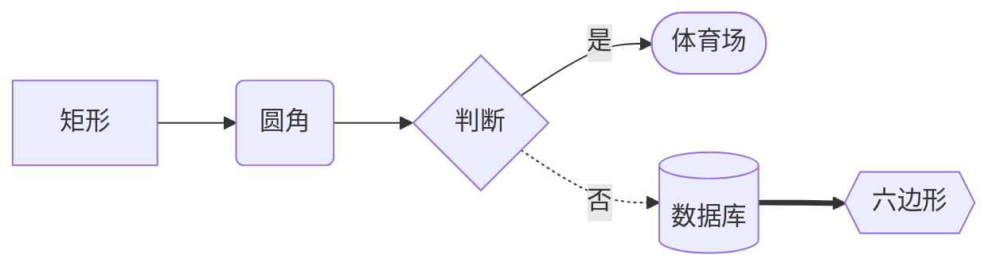

<div class="flex justify-center items-center gap-4">
  <span class="text-6xl">🧜‍♀️</span>
</div>

## Mermaid — 用文本画图

文本 DSL 描述图、浏览器端渲染成 SVG；diagram-as-code 让图随文档进库、可 diff/review。2026 年 v11

<div @click="$slidev.nav.next" class="mt-6 py-1" hover:bg="white op-10">
  Press Space for next page <carbon:arrow-right />
</div>

<div class="abs-br m-6 text-xl">
  <a href="https://github.com/mermaid-js/mermaid" target="_blank" class="slidev-icon-btn">
    <carbon:logo-github />
  </a>
</div>

<!--
今天聊 Mermaid。官方定位：JavaScript 文本转图表工具，用 Markdown 风格的 DSL 描述图，在浏览器端解析后渲染成 SVG。

核心理念叫 diagram-as-code：图表跟文档、代码一起进版本库，可以 diff、可以 review，专治文档腐烂，也就是 Doc-Rot。

2026 年的基线：npm latest 是 11.16.0，MIT 协议，作者 Knut Sveidqvist，2019 年 JS 开源大奖得主。底层依赖 d3 做渲染基座、dagre 做 flowchart 布局、dompurify 做 XSS 净化，v11 还引入了 roughjs 手绘风和 ELK 布局引擎。

顺序：定位、运行机制、七大主力图逐个过、新图速览、配置与主题、JS API、安全、CLI 与生态、易错坑、选型总结。
-->

---
layout: image-right
image: https://cover.sli.dev
---

# 为什么是「文本即图」？

拖拽画图工具（draw.io 等）的痛：

<v-clicks>

- 产物是 XML/二进制：diff 不可读、评审靠肉眼
- 文档里嵌导出图片：代码改了图没改 → **Doc-Rot**

</v-clicks>

<div v-click class="mt-4">

Mermaid 的答案：

- 文本 DSL 进 Git：可 diff / review，改一行自动重排
- GitHub / GitLab / Notion / Obsidian / Typora 原生渲染围栏代码块
- 22+ 种图，会 Markdown 就能上手
- 代价：布局由引擎决定，做不到像素级排版

</div>

<!--
为什么要文本即图？先看拖拽工具的痛点：draw.io 这类工具产物是 XML 文件，两个版本的差异肉眼根本读不出来，评审只能看导出图片；而文档里嵌的图片是死的，代码演进了图没人更新，这就是 Doc-Rot，文档腐烂。

Mermaid 的答案：图就是几行文本，跟代码一起提交进 Git，可以逐行 diff、走 PR review，改一行文字整张图自动重新布局。生态上它是技术文档绘图的事实标准：GitHub、GitLab、Notion、Obsidian、Typora 都原生渲染 mermaid 围栏代码块。22 种以上的图覆盖流程、时序、类、状态、ER、甘特、Git 全场景，学习成本极低。

也要说清代价：布局全靠引擎自动决定，精细排版控制力弱于拖拽工具；它是纯浏览器端渲染，服务端出图要绕行，后面会讲 CLI 方案。
-->

---

# 运行机制与四种用法

**渲染管线**：DSL 文本 → detector 按首行识别图类型 → 各图专属 parser → d3 / dagre 布局 → SVG 插入 DOM

- ① Live Editor（mermaid.live，零安装）　② 平台原生 / 插件集成（GitHub、VS Code）
- ③ script/CDN 引入 + `startOnLoad` 自动渲染　④ npm 依赖 + JS API 手动渲染

```html
<pre class="mermaid">
  flowchart TD
  A[Client] --> B[Load Balancer]
</pre>
<script type="module">
  import mermaid from "https://cdn.jsdelivr.net/npm/mermaid@11/dist/mermaid.esm.min.mjs";
  mermaid.initialize({ startOnLoad: true });
</script>
```

<div v-click class="mt-3 text-sm">

> `startOnLoad: true` 自动扫描的是 `<pre class="mermaid">` 标签(每图一个 pre)。全程浏览器端完成、依赖真实 DOM 测量文本 —— **Node 端不能直接跑**。

</div>

<!--
运行机制一条管线：DSL 文本先经 detector 按首行关键字识别图类型，再交给各图专属的 parser 解析，然后 d3 和 dagre 做布局，最后生成 SVG 插进 DOM。

四类用法从轻到重：一是 Live Editor，mermaid.live 打开就画，分享链接会把图定义压缩进 URL；二是平台原生或插件集成，GitHub、VS Code 直接用；三是页面里 CDN 引入，开 startOnLoad 自动渲染；四是 npm 依赖加 JS API 手动控制，后面 API 页细讲。

代码示例就是第三种：startOnLoad 为 true 时，mermaid 自动扫描页面里 class 为 mermaid 的 pre 标签，把其中文本渲染成 SVG，每个图一个独立的 pre。

划重点：整个渲染在浏览器端完成，要靠真实 DOM 测量文本尺寸，所以 Node 端不能直接跑，SSR 场景要用 mermaid-cli 的无头浏览器方案。
-->

---

# flowchart ①：方向、形状与连线

首行声明图类型（`graph` = `flowchart` 旧写法）；方向 `TB`(=TD) / `BT` / `LR` / `RL`

<div class="grid grid-cols-2 gap-4 mt-2">
<div>

```text
flowchart LR
  A[矩形] --> B(圆角)
  B --> C{判断}
  C -->|是| D([体育场])
  C -.->|否| E[(数据库)]
  E ==> F{{六边形}}
```

</div>
<div>



</div>
</div>

- 连线：`-->` 实箭、`---` 实线、`-.->` 虚箭、`==>` 粗箭、`~~~` 隐形、`--o` / `--x` 圆叉头、`<-->` 双向
- 边文字 `A -->|文字| B`；`&` 一对多并联；多写 dash（`----`）拉长 rank 距离

<!--
flowchart 是最高频的图。首行声明图类型，graph 是 flowchart 的旧写法，两者等价；方向五个值：TB 等于 TD 从上到下、BT 从下到上、LR 从左到右、RL 从右到左。

左边是语法、右边是 Slidev 实时渲染的效果。节点形状由 id 外面的包裹符号决定：方括号矩形、圆括号圆角、花括号菱形判断、双圆括号圆形、方括号套圆括号是圆柱也就是数据库，双花括号是六边形。id 可以复用，文本只需声明一次。

连线家族：两杠加大于号是实线箭头，三杠是无箭头实线，点线是虚线箭头，等号是粗箭头，三个波浪线是隐形线只参与布局，还有圆头、叉头、双向。边上加文字用管道符夹住，and 符号可以做一对多并联展开，想拉开两个节点的距离就多写几个 dash。
-->

---

# flowchart ②：子图、样式与 v11 新形状

```text
flowchart TB
  subgraph one[分组标题]
    direction LR
    a1 --> a2
  end
  one --> two
  A:::hot --> B
  classDef hot fill:#f96,stroke:#333
  linkStyle 0 stroke:#f66,stroke-width:3px
```

- 子图可嵌套、可整体连线；**坑：子图内节点连到外部后，子图自身 `direction` 失效**（随父图）
- `classDef` 定义类 → `:::` 或 `class A,B name` 附加；`classDef default` 改全局；`linkStyle n` 按**边定义序号**选边
- v11.3+ 统一形状语法 `@{ shape: cyl, label: "库" }`（30+ 语义化形状），另有 `@{ icon: }` / `@{ img: }` 节点
- v11.10+ 边动画 `e1@A --> B` + `e1@{ animate: true }`；`click` 交互受 securityLevel 管控

<!--
flowchart 进阶。subgraph 关键字加 end 圈出子图，子图可以嵌套、可以像普通节点一样整体连线，内部还能用 direction 单独设方向。但有个文档明载的坑：一旦子图内某个节点和外部有连线，这个子图自己的 direction 就会被忽略，改随父图方向，不是 bug。

样式三板斧：classDef 定义样式类，用三冒号或 class 语句附加到节点；classDef default 改所有节点默认样式；linkStyle 按边定义顺序的下标选边。注意 SVG 内联样式优先级高，外部 CSS 很难覆盖，正确通道就是 classDef 和 themeVariables。

v11.3 引入统一形状语法：节点 id 后跟 at 符号加花括号，shape 指定形状名，一举扩到 30 多种语义化形状，还有别名，比如 cyl 等于 database；icon 和 img 键可以做图标节点、图片节点。v11.10 支持给边命名再加动画。click 能给节点挂链接或回调，但受安全级别管控，默认 strict 下回调禁用，后面安全页细讲。
-->

---

# sequenceDiagram：消息箭头与组合块

<div class="grid grid-cols-2 gap-4">
<div>

```text
sequenceDiagram
  autonumber
  participant A as Alice
  actor U as 用户
  U ->>+ A: 请求（+ 激活）
  A -->>- U: 响应（- 结束）
```

- `autonumber` 消息自动编号
- 激活可堆叠，或 `activate` / `deactivate`

</div>
<div>

| 箭头 | 含义 |
| --- | --- |
| `->` / `-->` | 实线 / 虚线，无箭头 |
| `->>` / `-->>` | 实心箭头（请求 / 响应惯用） |
| `<<->>` / `<<-->>` | 双向（v11.0+） |
| `-x` / `--x` | 带 ×（失败 / 丢失） |
| `-)` / `--)` | 开箭头（**异步消息**） |

</div>
</div>

- 组合块：`loop` / `alt`+`else` / `opt` / `par`+`and` / `critical`+`option` / `break`，都以 `end` 收尾
- `Note left of / right of / over A,B`；`box` 参与者分组框；`rect rgb(...)` 背景高亮块
- `create` / `destroy participant`（v10.3+）动态生灭；特殊字符用实体 `#59;`（;）`#35;`（#）

<!--
时序图。参与者两种：participant 渲染方框，actor 渲染人形，as 起别名，按声明顺序从左到右排。

箭头语义是高频考点：单杠实线、双杠虚线；两个大于号是实心箭头，请求用实线、响应用虚线是惯例；v11 新增双向箭头；x 结尾表示失败或丢失；圆括号结尾是开箭头，语义是异步消息，不等回复。消息后缀加号激活对方、减号结束激活，激活条还能堆叠。autonumber 给消息自动编号。

组合块六件套：loop 循环、alt 加 else 条件分支、opt 可选、par 加 and 并行、critical 加 option 关键路径、break 中断，全部以 end 收尾，可以嵌套。

辅助表达：Note 在参与者左右或横跨多个参与者；box 给参与者画分组框；rect 画背景高亮块。v10.3 之后还能 create、destroy 参与者表达生命周期。文本里的分号、井号这些特殊字符用 HTML 实体写。
-->

---

# classDiagram：成员与关系语义

```text
classDiagram
  class Animal {
    <<abstract>>
    +String name
    +eat(food) bool
    +count()$ int
  }
  Animal <|-- Dog : 继承
  Customer "1" --> "0..*" Order
```

<div class="grid grid-cols-2 gap-x-6 text-sm mt-2">
<div>

- `<|--` 继承：空心三角指父类
- `*--` 组合：实心菱形，部分**不可**独立存活
- `o--` 聚合：空心菱形，部分**可**独立
- `-->` 关联；`..>` 依赖（虚线箭头）

</div>
<div>

- `..|>` 实现：虚线空心三角指接口
- `--` / `..` 实 / 虚连接线（无方向）
- 可见性 `+` `-` `#` `~`；后缀 `*` 抽象、`$` 静态
- 泛型 `List~T~`（不支持 `~K, V~`）；基数写引号里

</div>
</div>

<!--
类图。类体里成员靠有没有圆括号区分属性和方法，返回类型跟在括号后面空格分隔。可见性四个前缀：加号 public、减号 private、井号 protected、波浪号 package。后缀修饰两个：星号抽象方法、美元符静态成员。注解用双尖括号，比如 abstract、interface、enumeration。泛型用波浪号包住，List 波浪 T，可以嵌套但不支持带逗号的多参数形式。

关系箭头八件套是必考：空心三角实线指向父类是继承；星号实心菱形是组合，菱形在整体侧，部分不能脱离整体独立存活；小 o 空心菱形是聚合，部分可以独立；实线箭头是关联；虚线箭头是依赖；虚线空心三角指向接口是实现；还有不带方向的实线、虚线连接。

组合和聚合的区别记生命周期：轮子对车是组合，发动机对车常用聚合表达可拆卸复用，关键看部分能否独立存在。基数写在引号里，比如 1、0 到 1、0 到多，配合关联箭头表达一对多。lollipop 接口、namespace 命名空间这些进阶特性文档里也有。
-->

---

# stateDiagram-v2：状态机

```text
stateDiagram-v2
  [*] --> Still : 起点
  Still --> Moving
  Moving --> [*] : 终点
  state Active {
    [*] --> Idle
    --
    [*] --> LoggedIn
  }
  state check <<choice>>
  check --> Good : x > 0
```

- `[*]` 语义由箭头方向决定：从它**出发** = 初始态，指向它 = 终止态
- 复合状态 `state X { }` 可多层嵌套；`--` 分隔并发区域；**坑：不能跨复合状态直连内部状态**
- `<<fork>>` / `<<join>>` 分叉汇合；`<<choice>>` 条件分支；`note left/right of` 便签
- 样式走 `classDef` + `:::`，但**不能应用到 `[*]` 与复合状态**

<!--
状态图声明用 stateDiagram-v2，这是新渲染器，旧的 stateDiagram 还在但推荐 v2。

星号方括号是个复用符号，语义由箭头方向决定：从它出发就是初始态，指向它就是终止态。状态可以 id 冒号加描述，带空格的描述用 state 加 as 起别名。

复合状态用 state 加花括号，可以多层嵌套；花括号里用两个杠分隔并发区域，表达同时活跃的子状态机。这里有个硬限制：分属不同复合状态的内部状态之间，不能直接画转移线。

三种伪状态：fork 和 join 做分叉汇合，choice 做条件分支，配合转移上的条件文本。note 在状态旁边挂便签。

样式支持 classDef 加三冒号附加，但注意不能应用到起止态和复合状态上。
-->

---

# erDiagram：实体关系与基数语义

<div class="grid grid-cols-2 gap-4">
<div>

```text
erDiagram
  CUSTOMER ||--o{ ORDER : places
  ORDER ||--|{ LINE-ITEM : contains
  PERSON }|..|{ CAR : "driver"
  CUSTOMER {
    string id PK "主键注释"
    string nickname "string? 可空"
  }
```

</div>
<div>

```text
|o 零或一 o|    || 恰好一 ||
}o 零或多 o{    }| 一或多 |{
```

- 符号**贴近哪个实体**，就描述该侧数量
- 读法：一个 CUSTOMER 下**零或多**个 ORDER，每个 ORDER 属于**恰好一个** CUSTOMER
- `--` 实线 = identifying（子依赖父存在）；`..` 虚线 = non-identifying（可独立）

</div>
</div>

- 属性块：`类型 名字 PK/FK/UK "注释"`，约束可组合；类型加 `?` 表可空；实体别名 `ENTITY ["别名"]`
- 基数也可写文字别名：`one or zero` / `zero or more` / `one or many` / `only one` / `1+` 等

<!--
ER 图。关系一行三段：左实体、基数符号连线、右实体，冒号后是关系动词。

基数符号四对必背：竖线加小 o 是零或一，双竖线是恰好一，花括号加小 o 是零或多，花括号加竖线是一或多。关键规则：符号靠近哪个实体，就说明那一侧实体的数量。经典例子 CUSTOMER 到 ORDER：靠近 ORDER 的是零或多，靠近 CUSTOMER 的是双竖线，所以读作一个客户下零或多个订单，每个订单恰好属于一个客户。记不住符号可以用文字别名，one or zero、zero or more 这些。

连线本身还有语义：实线是 identifying 关系，子实体依赖父实体存在，比如订单行离开订单没意义；虚线是 non-identifying，两个实体可以独立存在。

实体可以带属性块：类型、名字，后面可选 PK、FK、UK 约束，还能组合，再加引号注释；类型加问号表示可空；实体名后方括号加引号是显示别名。
-->

---

# gantt：甘特图

```text
gantt
  dateFormat YYYY-MM-DD
  axisFormat %m-%d
  section 设计
    需求分析 :done, req, 2026-07-01, 3d
    原型     :active, proto, after req, 2d
  section 开发
    编码     :crit, dev, after proto, 5d
    里程碑   :milestone, m1, after dev, 0d
```

- 任务行 = `任务名 : 标签, id, 开始, 结束/时长`；**标签必须写在最前**（`done`/`active`/`crit`/`milestone` 可组合，写在日期后会解析失败）
- `dateFormat` 定**输入**格式，`axisFormat` 定**坐标轴显示**格式（strftime 风格）；依赖 `after id` / `until id`
- milestone 渲染为单点（位置 = 开始 + 时长/2，常写 `0d`）；`excludes weekends` 剔除周末，`todayMarker` 定制今日线

<!--
甘特图。section 分段，每段里一行一个任务。

任务行的元数据顺序是硬规矩：冒号后先写标签，再写 id，再写开始，最后结束或时长。四个标签：done 已完成、active 进行中、crit 关键路径、milestone 里程碑，可以组合出现，但必须在最前面，把日期写在标签前面会解析失败，这是高频坑。

两个 format 容易混：dateFormat 定义你输入日期用什么格式，比如年月日；axisFormat 定义坐标轴上显示什么格式，用的是 strftime 风格的百分号 token。tickInterval 控制刻度密度。

依赖用 after 加任务 id，可以跟多个；until 表示持续到某任务开始。excludes weekends 把周末从时长计算里剔除，还能排除具体日期。时长支持毫秒到年，可以带小数。

里程碑渲染成一个单点，位置在开始时间加时长的一半，所以常写 0d。今日线可以用 todayMarker 改样式或者直接 off 隐藏。
-->

---

# gitGraph：提交历史图

```text
gitGraph
  commit tag: "v1.0"
  branch develop
  commit type: HIGHLIGHT
  checkout main
  merge develop tag: "v2.0"
```

- 默认从 `main` 起步；`branch` 创建**即自动切换**；`checkout` / `switch` 等价
- `commit` 可带 `id:` / `tag:` / `type:`（NORMAL / REVERSE / HIGHLIGHT）；`merge 分支` 产生**双圈** merge commit
- `cherry-pick` 三前提：必带 `id:`、目标**不在当前分支**、拣选 merge commit 须给 `parent:`
- 方向 `LR:`（默认）/ `TB:` / `BT:`（v11.0+，带冒号）；`order: n` 控泳道（main 固定 0）

<!--
Git 图，画分支提交历史。左语法右实渲染。

默认从 main 分支开始，主分支名可以用配置改。branch 命令创建新分支并且立刻自动切换过去，这点跟真实 git 不同要注意；checkout 和 switch 完全等价。

commit 三个可选属性：id 自定义显示名，tag 打标签，type 有三种，NORMAL 实心圆、REVERSE 带叉的圆、HIGHLIGHT 高亮方块。merge 某分支会产生一个双圈的 merge commit，也能带 id、tag、type。泳道顺序用 order 控制，main 固定是 0。

cherry-pick 有三个前提，少一个就报错：必须用 id 指向一个已存在的提交；这个提交不能在当前分支上；如果拣选的是 merge commit，必须用 parent 指明父提交。另外当前分支还得至少有一个提交。

方向支持 LR、TB、BT，BT 是 v11 新增，写的时候注意方向后面带冒号。主题变量有专属通道 git0 到 git7 八个分支色循环。
-->

---

# 新图类型速览

| 图 | 关键字 | 一句话 |
| --- | --- | --- |
| 思维导图 | `mindmap` | **缩进定层级**，`::icon()` 加图标 |
| 时间线 | `timeline` | `时期 : 事件 : 事件`，`section` 分段共享配色 |
| 象限图 | `quadrantChart` | x/y 轴两端标签 + 点 `[0.75, 0.8]`（0~1） |
| XY 图 | `xychart` | `bar` + `line` 同图；`horizontal` 横排 |
| 桑基图 | `sankey-beta` | CSV 三列「源,目标,数值」描述流量 |
| 块图 | `block-beta` | `columns n` 网格 + `space` 占位 + 块间连线 |

另有 `architecture-beta` 架构图、`packet` 报文图、`kanban` 看板、`radar-beta` 雷达、`journey`、`C4Context`、`zenuml`、`treemap`…… 多数 `-beta` 后缀已可省略，radar 仍需 `radar-beta`

<!--
七大主力图之外，快速过一遍新图家族。

mindmap 思维导图，完全靠缩进定层级，节点形状复用方圆括号那套，双冒号 icon 加图标。timeline 时间线，时期冒号事件，一个时期可以挂多个事件，section 分段共享配色，还是实验态。quadrantChart 象限图，x 轴 y 轴两端各给标签，四个象限可命名，点用 0 到 1 的归一化坐标。xychart 能把柱状图和折线图画在同一张图上，加 horizontal 变横排。

sankey 桑基图最特别，语法就是 CSV 三列：源、目标、数值，描述流量分配。block 块图用 columns 定义网格列数，space 占位，形状复用 flowchart 那套，适合画分层架构。architecture 架构图有 group、service、junction 三种元素，service 带图标，连线要指定从哪个方位出发，L、R、T、B 四个接口方位，内置 cloud、database、disk、internet、server 五个图标，还能通过 registerIconPacks 接 iconify。packet 报文图画网络包位域，v11.7 之后支持相对位写法。

还有看板、雷达、用户旅程、C4 系列、zenuml。detector 源码显示 sankey、xychart、block、packet 的 beta 后缀在新版本已经可选，radar 还必须写 radar-beta。
-->

---

# 配置三层：frontmatter 与 directive

优先级从低到高：**默认配置 → 站点级 `mermaid.initialize({...})` → 图级 frontmatter / directive**

<div class="grid grid-cols-2 gap-4 mt-2">
<div>

```yaml
---
title: 订单流程
config:
  theme: forest
  flowchart:
    curve: linear
---
flowchart LR
  A --> B
```

</div>
<div>

```text
%%{init: { "theme": "dark" }}%%
flowchart LR
  A --> B
```

- frontmatter（v10.5+）是**官方推荐**；directive 同期标 **deprecated 但仍可用**
- 多个 directive 合并，同键**后者覆盖**；`init` / `initialize` 均可
- directive 内是 JSON（键用双引号）；frontmatter 是 YAML（缩进敏感）

</div>
</div>

<div class="mt-2 text-sm">

> `secure` 数组（默认含 `securityLevel`、`startOnLoad`、`maxTextSize` 等）：列入的键**只能由站点 owner 在 initialize 设置**，图作者的 directive / frontmatter 改不动。

</div>

<!--
配置体系三层，优先级从低到高：默认配置打底；站点级用 mermaid.initialize 传对象，全站生效，叫 siteConfig；图级配置写在每张图的文本里，单图生效。

图级配置两种写法。左边是 frontmatter：图顶部一段 YAML，title 给图起标题，config 键下面挂配置树，这是 v10.5 之后官方推荐的方式，注意 YAML 缩进敏感、大小写敏感。右边是 directive：双百分号花括号 init，里面是 JSON，键最好用双引号，单引号和尾逗号在部分解析路径会失败。directive 从 v10.5.0 起官方标注 deprecated、被 frontmatter 取代，但仍然可用，存量文档里大量存在，两者的关系是常考点。多个 directive 会合并，同键后写的覆盖先写的，init 和 initialize 两个关键字都行。

最下面是安全设计：配置里有个 secure 数组，默认包含 securityLevel、startOnLoad、maxTextSize 这些键，列入数组的配置只能由站点拥有者在 initialize 里设置，图作者在图文本里用 directive 或 frontmatter 改不动，防止不可信的图文本自行放开安全级别。
-->

---

# 主题与 themeVariables

五个内置主题：`default` / `neutral`（黑白打印友好）/ `dark` / `forest` / `base`（**唯一可定制**）

```text
%%{init: { "theme": "base", "themeVariables": {
  "primaryColor": "#9f9", "primaryBorderColor": "#7c7",
  "lineColor": "#f66", "fontSize": "16px" } }}%%
flowchart LR
  A --> B
```

- 自定义**只能从 `theme: 'base'` 出发**改 `themeVariables`，其他主题不吃变量
- **派生机制**：大量变量由 `primaryColor` 等基色计算派生，改基色全套联动
- 色值**只认十六进制**（`red` 这类颜色名不认）；图级换主题走 frontmatter / directive
- v11 外观加成：`look: 'handDrawn'` 手绘风（roughjs）；`layout: 'elk'` 复杂大图更整齐

<!--
主题五个：default 默认，neutral 黑白灰适合打印，dark 配深色页面，forest 绿系，base 是唯一为定制而生的主题。

想自定义配色，只能从 base 出发：theme 设为 base，再改 themeVariables。在别的主题下改变量不生效，这是最常见的「主题变量不生效」坑。

变量体系有个派生机制：你只需要给 primaryColor 这类基色，大量派生变量比如 primaryBorderColor、secondaryColor 会自动按算法算出来，改一个基色整套配色联动。常用变量还有 lineColor 线色、background 背景、fontFamily、fontSize、darkMode、noteBkgColor。注意色值只认十六进制，写 red 这种颜色名不认。

站点级换主题在 initialize 里设，单图换主题用 frontmatter 或 directive。flowchart 还能配 curve 曲线：basis 默认曲线、linear 直线、cardinal、step 系。

v11 两个外观加成：look 设 handDrawn 用 roughjs 渲染手绘风，接近 Excalidraw 的感觉但保持文本可维护；layout 设 elk 换 ELK 布局引擎，节点多、连线密的大图排得更整齐，flowchart 和状态图等支持。
-->

---

# JS API：run / render / parse（v10+ 全面 async）

```js
mermaid.initialize({ startOnLoad: false });
// ① 批量渲染 DOM 中已有的图（手动触发）
await mermaid.run({ querySelector: '.mermaid' });
// ② 动态渲染任意文本 → 拿 SVG 字符串自己插 DOM
const { svg, bindFunctions } = await mermaid.render('uid1', 'graph TB\na-->b');
el.innerHTML = svg;
bindFunctions?.(el); // click 等交互要手动绑定（有交互才存在）
// ③ 仅校验语法，不渲染：合法返回 { diagramType }，非法抛错
const ok = await mermaid.parse(text, { suppressErrors: true });
```

- **v10 破坏性变化**：`render` / `parse` 全部 async 返回 Promise；`init()` 废弃改 `run()`
- `render` 的 id 是渲染期临时元素的 DOM id，**必须全页唯一**——热更新 / 重复渲染用随机 id
- `run()` 处理过的节点标 `data-processed`，重复 run 不会重复渲染
- `mermaid.parseError` 全局钩子做实时报错；字体未加载完就渲染会**标签溢出**（等 `window.load`）

<!--
JS API 三件套，v10 之后全面 async 化。

initialize 把 startOnLoad 关掉就进入手动模式。第一个 API 是 run：批量渲染 DOM 里已有的图，可以传 querySelector 或者直接传 nodes 节点数组，还有 suppressErrors 选项。run 是 v10 用来取代废弃的 init 方法的。

第二个是 render：传一个唯一 id 和图文本，返回 Promise，解构出 svg 字符串和 bindFunctions。svg 自己插进 DOM；如果图里有 click 这类交互，必须手动调 bindFunctions 传入容器元素，交互才生效，没交互时它是 undefined，所以用可选链。id 参数是渲染期临时元素的 DOM id，必须全页唯一，SPA 热更新或重复渲染场景用递增或随机 id，不然残留元素 id 冲突报错。

第三个是 parse：只校验语法不渲染，合法返回带 diagramType 的对象，非法抛错，配 suppressErrors 改成返回 false。再配全局的 parseError 钩子，就能做编辑器实时报错。

一个渲染质量坑：字体还没加载完就渲染，文本测量不准会导致标签溢出错位，等 window.load 或显式指定 CSS 字体。
-->

---

# securityLevel：四档安全级别

| 值 | HTML 标签 | click 交互 | script |
| --- | --- | --- | --- |
| `strict`（**默认**） | 编码转义 | **禁用** | 禁用 |
| `antiscript` | 允许 | 启用 | **剥离 script** |
| `loose` | 允许 | 启用 | 允许（仅完全可信来源） |
| `sandbox` | 允许 | 受限 | 整图进 **iframe**，JS 全禁（beta） |

- 渲染**用户提交的图文本**（评论区 / 协作平台）= 渲染不可信输入，是 **XSS 攻击面**
- 内部有 DOMPurify 净化兜底，但把级别放 `loose` 等于自开后门——不可信来源保持 `strict` 或用 `sandbox`
- click callback / js href「strict 禁用、loose 可用」；`secure` 数组保证图作者**无法用 directive 降级**

<!--
安全级别四档，必考。

默认 strict：HTML 标签编码转义、click 交互禁用、script 禁用，最安全。antiscript 是折中：允许 HTML 标签但剥离其中的 script。loose 全开，click 回调、js 链接都能跑，只能用于完全可信的图来源。sandbox 最狠：整张图渲染进一个 sandbox iframe，JavaScript 全禁，交互和链接也受限，目前是 beta 品质。

为什么重要：只要你渲染的是用户提交的图文本，比如评论区、协作文档平台，那就是在渲染不可信输入，这是实打实的 XSS 攻击面。mermaid 内部虽然有 DOMPurify 做净化兜底，但你主动把 securityLevel 放到 loose 等于自己开后门。原则：不可信来源保持默认 strict，或者上 sandbox。

上一页讲的 secure 数组在这里闭环：securityLevel 这个键就在 secure 数组里，图作者不可能在图文本里用 directive 把安全级别改弱，只有站点 owner 能在 initialize 里设置。前面 flowchart 的 click 交互也在这里闭环：strict 下 callback 不生效，要交互就得 loose 并确认图源可信。
-->

---

# CLI 与集成生态

```bash
npm install -g @mermaid-js/mermaid-cli
mmdc -i input.mmd -o output.svg                    # 输出 svg / png / pdf
mmdc -i input.mmd -o out.png -t dark -b transparent
mmdc -i readme.template.md -o readme.md            # 转换 md 中的 mermaid 块
```

- `mmdc` 底层是 **puppeteer 无头浏览器**——Node/CI 出图的绕行方案；Docker 镜像 `minlag/mermaid-cli`（Linux sandbox 权限坑）
- 原生渲染平台：GitHub / GitLab / Gitea / Azure DevOps / Notion / Joplin / **Obsidian** / **Typora**
- 文档生成器：**VitePress 无内置**，需 `vitepress-plugin-mermaid`；Docusaurus 官方内置开关；**Slidev 内置**（本页幻灯即是）
- **Live Editor：mermaid.live**——分享链接把图定义压缩进 URL；VS Code / JetBrains 均有预览插件

<!--
生态与工具链。

mermaid-cli 提供 mmdc 命令，底层用 puppeteer 起无头浏览器渲染，这正是绕过「Node 端没有 DOM」限制的官方方案，CI 里批量出图、构建期出静态图都靠它。支持输出 svg、png、pdf，能设主题和背景，还能扫描整个 markdown 文件，把里面的 mermaid 围栏转成图片文件并替换引用。Docker 镜像 minlag/mermaid-cli 开箱即用，注意 Linux 下有 Chrome sandbox 权限的坑，官方仓库有对应参数。

平台侧：GitHub、GitLab、Gitea、Azure DevOps、Notion、Joplin 原生渲染 mermaid 围栏，Obsidian 和 Typora 编辑器原生支持。

文档生成器要分清：VitePress 没有内置，要装 vitepress-plugin-mermaid，插件把围栏转成客户端组件渲染；Docusaurus 官方内置，开个 markdown mermaid 配置就行；Slidev 内置支持，大家现在看到的这几页里的图就是 Slidev 直接渲的。

快速试验用 Live Editor，mermaid.live，分享链接会把图定义压缩进 URL，发给同事点开就能改。
-->

---

# 转义坑与易错点

- **`end` 小写坑**：flowchart 节点叫 `end` 会撞 subgraph 结束符——写 `End` / 加引号（sequence 同理）
- **`o` / `x` 开头节点坑**：`A---oB` 被解析成**圆头边**而非连到 oB——加空格或用大写
- **特殊字符**：文本含 `#` `;` 或中文标点混排时用引号包裹 `A["文本"]`；实体 `#35;`（#）`#59;`（;）
- **`%%` 注释里别放 `{}`**：会被当 directive 尝试解析，图直接崩
- **themeVariables 不生效**：忘了 `theme: 'base'`；或写了颜色名（只认 hex）
- **click 不响应**：默认 strict 禁 callback；render API 场景还要手动调 `bindFunctions`
- **样式改不动**：SVG 内联样式优先——走 `classDef` / `themeVariables` / `themeCSS` 通道
- **超长熔断**：默认 `maxTextSize` 50000 字符、`maxEdges` 500，巨型图撞墙先调参

<!--
把散在各图的坑集中盘一遍。

第一，end 全小写在 flowchart 里是 subgraph 的结束关键字，节点叫 end 会把图搞坏，写成大写开头或加引号，时序图里同理。第二，小 o 和小 x 开头的节点名：三个杠直接连 oB，会被解析成圆头边，连 xB 成叉头边，根本不是你想的那个节点，解决办法是加空格或用大写。

第三，文本里有井号、分号、括号或者中文标点混排时，用双引号把整个标签包起来最稳；也可以写实体，35 是井号、59 是分号。第四，双百分号注释里千万别放花括号，会被当成 directive 去解析，整张图崩掉。

第五第六前面讲过原理：主题变量不生效多半是忘了切 base 主题或者写了颜色名；click 不响应是 strict 级别禁了 callback，render API 场景还要记得手动 bindFunctions。第七，SVG 内联样式优先级高，外部 CSS 覆盖不动，老老实实走 classDef、themeVariables、themeCSS。

最后，图文本默认上限五万字符，边数上限五百，巨型图会撞熔断报 Maximum text size exceeded，先调 maxTextSize 和 maxEdges。另外补一个环境坑：VitePress、Nuxt 这类 SSR 框架里 import mermaid 后在 Node 侧执行渲染会因为没有 DOM 报错，确保只在客户端执行，或构建期用 CLI 出静态图。
-->

---

# 选型：Mermaid vs 拖拽 / 代码派

- **vs draw.io**：本质「代码 vs 画布」。Mermaid 进 Git 可 diff / review、改一行自动重排、平台原生渲染，维护成本最低；draw.io 拖拽所见即所得、排版像素级精确，但产物 XML diff 不可读、嵌图易腐——技术文档选 Mermaid，一次性精确大图选 draw.io
- **vs PlantUML**：同为 diagram-as-code。PlantUML 图类型更全、UML 细节更强，但依赖 **Java + Graphviz 服务端渲染**；Mermaid 纯 JS 浏览器渲染零服务依赖，**GitHub 原生渲 Mermaid、不渲 PlantUML**——协作文档默认 Mermaid，重度 UML 建模再上 PlantUML
- **vs Excalidraw**：白板自由勾画最快但无结构语义；Mermaid v11 `look: handDrawn` 也能手绘风且文本可维护——草稿白板 Excalidraw，沉淀进文档 Mermaid

<div class="mt-4">

> **一句话**：要进版本库、跟着代码活的图 → **Mermaid**；像素级掌控的一次性图 → draw.io；重 UML 语义 → PlantUML；白板涂鸦 → Excalidraw

</div>

<!--
选型三组对比。

对 draw.io：本质是代码对画布。Mermaid 的图是文本，进 Git、可 diff、可 review，改一行文字全图自动重排，GitHub、GitLab 原生渲染，维护成本最低；代价是布局全靠引擎，像素级排版和自由连线做不到。draw.io 反过来：拖拽所见即所得、排版精确，适合一次性交付的架构大图，但 XML 产物 diff 不可读，文档里只能嵌导出图片，容易腐烂。

对 PlantUML：同是 diagram-as-code 阵营。PlantUML 历史更久、图类型更全，UML 细节表达力更强；但它依赖 Java 加 Graphviz 服务端渲染，集成要么架服务要么调公共 server。Mermaid 纯 JS 浏览器端渲染，零服务依赖，平台原生支持面碾压，GitHub 原生渲 Mermaid 不渲 PlantUML。团队协作文档默认 Mermaid，重度 UML 建模再考虑 PlantUML。

对 Excalidraw：它是手绘风白板，头脑风暴最快，但纯手工、没有结构语义；Mermaid v11 的 handDrawn 外观也能出手绘风，还保持文本可维护。草稿阶段白板画，要沉淀进文档就转 Mermaid。
-->

---
layout: intro
---

# 总结

Mermaid = **文本 DSL → 浏览器端渲染 SVG 的 diagram-as-code 工具**（v11，npm 11.16.0）

- 管线：detector 首行识图 → 专属 parser → d3/dagre 布局 → SVG；Node 端出图走 mermaid-cli
- 七大主力图：flowchart / sequence / class / state / er / gantt / gitGraph，各有语义符号表
- 配置三层：默认 → `initialize` 站点级 → frontmatter（推荐）/ directive（deprecated 仍可用）
- 主题定制只能 `base` + themeVariables（hex）；v11：`look: handDrawn`、`layout: elk`、`@{ shape }`
- API：`run` / `render` / `parse` 全 async；安全四档默认 `strict`，不可信输入别开 `loose`
- 资源：mermaid.js.org 文档 ｜ mermaid.live 在线编辑器 ｜ GitHub mermaid-js/mermaid

<!--
总结。

Mermaid 是文本 DSL 到 SVG 的 diagram-as-code 工具，当前 v11。心智模型：首行声明图类型，detector 识别后交给各图专属 parser，d3 和 dagre 布局出 SVG，全程浏览器端；服务端和 CI 出图用 mermaid-cli 的无头浏览器方案。

七大主力图各有一张符号语义表：flowchart 的形状与连线、时序图的箭头家族、类图的关系八件套、状态图的起止态、ER 图的基数四对、甘特图的标签顺序、Git 图的分支规则。

配置记三层优先级，图级用 frontmatter，directive 已标废弃但存量到处在用；主题定制只有 base 加 themeVariables 一条路，色值必须十六进制。API 三件套全部 async，render 的 id 要全页唯一。安全四档默认 strict，渲染用户输入千万别开 loose。

资源：官方文档 mermaid.js.org，在线编辑器 mermaid.live，仓库 mermaid-js 下的 mermaid。会 Markdown 就会画图，让图跟着代码一起活。谢谢大家。
-->
