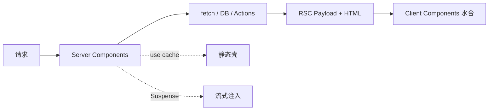
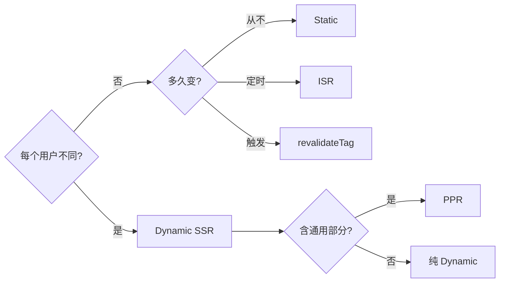

<div class="flex justify-center items-center gap-4">
  <logos:nextjs-icon class="text-7xl" />
</div>

<br/>

## Next.js：React 圈的元框架事实标准

Server Components + App Router + Cache Components，把 React 升级成全栈应用框架

<div @click="$slidev.nav.next" class="mt-12 py-1" hover:bg="white op-10">
  Press Space for next page <carbon:arrow-right />
</div>

<div class="abs-br m-6 text-xl">
  <a href="https://github.com/IllegalCreed/SlideStack" target="_blank" class="slidev-icon-btn">
    <carbon:logo-github />
  </a>
</div>

<!--
今天聊 Next.js 16。

Vercel 主导的 React 元框架，2025 年 10 月发布的 16 版本是又一个分水岭：
Turbopack 默认、Cache Components 出实验、middleware 改名 proxy、同步 cookies/headers/params 彻底移除。
全球用 React 做 SSR / SSG / RSC 的事实标准。
-->

---
transition: fade-out
---

# 什么是 Next.js？

Vercel 维护的 React 元框架，把 UI 库升级成「全栈应用框架」

<v-click>

- **App Router**：基于 React Server Components 的新一代文件路由（React 19.2 + Canary）
- **Server Components 默认**：组件默认在服务端跑，零 JS 抵达客户端
- **Server Actions**：表单 / 按钮直接调 `'use server'` 函数，自动 POST + revalidate
- **Cache Components**：`use cache` 指令 + 自动 PPR（Partial Prerendering）
- **Turbopack**：Rust 写的下一代 bundler，Next.js 16 起 dev / build 默认启用
- **零配置 TypeScript + ESLint Flat Config**：开箱即用
- **多端部署**：Node / Vercel / Docker / 静态导出，Adapter API 支持自定义平台
- **React Compiler**：1.0 稳定，自动 memo，告别手写 useMemo / useCallback

</v-click>

<br>

<div v-click text-xs>

_Read more about_ [_Next.js_](https://nextjs.org)

</div>

<style>
h1 {
  background-color: #000000;
  background-image: linear-gradient(45deg, #000000 10%, #666666 90%);
  background-size: 100%;
  -webkit-background-clip: text;
  -moz-background-clip: text;
  -webkit-text-fill-color: transparent;
  -moz-text-fill-color: transparent;
}
</style>

---
transition: slide-up
level: 2
---

# 定位与生态

Next.js 在 React 生态的位置 + 与原生 React / 其他元框架的关系

<v-clicks>

- **谁在用**：Netflix、TikTok、Twitch、Hulu、Notion、Linear 等顶级应用
- **背后团队**：Vercel 收购了 Next.js 创始团队，与 React 核心团队深度合作
- **React 特性首发地**：RSC / Server Actions / `use` API 等都先在 Next.js 中实装
- **不是 React 唯一选择**：还有 Remix（已合入 React Router v7）/ TanStack Start / Astro
- **学习路径**：React 基础 → 元框架基础 → App Router 范式 → Cache Components
- **适合做**：SaaS 全栈应用 / 内容站 / 电商 / 后台 / Dashboard 都覆盖
- **不适合**：纯静态简单博客（Astro 更轻）/ 极致包体积（Preact / Solid 更小）

</v-clicks>

---
transition: slide-up
---

# 版本里程碑

| 版本 | 时间 | 关键特性 |
|---|---|---|
| **1** | 2016.10 | Vercel（ZEIT）发布，文件路由 + SSR |
| **9** | 2019.7 | TypeScript、Dynamic Routes、API Routes |
| **12** | 2021.10 | SWC、Middleware、ESM、ISR |
| **13** | 2022.10 | **App Router** + Server Components（beta） |
| **14** | 2023.10 | Server Actions 稳定、Turbopack alpha |
| **15** | 2024.10 | React 19、async cookies/headers（兼容期）、ppr 实验 |
| **16** | 2025.10 | **Turbopack 默认 / Cache Components / proxy 改名 / async API 彻底切换** |

<v-click>

**今天主要讲 Next.js 16 + App Router**。Pages Router 仍维护但不再推新特性；新项目一律 App Router。

</v-click>

---
transition: slide-up
---

# 心智模型：一句话总结

**服务端组件默认 + 客户端组件按需 + 全套全栈能力开箱即用**



---
transition: slide-up
---

# 对比 Vue / Nuxt

| 维度 | Next.js 16 | Nuxt 4 |
|---|---|---|
| 默认组件 | Server Component | SSR Vue 组件 |
| 数据获取 | `await fetch` + `use cache` | `useFetch` + `routeRules` |
| 渲染 | Static / Dynamic / PPR | SSR / SSG / ISR / SWR |
| 自动导入 | 显式 import | 全自动 |

---
transition: slide-up
---

# App Router vs Pages Router

<v-clicks>

| 维度 | App Router (`app/`) | Pages Router (`pages/`) |
|---|---|---|
| 出现时间 | Next.js 13 (2022) | Next.js 1 (2016) |
| 默认渲染 | Server Components | Client Components |
| 数据获取 | `await fetch` 直接组件内 | `getStaticProps` / `getServerSideProps` |
| 布局 | 嵌套 `layout.js` | `_app.tsx` 一层 |
| API | Route Handlers (`route.ts`) | API Routes (`pages/api/`) |
| 流式 / Suspense | 原生 | 不支持 |
| React 版本 | 19+ Canary（含 RSC） | 自选 React 18+ |

新项目永远 App Router；旧项目可逐目录迁移（两者可共存）。

</v-clicks>

---
transition: slide-up
---

# Server Components：默认服务端

```tsx
// app/posts/page.tsx —— 默认是 Server Component
import { db } from '@/lib/db'

export default async function PostsPage() {
  const posts = await db.posts.findMany()  // 直接查库，不会暴露给客户端
  return (
    <ul>
      {posts.map(p => <li key={p.id}>{p.title}</li>)}
    </ul>
  )
}
```

<v-click>

**关键特性**：

- 组件本身是 `async function`，可以直接 `await`
- 访问数据库 / 文件系统 / API Key 等服务端资源
- 渲染结果以 **RSC Payload**（二进制流）返回，**零 JS** 抵达浏览器
- 比 SSR 更进一步：不止首屏，导航后 RSC Payload 仍走服务端

</v-click>

---
transition: slide-up
---

# Client Components：`'use client'` 边界

```tsx
'use client'  // ← 文件顶部声明
import { useState } from 'react'

export default function Counter() {
  const [count, setCount] = useState(0)
  return (
    <button onClick={() => setCount(c => c + 1)}>
      Count: {count}
    </button>
  )
}
```

<v-clicks>

**何时需要**：

- 状态 + 事件处理（`useState`、`onClick`、`onChange`）
- 生命周期 / 浏览器 API（`useEffect`、`localStorage`、`window`）
- 自定义 Hook 中含上述任一项

`'use client'` 是**模块图边界**：标记后该文件及其 import 的所有模块都进客户端 bundle。**不要在根布局加** —— 整树都会变 Client。

</v-clicks>

---
transition: slide-up
---

# Server + Client 组合范式

```tsx
// app/page.tsx —— Server Component
import LikeButton from './like-button'
import { getPost } from '@/lib/data'

export default async function Page() {
  const post = await getPost('1')              // 服务端拉数据
  return (
    <article>
      <h1>{post.title}</h1>
      <LikeButton likes={post.likes} />        {/* props 传给 Client */}
    </article>
  )
}
```

```tsx
// app/like-button.tsx
'use client'
import { useState } from 'react'

export default function LikeButton({ likes }: { likes: number }) {
  const [count, setCount] = useState(likes)
  return <button onClick={() => setCount(c => c + 1)}>♥ {count}</button>
}
```

<v-click>

**经验**：Server 拉数据 → props 传给 Client 做交互。Client 不能 import Server 模块（避免泄露 secret）。

</v-click>

---
transition: slide-up
---

# Server Actions：表单写入

```tsx
// app/actions.ts
'use server'
import { db } from '@/lib/db'
import { revalidatePath } from 'next/cache'

export async function createPost(formData: FormData) {
  const title = formData.get('title') as string
  await db.posts.create({ data: { title } })
  revalidatePath('/posts')   // 让 /posts 重新生成
}
```

```tsx
// app/new/page.tsx —— Server Component
import { createPost } from '../actions'

export default function NewPostPage() {
  return (
    <form action={createPost}>
      <input name="title" required />
      <button type="submit">Publish</button>
    </form>
  )
}
```

<v-click>

**特点**：底层走 POST 单次往返；progressive enhancement（JS 没加载也能提交）。

</v-click>

---
transition: slide-up
---

# App Router 文件约定

```
app/
├── layout.tsx          ← 共享布局（嵌套）
├── page.tsx            ← 路由 UI（/）
├── loading.tsx         ← Suspense fallback
├── error.tsx           ← Error Boundary（必须 'use client'）
├── not-found.tsx       ← 404 页面
├── template.tsx        ← 每次路由变化重新创建（不复用）
├── default.tsx         ← Parallel Routes 默认槽
├── route.ts            ← API 路由（替代 pages/api）
└── proxy.ts            ← 中间件（Next.js 16 起重命名）
```

<v-clicks>

- `layout.tsx`：包裹子路由，导航时**不重渲染**（保留状态）
- `loading.tsx`：自动包成 `<Suspense fallback={<Loading />}>`
- `error.tsx`：自动包成 ErrorBoundary，必须是 Client Component
- `route.ts`：HTTP Route Handler，导出 `GET` / `POST` / `PUT` / `DELETE`

</v-clicks>

---
transition: slide-up
---

# 路由形态：动态 / 通配 / 可选

```
app/
├── blog/
│   └── [slug]/page.tsx           → /blog/:slug 动态段
├── docs/
│   └── [...path]/page.tsx        → /docs/* catch-all
├── shop/
│   └── [[...filters]]/page.tsx   → /shop 和 /shop/a/b 可选 catch-all
├── (marketing)/                  → 路由分组（括号不进 URL）
│   ├── pricing/page.tsx          → /pricing
│   └── about/page.tsx            → /about
└── @modal/                       → Parallel Route（命名槽）
    └── default.tsx               → 必须显式提供（Next.js 16 起强制）
```

```tsx
// app/blog/[slug]/page.tsx —— Next.js 16 params 必须 async
export default async function Page({
  params,
}: {
  params: Promise<{ slug: string }>
}) {
  const { slug } = await params              // ← 必须 await
  return <h1>Post: {slug}</h1>
}
```

---
transition: slide-up
---

# Layout 嵌套机制

```tsx
// app/layout.tsx —— Root Layout（必须含 html + body）
export default function RootLayout({ children }) {
  return (
    <html lang="en">
      <body>
        <Header />
        {children}
        <Footer />
      </body>
    </html>
  )
}
```

<v-click>

**机制**：

- Root Layout 必须，包含 `<html>` 和 `<body>`
- 子 Layout（如 `app/dashboard/layout.tsx`）嵌套在父内，自动包裹 `children`
- **导航时只重渲染受影响段**，Layout 状态保留
- 多 Root Layout：用 Route Groups `(marketing)/layout.tsx` + `(dashboard)/layout.tsx`

</v-click>

---
transition: slide-up
---

# Parallel Routes + Intercepting Routes

**Parallel Routes（命名槽）**：同一布局并行渲染多个独立子树。

```
app/
├── @analytics/page.tsx       → 通过 slot prop 注入
├── @team/page.tsx
└── layout.tsx
```

```tsx
export default function Layout({ children, analytics, team }) {
  return <>{children} {analytics} {team}</>
}
```

<v-click>

**Intercepting Routes（拦截）**：在当前 layout 拦截目标路由（用于 Modal）。

```
app/
├── feed/
│   ├── (.)photo/[id]/page.tsx    → 拦截同层级 photo
│   └── page.tsx
└── photo/[id]/page.tsx           → 直接访问的目标
```

约定：`(.)`（同层）/ `(..)`（上层）/ `(...)`（根）。常见用法：相册列表点图开 Modal，URL 仍是 `/photo/123`，刷新 / 分享回退到独立页面。

</v-click>

---
transition: slide-up
---

# 数据获取：Server Components 内 await

```tsx
// app/blog/page.tsx —— 默认 fetch 不缓存（Next.js 15+）
export default async function BlogPage() {
  const res = await fetch('https://api.example.com/posts')
  const posts = await res.json()
  return <PostList posts={posts} />
}
```

<v-clicks>

**fetch 缓存策略**（Next.js 15+ 默认 no-cache）：

```ts
// 强制缓存（默认 SSG 行为）
fetch(url, { cache: 'force-cache' })

// 完全不缓存（每次新请求）
fetch(url, { cache: 'no-store' })

// 时间窗口缓存（ISR）
fetch(url, { next: { revalidate: 3600 } })

// 标签缓存（可主动失效）
fetch(url, { next: { tags: ['posts'] } })
```

> 💡 **重大变化**：Next.js 14 默认 `force-cache`，15 起默认 `no-cache`。升级要逐个 fetch 检查缓存策略。

</v-clicks>

---
transition: slide-up
---

# Cache Components：`use cache` 指令

```ts
// next.config.ts —— Next.js 16 启用
const nextConfig: NextConfig = { cacheComponents: true }
export default nextConfig
```

```tsx
// 函数级缓存
export async function getUsers() {
  'use cache'
  cacheLife('hours')
  return db.query('SELECT * FROM users')
}

// 组件级缓存
export default async function Page() {
  'use cache'
  cacheLife('hours')
  const users = await db.query('SELECT * FROM users')
  return <ul>{users.map(u => <li key={u.id}>{u.name}</li>)}</ul>
}
```

<v-click>

**关键特性**：参数 + 闭包变量自动成为 cache key；同输入返同结果；`cacheLife('seconds' | 'minutes' | 'hours' | 'days' | 'weeks' | 'max')` 控制 TTL。

</v-click>

---
transition: slide-up
---

# Revalidation：缓存刷新三方式

```ts
import { revalidatePath, revalidateTag, updateTag, refresh } from 'next/cache'

revalidatePath('/posts')                  // 1. 按路径失效
revalidatePath('/posts/[slug]', 'page')

revalidateTag('posts', 'max')             // 2. 按标签失效（Next.js 16 必须传第二参数）
updateTag('user-profile')                 // 3. read-your-writes 立即生效（Actions 限定）
refresh()                                 // 4. 刷新客户端 router
```

<v-clicks>

**何时用哪个**：

- `revalidatePath`：路由级精确失效，常用于 mutation 后
- `revalidateTag`：跨多路由共享的数据失效（如 `tags: ['posts']`），SWR 风格
- `updateTag`：用户改完立即看到新值（个人资料、设置）
- `refresh`：仅更新 router 状态，不动数据缓存

</v-clicks>

---
transition: slide-up
---

# Streaming + Suspense

```tsx
// app/dashboard/page.tsx
import { Suspense } from 'react'
import Posts from './posts'
import Stats from './stats'

export default function Dashboard() {
  return (
    <>
      <h1>Dashboard</h1>
      {/* 慢数据用 Suspense 包，先回 HTML 后流式补 */}
      <Suspense fallback={<p>Loading posts...</p>}>
        <Posts />
      </Suspense>
      <Suspense fallback={<p>Loading stats...</p>}>
        <Stats />
      </Suspense>
    </>
  )
}
```

<v-click>

**机制**：服务端开始渲染就开始流式 HTML；遇到 Suspense 边界就先发 fallback，等数据 resolve 再发真实内容。**用户体验**：先看到框架 → 数据陆续到位，避免「白屏 → 全屏」。

</v-click>

---
transition: slide-up
---

# Partial Prerendering (PPR)

```tsx
// 一个路由同时含静态壳 + 动态洞
import { Suspense } from 'react'
import { cookies } from 'next/headers'

export default function Page() {
  return (
    <>
      <Nav /> <Hero />            {/* 静态部分：构建时 prerender */}
      <Suspense fallback={<CartSkeleton />}>
        <Cart />                  {/* 动态洞：请求时流入 */}
      </Suspense>
    </>
  )
}

async function Cart() {
  const session = (await cookies()).get('session')?.value
  return <CartView items={await getCart(session)} />
}
```

<v-click>

**优势**：静态壳走 CDN 秒回；动态洞按需流入。**告别**「整页要么 SSG 要么 SSR」的二选一。Next.js 16 起通过 `cacheComponents: true` 启用（不再用 `experimental.ppr`）。

</v-click>

---
transition: slide-up
---

# 渲染策略决策树



---
transition: slide-up
---

# 渲染策略实战速记

- 内容站首页 / 文档 → **Static**
- 博客 / 产品列表（小时级新鲜度） → **ISR**
- 仪表盘 / 个人页 → **Dynamic**（或 PPR）
- 电商页（静态 SEO + 动态价格 / 购物车） → **PPR**

---
transition: slide-up
---

# Route Handlers：原生 Web API

```ts
// app/api/posts/route.ts
import { NextResponse } from 'next/server'

export async function GET() {
  return NextResponse.json(await db.posts.findMany())
}

export async function POST(request: Request) {
  const body = await request.json()
  const post = await db.posts.create({ data: body })
  return NextResponse.json(post, { status: 201 })
}
```

```ts
// app/api/posts/[id]/route.ts —— 动态段同样要 await params
export async function DELETE(_: Request, { params }: { params: Promise<{ id: string }> }) {
  const { id } = await params
  await db.posts.delete({ where: { id } })
  return new Response(null, { status: 204 })
}
```

<v-click>

支持的方法：`GET` / `HEAD` / `POST` / `PUT` / `DELETE` / `PATCH` / `OPTIONS`。OPTIONS 没定义时自动生成 Allow 头。

</v-click>

---
transition: slide-up
---

# proxy.ts：路由前置拦截

```ts
// proxy.ts （Next.js 16 起，旧名 middleware.ts）
import { NextResponse, type NextRequest } from 'next/server'

export function proxy(request: NextRequest) {
  const token = request.cookies.get('token')
  if (!token && request.nextUrl.pathname.startsWith('/admin')) {
    return NextResponse.redirect(new URL('/login', request.url))
  }
  const response = NextResponse.next()
  response.headers.set('x-custom', 'value')
  return response
}

export const config = { matcher: ['/admin/:path*', '/dashboard/:path*'] }
```

<v-clicks>

**Next.js 16 变化**：

- 文件名 `middleware.ts` → `proxy.ts`，函数名同步改
- **不再支持 Edge runtime**，固定 Node.js（旧 `middleware` 过渡期保留）
- 配置 `skipMiddlewareUrlNormalize` → `skipProxyUrlNormalize`

</v-clicks>

---
transition: slide-up
---

# 优化：next/image

```tsx
import Image from 'next/image'

export default function Hero() {
  return (
    <>
      {/* 自动 srcset + WebP / AVIF + lazy + LCP 提示 */}
      <Image src="/hero.jpg" alt="Hero" width={1200} height={600} priority />
      {/* 远程图：必须配 remotePatterns */}
      <Image src="https://cdn.example.com/photo.jpg" alt="" width={400} height={300} />
    </>
  )
}
```

```ts
// next.config.ts
const nextConfig = {
  images: {
    remotePatterns: [{ protocol: 'https', hostname: 'cdn.example.com' }],
    minimumCacheTTL: 14400,  // Next.js 16 默认从 60 改为 4h
  },
}
```

---
transition: slide-up
---

# 优化：next/font

```tsx
// app/layout.tsx —— Google Fonts 自托管（零运行时请求）
import { Inter, Roboto_Mono } from 'next/font/google'

const inter = Inter({ subsets: ['latin'], display: 'swap', variable: '--font-inter' })
const mono = Roboto_Mono({ subsets: ['latin'], variable: '--font-mono' })

export default function RootLayout({ children }) {
  return (
    <html className={`${inter.variable} ${mono.variable}`}>
      <body>{children}</body>
    </html>
  )
}
```

<v-click>

**特点**：构建期把字体下载本地 + 转 woff2 + 子集化，**零运行时第三方请求**（隐私 + 性能双赢）。本地字体用 `next/font/local`。

</v-click>

---
transition: slide-up
---

# Metadata API（SEO）

```tsx
// app/blog/[slug]/page.tsx
import type { Metadata } from 'next'

// 静态元数据
export const metadata: Metadata = { title: 'My Blog', description: 'Read the latest posts' }

// 动态元数据（基于 params 生成）
export async function generateMetadata(
  { params }: { params: Promise<{ slug: string }> },
): Promise<Metadata> {
  const { slug } = await params
  const post = await getPost(slug)
  return {
    title: post.title,
    description: post.excerpt,
    openGraph: { images: [post.cover] },
  }
}
```

<v-click>

**自动展开**：`openGraph` / `twitter` / `alternates.canonical` / `robots` 等全部类型友好。还有文件约定：`opengraph-image.tsx` / `twitter-image.tsx` / `icon.tsx` 在构建时生成图。

</v-click>

---
transition: slide-up
---

# 鉴权：Auth.js（NextAuth）

```ts
// auth.ts
import NextAuth from 'next-auth'
import GitHub from 'next-auth/providers/github'

export const { handlers, auth, signIn, signOut } = NextAuth({
  providers: [GitHub],
})
```

```ts
// app/api/auth/[...nextauth]/route.ts
export { GET, POST } from '@/handlers'
```

```tsx
// app/protected/page.tsx
import { auth } from '@/auth'
import { redirect } from 'next/navigation'

export default async function Page() {
  const session = await auth()
  if (!session) redirect('/login')
  return <p>Hello {session.user?.name}</p>
}
```

<v-click>

Auth.js v5（原 NextAuth）专为 App Router 重写：支持 RSC / Server Actions / Edge / 多 Provider。其它选择：Clerk（开箱即用付费）/ Lucia（轻量）/ Better Auth（新秀）。

</v-click>

---
transition: slide-up
---

# 部署目标对比

| 目标 | 配置 | 特性支持 |
|---|---|---|
| **Vercel** | 零配置 | 全（默认推荐）|
| **Node.js 自托管** | `next build` + `next start` | 全（VPS / K8s）|
| **Docker** | `output: 'standalone'` | 全（容器化）|
| **Static Export** | `output: 'export'` | **不含 SSR / Actions / ISR** |
| **Cloudflare / Netlify** | 平台适配器 | 多数（Edge CDN）|
| **Bun** | 官方验证适配器 | 多数（极速运行）|

```ts
// next.config.ts —— Docker 最小镜像
const nextConfig = { output: 'standalone' }   // 输出 .next/standalone/
```

---
transition: slide-up
---

# Turbopack：默认 bundler

```bash
# Next.js 15 时代：需手动开
next dev --turbopack
next build --turbopack

# Next.js 16 起：默认就是 Turbopack
next dev
next build
```

<v-clicks>

**特性**：

- Rust 实现，比 Webpack 快 **2-10x**（dev 启动 / HMR / build）
- 完全兼容 Next.js 全特性（RSC / Server Actions / PPR）
- 实验：`turbopackFileSystemCacheForDev: true` 磁盘缓存编译产物
- 仍有 Webpack config？build 会失败，需用 `next build --webpack` 退回
- Sass `@import '~bootstrap'` 不支持，需改成 `@import 'bootstrap'`

</v-clicks>

---
transition: slide-up
---

# React Compiler：自动 memo

```ts
// next.config.ts
const nextConfig = {
  reactCompiler: true,    // Next.js 16 起稳定（默认关闭）
}
```

```bash
pnpm add -D babel-plugin-react-compiler
```

<v-clicks>

**作用**：编译器自动分析组件依赖，**自动 memo** 组件 / 值 / 回调，让多数手写 `useMemo` / `useCallback` / `React.memo` 不再必要。

**代价**：

- 编译时间增加（依赖 Babel）
- 部分动态模式无法分析（Compiler 会跳过）
- Next.js 不默认启用，需观察构建性能

**何时启用**：性能瓶颈在 React re-render 时；新项目可直接开。

</v-clicks>

---
transition: slide-up
---

# Server Functions 完整示例

```tsx
// app/lib/actions.ts —— 文件级 use server
'use server'
import { auth } from '@/lib/auth'
import { revalidatePath, redirect } from 'next/cache'
export async function createPost(formData: FormData) {
  const session = await auth()
  if (!session?.user) throw new Error('Unauthorized')
  const title = formData.get('title') as string
  await db.posts.create({ data: { title, authorId: session.user.id } })
  revalidatePath('/posts')
  redirect('/posts')
}
```

```tsx
// app/new/form.tsx —— Client Component 调 Action
'use client'
import { useActionState } from 'react'
import { createPost } from '@/app/lib/actions'
export default function NewPostForm() {
  const [, action, pending] = useActionState(createPost, null)
  return <form action={action}>
    <input name="title" required />
    <button disabled={pending}>{pending ? '...' : 'Publish'}</button>
  </form>
}
```


---
transition: slide-up
---

# 错误处理：error.tsx + not-found.tsx

```tsx
// app/posts/error.tsx —— 必须 'use client'（要绑 reset）
'use client'

type Props = { error: Error & { digest?: string }; reset: () => void }

export default function Error({ error, reset }: Props) {
  return (
    <div>
      <h2>Something went wrong</h2>
      <p>{error.message}</p>
      <button onClick={() => reset()}>Try again</button>
    </div>
  )
}
```

```tsx
// app/posts/[slug]/page.tsx
import { notFound } from 'next/navigation'

export default async function PostPage({ params }) {
  const { slug } = await params
  const post = await getPost(slug)
  if (!post) notFound()    // 触发 not-found.tsx
  return <article>{post.title}</article>
}
```

---
transition: slide-up
---

# 环境变量

```bash
# .env.local（不进 git）
DATABASE_URL=postgres://...
NEXT_PUBLIC_API_URL=https://api.example.com
```

```ts
const dbUrl = process.env.DATABASE_URL                   // 服务端读
// 客户端读：必须 NEXT_PUBLIC_ 前缀
'use client'
const apiUrl = process.env.NEXT_PUBLIC_API_URL
```

<v-clicks>

- `NEXT_PUBLIC_*` 编译期注入客户端 bundle（**写死，无法运行时改**）；其它前缀仅服务端可见
- 想要**运行时**读环境变量？用 `connection()` 强制延迟到请求时：

```ts
import { connection } from 'next/server'
await connection()
const cfg = process.env.RUNTIME_CONFIG
```

- Next.js 16 移除 `serverRuntimeConfig` / `publicRuntimeConfig`，统一走 env

</v-clicks>

---
transition: slide-up
---

# 生态对比：Next vs Nuxt vs SvelteKit vs Astro

| 维度 | Next.js 16 | Nuxt 4 | SvelteKit 2 | Astro 5 |
|---|---|---|---|---|
| 基础 | React 19 | Vue 3 | Svelte 5 | 多框架 |
| 路由 | `app/` | `pages/` | `routes/` | `pages/` |
| 默认 | Server Components | SSR Vue | 同构 SSR | Islands |
| 渲染 | Static / Dynamic / PPR | SSR / SSG / ISR | SSR / SSG | 静态 + Islands |
| 数据 | `await fetch` + RSC | `useFetch` | `load()` | `getStaticPaths` |
| 学习曲线 | 高 | 中 | 低 | 低 |
| 招聘市场 | **最大** | 中 | 小 | 小 |

---
transition: slide-up
---

# 选型决策矩阵

| 场景 | 推荐 |
|---|---|
| **新建 SaaS / 后台 + 全栈 + 团队 React 熟** | **Next.js 16 App Router** |
| **新建 SaaS / 团队 Vue 熟** | Nuxt 4 |
| **博客 / 营销站 / 多框架混搭** | Astro 5 |
| **极致包体积 / DX 简洁** | SvelteKit 2 |
| **纯 SPA + 自建后端** | Vite + React + React Router v7 |
| **跨端（Web + Mobile）** | Next.js（Web） + Expo（Mobile）|

<v-click>

> 团队主语言决定 80%；Next.js 在 React 圈是工业标准。两个语言之间选 → 看招聘市场和现有栈。

</v-click>

---
transition: slide-up
---

# 常见踩坑（一）：缓存 / 异步 API

<v-clicks>

- **fetch 默认不缓存（Next.js 15+）** → 14 升 15 性能可能崩，逐个 fetch 加 `cache: 'force-cache'` 或 `next.revalidate`
- **`cookies()` / `headers()` / `params` 必须 await（Next.js 16）** → 同步用法彻底移除，用 codemod 自动迁移
- **`searchParams` 也是 Promise** → `const { q } = await searchParams`
- **`revalidateTag` 必须传第二参数（Next.js 16）** → `revalidateTag('posts', 'max')`
- **Cache Components 启用后 fetch 不再自动缓存** → 改用 `'use cache'` + `cacheLife()`
- **`middleware.ts` → `proxy.ts`** → 文件名 + 函数名 + 配置都改，codemod 可自动
- **proxy 不支持 Edge runtime** → 需要 Edge 继续用 `middleware.ts`（过渡期）

</v-clicks>

---
transition: slide-up
---

# 常见踩坑（二）：组件 / 水合

<v-clicks>

- **Hydration mismatch**：服务端和客户端首次渲染不一致（如用 `Date.now()` / `Math.random()` / `localStorage`）
  - **修法**：动态值放 `useEffect` 内 setState，或 `<Suspense>` + `connection()` 延迟到请求时
- **`'use client'` 放错位置**：放在根布局 → 整树进 bundle；放错叶子 → 服务端能力丢失
- **Client 组件不能 import Server-only 模块**：用 `import 'server-only'` 包内核工具阻止误用
- **Server Component 不能用 React Context**：必须 `'use client'` 包 Provider，最深处再消费
- **Server Actions 安全**：每个 Action 必须**自己**验证身份（直接 POST 也能调）
- **Parallel Routes `default.tsx` 强制（Next.js 16）**：所有命名槽都要显式 default，否则 build 失败
- **`<Image>` 远程域名**：必须配 `images.remotePatterns`（旧 `images.domains` 已废）

</v-clicks>

---
transition: slide-up
---

# 常见踩坑（三）：开发 / 部署

<v-clicks>

- **`output: 'export'` 限制大**：不支持 SSR / Server Actions / ISR / `<Image>` 优化器 / Route Handlers
  - 想要静态站又要少部分动态？考虑 Astro / VitePress
- **Vercel 之外部署 PPR**：需要平台支持流式响应（Cloudflare Workers / Node.js 默认 OK）
- **Docker 镜像太大**：用 `output: 'standalone'` + multi-stage build，最小可到 ~100MB
- **Webpack 自定义被 Turbopack 拒绝**：Next.js 16 默认 Turbopack，遇到 webpack config 会 build 失败
  - 临时方案：`next build --webpack` 退回；长期：迁移到 `turbopack.resolveAlias`
- **`next dev` 和 `next build` 并发跑（Next.js 16）**：dev 输出到 `.next/dev/`，build 到 `.next/`，互不打架
- **`process.env` 在 Edge 是 immutable**：需要运行时改？用 `connection()` 强制 dynamic

</v-clicks>

---
transition: slide-up
---

# Next.js 16 升级清单

```bash
# 1. 自动升级 + codemod 一把梭
pnpm dlx @next/codemod@canary upgrade latest
```

<v-clicks>

**codemod 能做**：

- 更新 `next.config`（`experimental.turbopack` → `turbopack`）
- `middleware.ts` → `proxy.ts`，函数名 / config flag 同步改
- `cookies()` / `headers()` / `params` 加 `await`
- 移除 `unstable_` 前缀 / `experimental_ppr` segment config / `next lint` 调用

**手动确认**：

- Node.js **≥ 20.9.0**（Node 18 不再支持） / TypeScript **≥ 5.1**
- 浏览器：Chrome 111+ / Edge 111+ / Firefox 111+ / Safari 16.4+
- 所有 Parallel Routes 加 `default.tsx`

</v-clicks>

---
transition: slide-up
---

# 性能优化清单

<v-clicks>

- **Server Components 默认**：能 Server 别 Client，减少 JS bundle
- **`'use client'` 推到叶子**：搜索框 / 按钮 Client，外层壳 Server
- **`<Image>` priority 标记 LCP 图**：避免 lazy load 影响首屏指标
- **`<Font>` 自托管**：消除字体 CDN 请求 + 改善 CLS
- **`use cache` + `cacheLife`**：复用昂贵计算
- **`generateStaticParams`**：动态路由构建时生成静态版
- **Suspense 拆慢请求**：先回 HTML 后流式补
- **Turbopack 默认开**：dev / build 双提速
- **React Compiler**：评估开启，自动 memo 省心
- **`output: 'standalone'`**：Docker 镜像瘦身
- **CDN 缓存层**：Vercel / Cloudflare 自动；自部署用 nginx + ETag

</v-clicks>

---
transition: slide-up
---

# 测试

```bash
# 推荐组合
pnpm add -D vitest @testing-library/react @testing-library/jest-dom jsdom
pnpm add -D @playwright/test
```

```ts
// vitest.config.ts
import { defineConfig } from 'vitest/config'
import react from '@vitejs/plugin-react'

export default defineConfig({
  plugins: [react()],
  test: { environment: 'jsdom' },
})
```

<v-clicks>

**层次划分**：

- **单元测试**：Vitest + Testing Library（组件、hooks、纯函数）
- **E2E**：Playwright（开发体验最好）/ Cypress（生态更老）
- **Server Components 测试**：仍不完善，主要靠 E2E 覆盖；社区有 `@testing-library/react-server`
- **Server Actions**：当普通函数测；mock 数据库即可
- **MSW**：mock 后端 API（v2 支持 RSC）

</v-clicks>

---
transition: slide-up
---

# 监控 + 可观测

```ts
// instrumentation.ts （项目根，跟 app/ 同级）
export async function register() {
  if (process.env.NEXT_RUNTIME === 'nodejs') {
    await import('./instrumentation-node')
  }
}

export async function onRequestError(err, request, context) {
  await fetch('https://logs.example.com/errors', {
    method: 'POST',
    body: JSON.stringify({ err, request, context }),
  })
}
```

```ts
// instrumentation-node.ts
import * as Sentry from '@sentry/nextjs'
Sentry.init({ dsn: process.env.SENTRY_DSN, tracesSampleRate: 1.0 })
```

<v-click>

**生态**：Sentry（最流行）/ Datadog / New Relic / OpenTelemetry（标准协议）。Vercel Analytics 集成 Web Vitals + Server timings 一键开。

</v-click>

---
transition: slide-up
---

# DevTools 工具链

<v-clicks>

- **Next.js DevTools**：Next.js 15+ 内置浏览器面板（路由 / 缓存 / 渲染指标）
- **next-devtools-mcp**：MCP 服务器，AI 助手能自动跑升级 + 迁移
- **React DevTools**：组件树 / props / state / Profiler
- **VS Code Next.js 扩展**：路由跳转 / 自动补全 / 文件模板
- **`next typegen`**：生成 `PageProps` / `LayoutProps` / `RouteContext` 类型
- **Turbopack tracing**：`pnpm next internal trace .next/dev/trace-turbopack` 性能剖析
- **Lighthouse / Vercel Analytics**：真实用户性能指标（Web Vitals）

</v-clicks>

---
transition: slide-up
---

# 何时不选 Next.js

<v-clicks>

- **团队全是 Vue / Angular / Svelte** → 用对应生态的元框架
- **纯静态简单博客 / 文档** → Astro / VitePress / Hugo 更轻
- **极致包体积要求** → Preact / Solid（运行时小一档）
- **复杂图形 / 游戏** → Vite + React + react-three-fiber，不需要 SSR
- **后台管理（不要 SEO）** → Vite + React 起手就行，省去 RSC 心智负担
- **强约定 + DI + 大型团队** → Angular 仍有市场（电信 / 银行）
- **依赖某个仅 Vue 的库** → 选 Nuxt
- **预算 / 部署平台限制（不能跑 Node）** → 看是否能用 `output: 'export'`

</v-clicks>

---
transition: slide-up
---

# 经验法则

<v-clicks>

- **App Router 一律优先**——新项目不要再用 Pages Router
- **Server Components 默认，Client 推到叶子**——bundle 越小越好
- **Server Actions + Cache Components**——告别手写 API + Redux，最现代范式
- **`<Image>` + `<Font>` 总是用**——开箱即用的性能优化，不用白不用
- **`generateMetadata` 写 SEO**——比 `useEffect` 改 title 强一万倍
- **`next typegen` 自动生成路由类型**——别手写 `params` 类型
- **rate-limit Server Actions**——直接 POST 也能调，必须加速率限制
- **`server-only` 包标注后端代码**——防止误 import 到 Client
- **Sentry 第一天就装**——RSC 错误栈不友好，必须监控
- **部署 Vercel 之外**——Docker `output: 'standalone'` 或验证适配器

</v-clicks>

---
transition: slide-up
---

# 学习路径

<v-clicks>

**第 1 周：基础**
- React 19 基础 → App Router 文件约定 → 第一个 Server Component
- 跟着 [Learn Next.js](https://nextjs.org/learn) 走一遍

**第 2 周：核心范式**
- Server vs Client Components 边界 → Server Actions → revalidate
- Suspense + Streaming → loading.tsx / error.tsx

**第 3 周：性能 / 部署**
- Cache Components + `use cache` + PPR → next/image / font → Metadata
- Vercel / Docker 部署

**第 4 周+：进阶**
- Auth.js v5 → TanStack Query → Prisma / Drizzle → Sentry → React Compiler

</v-clicks>

---
layout: center
class: text-center
---

# 总结

适合：React 项目要 SSR / RSC / Server Actions / 全栈一体化

不需要：纯 SPA 后台仪表盘 → Vite + React 更省心；纯静态站 → Astro 更合适

<div class="mt-8 text-2xl">
  <carbon:document /> <a href="https://nextjs.org/docs" target="_blank">nextjs.org/docs</a>
</div>

<div class="mt-4">
  <carbon:logo-github /> <a href="https://github.com/vercel/next.js" target="_blank">vercel/next.js</a>
</div>

<div class="mt-4">
  <carbon:play /> <a href="https://nextjs.org/learn" target="_blank">Learn Next.js</a>
</div>
