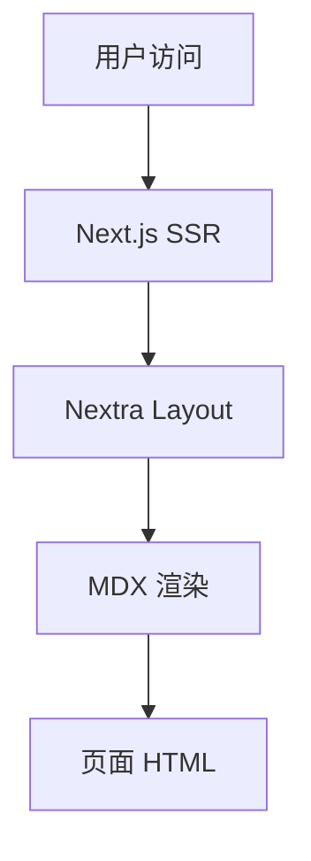

<div class="flex justify-center text-9xl">
  ▲
</div>

<br/>

## Nextra —— Next.js 文档框架

由 Vercel 团队 + Shu Ding 主导，SWR / Turborepo / ESLint Next / Million.js 同款（基于 v4.x）

<div @click="$slidev.nav.next" class="mt-12 py-1" hover:bg="white op-10">
  Press Space for next page <carbon:arrow-right />
</div>

<div class="abs-br m-6 text-xl">
  <a href="https://github.com/IllegalCreed/SlideStack" target="_blank" class="slidev-icon-btn">
    <carbon:logo-github />
  </a>
</div>

<!--
今天讲 Nextra —— Vercel 团队和 Shu Ding 主导的、基于 Next.js 的文档站框架。
4.x 是当下版本，全面拥抱 App Router + React 19 + RSC。
它最大的特点是「Next.js 原生」—— 如果你已经在 Next.js 生态里，
Nextra 是把文档站接进项目最自然的方式。
对标 VitePress —— 两者在各自生态都是「文档驱动型」站点的主流选择。
-->

---
transition: fade-out
---

# 什么是 Nextra？

Vercel 出品，Next.js 原生的「文档框架」

<v-click>

- **Next.js 原生**：跑在 App Router + React 19 + RSC，部署到 Vercel 一键完成
- **三大主题**：docs（多版本文档）/ blog（极简博客）/ custom（完全自定义）
- **MDX 3 一等公民**：Markdown 中直接 import React 组件，写 JSX 表达式
- **Pagefind 内置搜索**：零配置全文搜索，构建期生成索引，运行时零成本
- **自动 sidebar + ToC**：基于文件系统自动生成，`_meta.ts` 精细调整
- **i18n / RTL / dark mode / OG 卡片** 全套开箱即用

</v-click>

<br>

<div v-click>

```bash
pnpm create next-app -e https://github.com/shuding/nextra/tree/main/examples/docs
```

</div>

<div v-click text-xs>

_Read more about_ [_What is Nextra?_](https://nextra.site/docs)

</div>

<style>
h1 {
  background-color: #000000;
  background-image: linear-gradient(45deg, #000000 10%, #8b5cf6 90%);
  background-size: 100%;
  -webkit-background-clip: text;
  -moz-background-clip: text;
  -webkit-text-fill-color: transparent;
  -moz-text-fill-color: transparent;
}
</style>

<!--
[click] Nextra 不是通用 SSG —— 它建立在 Next.js 之上，专为「文档站」优化。
docs / blog / custom 三个主题覆盖了 90% 的内容站场景。
MDX 3 让 Markdown 中可以直接复用任意 React 组件；Pagefind 让搜索零成本零配置开箱即用。

[click] 安装方式：使用 Next.js 官方脚手架 + Nextra 的 example 模板，
一条命令生成完整可运行的项目。
-->

---
transition: fade-out
---

# Nextra 的定位与生态

Vercel 出品，对标 VitePress

<v-click>

| 维度 | Nextra 4 | VitePress 1 | Docusaurus 3 | Starlight | MkDocs |
| --- | --- | --- | --- | --- | --- |
| 渲染框架 | **Next.js 15 + RSC** | Vue 3 + Vite | React 18 + Webpack | Astro Island | Python + Jinja |
| 内容格式 | **MDX 3** | Markdown + Vue | MDX 3 | Markdown + MDX | Markdown |
| 搜索 | **Pagefind 内置** | MiniSearch 内置 | Algolia | Pagefind 内置 | 内置 |
| 多版本文档 | 第三方 | 第三方 | **✅ 一等公民** | 第三方 | mike 插件 |
| 部署目标 | **Vercel / 任意** | 任意 | 任意 | 任意 | 任意 |
| 典型用户 | SWR / Turborepo | Vue / Vite | React Native / Jest | Astro / Tauri | FastAPI |

</v-click>

<div v-click text-xs text-right>

_Read more about_ [_Nextra Showcase_](https://nextra.site/showcase)

</div>

<style>
h1 {
  background-color: #000000;
  background-image: linear-gradient(45deg, #000000 10%, #8b5cf6 90%);
  background-size: 100%;
  -webkit-background-clip: text;
  -moz-background-clip: text;
  -webkit-text-fill-color: transparent;
  -moz-text-fill-color: transparent;
}
</style>

<!--
[click] 五大主流文档框架对比 ——
Nextra 的护城河是「Next.js 原生」+ Vercel 一键部署 + Pagefind 零配置搜索。
代价是必须吃 Next.js 全家桶 —— React 19 + Webpack/Turbopack + Node 部署（除非走静态导出）。

选型逻辑：
- 已经在 Next.js 项目里 / 团队熟悉 React ⇒ Nextra
- 极简 / 极快构建 + Vue 生态 ⇒ VitePress
- 多版本文档 + 博客 + 企业级 ⇒ Docusaurus
- 零 JS 性能极致 ⇒ Starlight
-->

---
transition: fade-out
---

# 知名用户：Vercel 生态的官方文档框架

<v-click>

**Vercel 自家 / 核心生态**

- SWR / Turborepo / Million.js / Vercel AI SDK / Vercel Examples

**主流开源库**

- ESLint Next.js plugin / Reflex / tRPC（早期）/ Hyper / GraphQL.js（部分）
- Resend / Liveblocks / Refine / Hookform / Tanstack（部分子项目）

**企业产品文档**

- Vercel 自家 Product Docs / Cloudflare 部分页面 / Coinbase 部分

</v-click>

<div v-click>

> 💡 **观察**：选择 Nextra 的项目几乎都有共同特征 —— **本身就用 Next.js 或 React 技术栈** + 偏好 **Vercel 部署** + 想要 **MDX 3 + 零配置搜索** 一站式方案。

</div>

<div v-click text-xs text-right>

_Read more about_ [_Nextra Showcase_](https://nextra.site/showcase)

</div>

<style>
h1 {
  background-color: #000000;
  background-image: linear-gradient(45deg, #000000 10%, #8b5cf6 90%);
  background-size: 100%;
  -webkit-background-clip: text;
  -moz-background-clip: text;
  -webkit-text-fill-color: transparent;
  -moz-text-fill-color: transparent;
}
</style>

<!--
[click] Nextra 在 Next.js 生态地位类似 VitePress 在 Vue 生态。
Vercel 自家产品几乎全用它 —— SWR / Turborepo / Million.js / AI SDK 文档都跑在 Nextra 上。
外部主流开源项目也大量选择 Nextra，特别是已经用 Next.js 做主站的团队。

[click] 这些项目的共同特征非常清晰：
要么主站本身就用 Next.js（文档 + 主站共用 monorepo 中的 Next 配置最方便）
要么团队对 React + Vercel 部署有路径依赖。
对于纯文档诉求的小项目，VitePress / Starlight 可能更轻；
但 Nextra 在「文档 + 主站融合」场景下几乎没有对手。
-->

---
layout: two-cols-header
transition: fade-out
layoutClass: gap-x-16
---

# 创建项目

Node 18+，从官方 example 一键拉起

::left::

<v-click>

**推荐：从官方 example 创建**

```bash
# 拉取 docs 主题模板
pnpm create next-app -e \
  https://github.com/shuding/nextra/tree/main/examples/docs

# blog 主题模板
pnpm create next-app -e \
  https://github.com/shuding/nextra/tree/main/examples/blog
```

**启动 / 构建 / 预览**

```bash
cd my-docs
pnpm dev          # http://localhost:3000
pnpm build        # 输出 .next/
pnpm start        # 预览生产构建
```

</v-click>

::right::

<v-click>

**手动安装：现有 Next.js 项目**

```bash
pnpm add next react react-dom \
  nextra nextra-theme-docs
```

需要手动创建：

- `next.config.mjs`（接入 Nextra 插件）
- `mdx-components.tsx`（必需）
- `app/layout.tsx`（接入 Theme）
- `content/` 或 `src/content/` 放 MDX

**Nextra 4 仅支持 App Router**，Pages Router 用户请用 Nextra 3。

</v-click>

<style>
h1 {
  background-color: #000000;
  background-image: linear-gradient(45deg, #000000 10%, #8b5cf6 90%);
  background-size: 100%;
  -webkit-background-clip: text;
  -moz-background-clip: text;
  -webkit-text-fill-color: transparent;
  -moz-text-fill-color: transparent;
}
</style>

<!--
[click] 推荐路线 ——
通过 `create-next-app -e` 拉官方 example 仓库子目录，
省得手动配 next.config / mdx-components / app/layout 三件套。

docs 模板默认接 docs theme，blog 模板接 blog theme，开箱即用。

[click] 手动安装路线适合「现有 Next.js 项目想嵌入文档」的场景。
要注意 Nextra 4 是 App Router only —— Pages Router 用户必须留在 Nextra 3。
4.x 升级时这是最常踩的坑。
-->

---
transition: fade-out
---

# 项目结构

docs example 模板生成的标准目录

<v-click>

```text
my-docs/
├── app/                          # ⭐ App Router 入口
│   ├── layout.tsx                # 接入 Nextra Layout + Navbar + Footer
│   ├── [[...mdxPath]]/           # Nextra 提供的动态 catch-all 路由
│   │   └── page.jsx
│   └── _meta.global.ts           # （可选）集中式 _meta 配置
├── content/                      # 📚 MDX 内容根目录
│   ├── index.mdx
│   ├── _meta.ts                  # sidebar 配置
│   ├── guide/
│   │   ├── _meta.ts
│   │   ├── installation.mdx
│   │   └── configuration.mdx
│   └── advanced/
│       └── theming.mdx
├── public/                       # 📦 静态资源
├── mdx-components.tsx            # ⚙️ MDX 组件注册（必需）
├── next.config.mjs               # ⚙️ Nextra 插件配置
└── tsconfig.json
```

</v-click>

<div v-click text-xs text-right>

_Read more about_ [_File Conventions_](https://nextra.site/docs/file-conventions)

</div>

<style>
h1 {
  background-color: #000000;
  background-image: linear-gradient(45deg, #000000 10%, #8b5cf6 90%);
  background-size: 100%;
  -webkit-background-clip: text;
  -moz-background-clip: text;
  -webkit-text-fill-color: transparent;
  -moz-text-fill-color: transparent;
}
</style>

<!--
[click] Nextra 4 关键变化：
1. App Router only —— `app/layout.tsx` 接 Layout，`app/[[...mdxPath]]/page.jsx` 接 Nextra 提供的 catch-all 路由
2. 内容默认从 `content/` 读取（而不是 Nextra 3 的 `pages/`）
3. `mdx-components.tsx` 必需 —— 这是 MDX 3 + RSC 的硬性要求

四个文件能让一个空 Next.js 项目跑起文档：
mdx-components.tsx + next.config.mjs + app/layout.tsx + app/[[...mdxPath]]/page.jsx
后两个 example 模板已经准备好，新建项目几乎不需要改。
-->

---
transition: fade-out
---

# 核心配置 next.config.mjs

接入 Nextra 插件，所有特性从这里开关

<v-click>

```js {1|3-12|14-18|all}
import nextra from 'nextra'

// Nextra 插件配置（影响 MDX 编译）
const withNextra = nextra({
  // 默认 'content/'，可改成 'src/content/' 或别的
  contentDirBasePath: '/',
  // 启用 LaTeX / Mermaid / Pagefind 等可选特性
  latex: true,
  search: { codeblocks: true },
  // 关闭默认搜索：search: false
  defaultShowCopyCode: true,
})

// 正常的 Next.js 配置
export default withNextra({
  reactStrictMode: true,
  // 静态导出（部署到 GitHub Pages / Cloudflare 时需要）
  // output: 'export',
  // images: { unoptimized: true },
})
```

</v-click>

<div v-click>

`withNextra()` 是一个 **HOC（高阶函数）** —— 包裹 Next.js 配置对象，注入 MDX 编译 + 主题接入。

</div>

<style>
h1 {
  background-color: #000000;
  background-image: linear-gradient(45deg, #000000 10%, #8b5cf6 90%);
  background-size: 100%;
  -webkit-background-clip: text;
  -moz-background-clip: text;
  -webkit-text-fill-color: transparent;
  -moz-text-fill-color: transparent;
}
</style>

<!--
[click] 分三段看：
1. import nextra —— 拿到工厂函数
2. nextra({...}) —— 传 Nextra 专属配置（影响 MDX 编译 / 内置插件）
3. withNextra({...}) —— 把 Nextra 配置包裹到正常 Next.js 配置上输出

[click] 这个 HOC 设计很优雅 —— 把 Nextra 关心的（MDX / 搜索 / LaTeX）和
Next.js 关心的（reactStrictMode / output / images）分离，互不污染。

值得记的配置：
- contentDirBasePath：默认 '/'，文件 → URL 映射的根
- latex: true / search / defaultShowCopyCode 都是开箱即用开关
- output: 'export' + images.unoptimized: true：静态导出（部署 GitHub Pages）
-->

---
transition: fade-out
---

# mdx-components.tsx：MDX 组件中枢

Nextra 4 的硬性要求，主题样式 + 自定义组件都从这里走

<v-click>

```tsx
import { useMDXComponents as getThemeComponents } from 'nextra-theme-docs'

// 从所选 theme 拿默认 MDX 组件映射（Callout / Cards / Tabs ...）
const themeComponents = getThemeComponents()

// 暴露给 RSC 的 useMDXComponents Hook
export function useMDXComponents(components) {
  return {
    ...themeComponents,
    ...components,
    // 也可以覆盖原生标签
    h1: (props) => <h1 className="text-purple-600" {...props} />,
  }
}
```

</v-click>

<div v-click>

> 💡 **关键点**：Next.js 15 + RSC 下 MDX 渲染依赖 `useMDXComponents`，Nextra 通过它把 Theme 的样式注入到所有 MDX 页面，绕开手动 `MDXProvider`。

</div>

<div v-click>

**Turbopack 别名**：如果用 Turbopack 开发，需要在 `next.config.mjs` 里加 `turbopack.resolveAlias['next-mdx-import-source-file']`，指向这个文件。

</div>

<style>
h1 {
  background-color: #000000;
  background-image: linear-gradient(45deg, #000000 10%, #8b5cf6 90%);
  background-size: 100%;
  -webkit-background-clip: text;
  -moz-background-clip: text;
  -webkit-text-fill-color: transparent;
  -moz-text-fill-color: transparent;
}
</style>

<!--
[click] mdx-components.tsx 是 Nextra 4 最容易踩坑的「必需文件」——
没有这个文件 → 所有 MDX 页面只有原生 HTML，没有 Callout/Cards/Tabs 等内置组件样式。

模式很标准：
1. 从 theme 拿到默认 components 映射（getThemeComponents）
2. spread 后追加 / 覆盖
3. 用 useMDXComponents 名字 export 出来

[click] 为什么必需？因为 React 19 + RSC 模式下，
传统 `<MDXProvider>` 是 Client Component，不能在 Server Component 树里用。
useMDXComponents 是 next-mdx 团队的方案 —— 在编译期解析。

[click] Turbopack 别名是另一个坑 —— 如果只用 Webpack 没问题，
但 Next.js 15 默认开 Turbopack，需要显式告诉它 import source file 在哪。
-->

---
layout: two-cols-header
transition: fade-out
layoutClass: gap-x-16
---

# 三大主题对比

挑哪个，决定了项目骨架

::left::

<v-click>

**Docs Theme（最常用）**

- 内置 Navbar / Sidebar / ToC / Search
- 适合：API 文档、产品手册、SDK 文档

**Blog Theme（极简博客）**

- 列表 + 文章 + 标签 + RSS + 自动 og-image
- 复杂博客建议 Docs Theme + 手写列表

</v-click>

::right::

<v-click>

**Custom Theme（终极自由）**

- 从零拼装 Navbar / Sidebar / Layout
- 借助 `normalizePages()` + `getPageMap()` 拿站点结构

</v-click>

<div v-click>

| 维度 | docs | blog | custom |
| --- | --- | --- | --- |
| 开箱即用度 | ⭐⭐⭐⭐⭐ | ⭐⭐⭐⭐ | ⭐⭐ |
| 定制自由度 | ⭐⭐⭐ | ⭐⭐ | ⭐⭐⭐⭐⭐ |

</div>

<style>
h1 {
  background-color: #000000;
  background-image: linear-gradient(45deg, #000000 10%, #8b5cf6 90%);
  background-size: 100%;
  -webkit-background-clip: text;
  -moz-background-clip: text;
  -webkit-text-fill-color: transparent;
  -moz-text-fill-color: transparent;
}
</style>

<!--
[click] Docs Theme 是 90% 项目的最佳选择 ——
Vercel 团队主推、社区主推，文档 + 教程 + Showcase 全围绕它。
即使有定制需求，先在 Docs Theme 上 swizzle / 改 CSS 试试，
真不够再考虑 Custom。

Blog Theme 是「极简博客 ≈ 静态 RSS 站」场景 ——
不要把它和 Docusaurus blog 比，能力差距很大。
有较复杂博客诉求 → 用 Docs Theme + 自己写列表页路由。

[click] Custom Theme 实际上是「Next.js 项目 + Nextra Compiler」——
只用 Nextra 的 MDX 编译能力，不用任何 UI。
适合品牌强诉求、想做主站 + 文档融合的团队（Vercel 自家产品页就是这种模式）。

[click] 决策矩阵：
- 起步 / API 文档 → Docs（毫不犹豫）
- 单人技术博客 → Blog（够用就行）
- 品牌站 / 主站融合 → Custom（贵但值）
-->

---
transition: fade-out
---

# app/layout.tsx：接入 Docs Theme

整个站点的骨架，Navbar / Footer / Banner 都在这里

<v-click>

```tsx {1-3|5-7|9-22|all}
import { Footer, Layout, Navbar } from 'nextra-theme-docs'
import { Banner, Head } from 'nextra/components'
import { getPageMap } from 'nextra/page-map'

const banner = <Banner storageKey="v4-release">🎉 v4.0 上线</Banner>
const navbar = <Navbar logo={<b>MyDocs</b>} projectLink="https://github.com/x/y" />
const footer = <Footer>MIT © MyDocs.</Footer>

export default async function RootLayout({ children }) {
  return (
    <html lang="zh-CN" dir="ltr" suppressHydrationWarning>
      <Head />
      <body>
        <Layout banner={banner} navbar={navbar} footer={footer}
          pageMap={await getPageMap()}
          docsRepositoryBase="https://github.com/x/y/tree/main">
          {children}
        </Layout>
      </body>
    </html>
  )
}
```

</v-click>

<style>
h1 {
  background-color: #000000;
  background-image: linear-gradient(45deg, #000000 10%, #8b5cf6 90%);
  background-size: 100%;
  -webkit-background-clip: text;
  -moz-background-clip: text;
  -webkit-text-fill-color: transparent;
  -moz-text-fill-color: transparent;
}
</style>

<!--
[click] 分三段：
1. import —— Layout / Navbar / Footer 从 nextra-theme-docs；Banner / Head 是通用组件；getPageMap 是关键 helper
2. 站点元数据 + 三块 React Element —— banner / navbar / footer 都用 JSX 创建后透传给 Layout
3. RootLayout —— 异步 Server Component，await getPageMap() 拿到完整文件结构

注意几个点：
- async 函数 + Server Component —— 因为 getPageMap 是异步的
- suppressHydrationWarning —— Theme 支持 darkmode 自动切换，hydration mismatch 必须屏蔽
- docsRepositoryBase —— 文档页底部「Edit this page on GitHub」链接的根
-->

---
transition: fade-out
---

# `_meta.ts`：sidebar 与导航中枢

每个目录一个，控制顺序 / 显示名 / 子配置

<v-click>

```ts
// content/_meta.ts —— 根目录
export default {
  index: '介绍',
  guide: '指南',
  advanced: '进阶',
  '###': { type: 'separator', title: '更多' },
  showcase: { title: '案例', type: 'page' },
  github: { title: 'GitHub', href: 'https://github.com/x/y' },
  legal: { display: 'hidden' },  // 不出现在 sidebar
}
```

</v-click>

<div v-click>

```ts
// content/guide/_meta.ts —— guide 子目录
export default {
  installation: '安装',
  configuration: {
    title: '配置',
    theme: { toc: false, sidebar: false, layout: 'full' },  // 单页特殊样式
  },
  '*': { theme: { breadcrumb: true } },  // 通配符默认值
}
```

</div>

<div v-click>

> 💡 **类型支持**：项目根放一个 `_meta.global.ts` 可以集中所有 sidebar 配置，避免分散到每个目录。

</div>

<style>
h1 {
  background-color: #000000;
  background-image: linear-gradient(45deg, #000000 10%, #8b5cf6 90%);
  background-size: 100%;
  -webkit-background-clip: text;
  -moz-background-clip: text;
  -webkit-text-fill-color: transparent;
  -moz-text-fill-color: transparent;
}
</style>

<!--
[click] _meta.ts 控制：
- 文件出现顺序（对象 key 顺序就是 sidebar 顺序）
- 显示名（string 简写，或 { title } 对象）
- 类型（page / menu / separator / hidden）
- 外链（href）
- 子页面的 theme 覆盖（toc / sidebar / layout / breadcrumb）

[click] 几个高级玩法：
- `'###'` 这种字符串 key + `type: 'separator'` —— sidebar 分组标题
- `type: 'page'` —— 出现在 navbar 顶部而不是 sidebar
- `theme: { layout: 'full' }` —— 单页无 sidebar 全宽布局
- `'*'` 通配符 —— 给该目录所有未列出的页面设默认值
- `display: 'hidden'` —— 不出现在 sidebar 但 URL 可达

[click] _meta.global.ts 是 Nextra 4 新增的「集中模式」——
所有 _meta 配置合并到一个文件，对大型项目更易维护，但失去就近性。
两种模式按团队偏好选。
-->

---
transition: fade-out
---

# MDX 3：Markdown 中的 React 表达力

import / export / JSX 表达式 全员上场

<v-click>

```mdx
---
title: MDX 示例
---
import { Callout, Steps, Tabs } from 'nextra/components'
import { HelloComponent } from '@/components/Hello'

export const version = '4.0'

# MDX 完整能力

当前版本：{version}
<HelloComponent name="Nextra" />

<Tabs items={['pnpm', 'npm', 'yarn']}>
  <Tabs.Tab>pnpm add nextra nextra-theme-docs</Tabs.Tab>
  <Tabs.Tab>npm i nextra nextra-theme-docs</Tabs.Tab>
</Tabs>
```

</v-click>

<div v-click>

> ⚠️ **MDX 3 严格规则**：`{` 字符会被识别为 JSX 表达式开始。要显示字面大括号请用 `&#123;` 转义或代码块包裹。

</div>

<div v-click text-xs text-right>

_Read more about_ [_MDX_](https://nextra.site/docs/guide/markdown)

</div>

<style>
h1 {
  background-color: #000000;
  background-image: linear-gradient(45deg, #000000 10%, #8b5cf6 90%);
  background-size: 100%;
  -webkit-background-clip: text;
  -moz-background-clip: text;
  -webkit-text-fill-color: transparent;
  -moz-text-fill-color: transparent;
}
</style>

<!--
[click] MDX 3 是 Nextra 4 的核心 ——
内容文件统一 .mdx 扩展名（虽然 .md 也支持，但失去 JSX 能力）。
能 import 任意 React 组件（包括 Server Components 和 Client Components），
能 export 局部变量在文中插值。

`@/components/Hello` 用 Next.js 的路径别名（tsconfig paths）—— 推荐做法。

[click] MDX 3 升级严格性是常见坑 ——
v2 中合法的 `{ key: value }` 字面 JSON 在 v3 会被识别为 JSX 表达式开始。
解决：用 HTML 实体 `&#123;` 转义、放反引号包裹、或者放代码块。
-->

---
layout: two-cols-header
transition: fade-out
layoutClass: gap-x-16
---

# 内置组件：Callout / Cards / Steps

零导入烦恼，主题样式自带

::left::

<v-click>

**Callout（提示框）**

```mdx
import { Callout } from 'nextra/components'

<Callout type="info">普通提示</Callout>
<Callout type="warning">警告</Callout>
<Callout type="error">错误</Callout>
<Callout type="important">重要</Callout>
<Callout type="info" emoji="⭐">自定义 emoji</Callout>
```

**Steps（分步说明）**

```mdx
import { Steps } from 'nextra/components'

<Steps>
### 第 1 步
内容
### 第 2 步
内容
</Steps>
```

</v-click>

::right::

<v-click>

**Cards（卡片导航）**

```mdx
import { Cards } from 'nextra/components'
import { GearIcon, BookIcon } from '@/icons'

<Cards num={2}>
  <Cards.Card
    icon={<BookIcon />}
    title="快速开始"
    href="/guide/install"
  />
  <Cards.Card
    icon={<GearIcon />}
    title="高级配置"
    href="/advanced/config"
  />
</Cards>
```

`num` 控制列数，默认 3。

</v-click>

<style>
h1 {
  background-color: #000000;
  background-image: linear-gradient(45deg, #000000 10%, #8b5cf6 90%);
  background-size: 100%;
  -webkit-background-clip: text;
  -moz-background-clip: text;
  -webkit-text-fill-color: transparent;
  -moz-text-fill-color: transparent;
}
</style>

<!--
[click] 三个最常用的「文档专用」组件：
- Callout：5 种 type（default / info / warning / error / important）+ emoji 自定义
- Steps：把 h3-h6 标题序列变成可视化「分步流程」，技术文档必备
- 注意 Steps 里的标题会进入 ToC，如不想进入用纯 HTML `h3` 标签代替

[click] Cards 是 Nextra 的「招牌组件」——
导航页 / 首页几乎都用它做入口卡片。
`icon` 接 React node（推荐放 SVG icon），title + href 是必需。
`num` 控列数，响应式自动 fallback。

这些组件都从 `nextra/components` 导出，不依赖 theme，
所以即使你用 custom theme 也能用。
-->

---
layout: two-cols-header
transition: fade-out
layoutClass: gap-x-16
---

# 内置组件：Tabs / FileTree / Bleed

代码示例、目录结构、宽屏图都覆盖了

::left::

<v-click>

**Tabs（代码示例多选）**

```mdx
import { Tabs } from 'nextra/components'

<Tabs items={['pnpm', 'npm', 'yarn']} defaultIndex={0}>
  <Tabs.Tab>pnpm add nextra</Tabs.Tab>
  <Tabs.Tab>npm i nextra</Tabs.Tab>
  <Tabs.Tab>yarn add nextra</Tabs.Tab>
</Tabs>
```

props：

- `items`：标签数组
- `defaultIndex`：初始 tab
- `storageKey`：跨页面同步选中

</v-click>

::right::

<v-click>

**FileTree（目录可视化）**

```mdx
import { FileTree } from 'nextra/components'

<FileTree>
  <FileTree.Folder name="content" defaultOpen>
    <FileTree.File name="_meta.ts" />
    <FileTree.File name="index.mdx" />
    <FileTree.Folder name="guide">
      <FileTree.File name="install.mdx" />
    </FileTree.Folder>
  </FileTree.Folder>
</FileTree>
```

**Bleed（宽屏溢出）**

```mdx
<Bleed full>
  
</Bleed>
```

</v-click>

<style>
h1 {
  background-color: #000000;
  background-image: linear-gradient(45deg, #000000 10%, #8b5cf6 90%);
  background-size: 100%;
  -webkit-background-clip: text;
  -moz-background-clip: text;
  -webkit-text-fill-color: transparent;
  -moz-text-fill-color: transparent;
}
</style>

<!--
[click] Tabs 的 storageKey 很有用 ——
全站「包管理器选择」用同一个 storageKey 后，
用户在某个页面选了 pnpm，跳到其他页面也是 pnpm，体验大幅提升。
默认 localStorage 持久化。

[click] FileTree 在解释项目结构时不可替代 ——
比纯文本树状图美观、可折叠、有 hover 反馈。
defaultOpen 控制是否默认展开。

Bleed 在文档里放宽屏图、视频嵌入很好用 ——
`<Bleed full>` 让内容铺满视口宽度（突破默认的内容栏宽度）。
对架构图 / 流程图特别有用。
-->

---
transition: fade-out
---

# Pagefind：零配置全文搜索

构建期生成索引，运行时纯静态

<v-click>

```json
// package.json
{
  "scripts": { "build": "next build && pagefind --site .next/server/app" },
  "devDependencies": { "pagefind": "^1.4.0" }
}
```

</v-click>

<div v-click>

**工作机制**：`next build` 完成后 `pagefind` 扫描产物 HTML → 生成 `_pagefind/` 目录 → Nextra Theme 自动调用提供搜索 UI。

**特点**：完全本地化 / 多语言分词内置 / 按需懒加载（1MB 站点典型索引 ~50KB）/ 过滤代码块用 `search: { codeblocks: false }`。

> 💡 **替代方案**：[Algolia DocSearch](https://docsearch.algolia.com/) 免费给开源项目、跨语言更强，但要走外部服务。

</div>

<style>
h1 {
  background-color: #000000;
  background-image: linear-gradient(45deg, #000000 10%, #8b5cf6 90%);
  background-size: 100%;
  -webkit-background-clip: text;
  -moz-background-clip: text;
  -webkit-text-fill-color: transparent;
  -moz-text-fill-color: transparent;
}
</style>

<!--
[click] Pagefind 是 CloudCannon 团队的开源全文搜索 ——
跟 VitePress 集成的是 MiniSearch，但 Nextra 选了 Pagefind。
本质区别：MiniSearch 是运行时索引（每次访问都加载完整索引），
Pagefind 是按需切片（搜啥加载啥），适合大型文档站。

[click] 集成只要两步：
1. 安装 pagefind devDep
2. 在 build script 后跟一次 pagefind 命令

Nextra Theme 已经把搜索 UI（Ctrl+K 弹窗）做好了，自动调用 `_pagefind/`。

[click] 替代方案 Algolia DocSearch ——
开源项目免费、跨语言更强、生态成熟，
但要外部依赖 + 申请 + 提交站点验证。
中小项目 Pagefind 完全够用；超大型站（如 Vue / React 主站）可以考虑 DocSearch。
-->

---
transition: fade-out
---

# i18n 国际化

Next.js i18n + Nextra theme 双层联动

<v-click>

**Step 1 + 2：声明 locale + Layout 传配置**

```js
// next.config.mjs
export default withNextra({
  i18n: { locales: ['zh', 'en', 'de'], defaultLocale: 'zh' },
})
```

```tsx
// app/layout.tsx
<Layout i18n={[
  { locale: 'zh', name: '简体中文' },
  { locale: 'en', name: 'English' },
]} ...其他 props />
```

</v-click>

<div v-click>

**Step 3：按 locale 拆 content/zh/、content/en/ 子目录** —— URL 自动带 locale 前缀。

> ⚠️ **静态导出限制**：`output: 'export'` 模式下中间件失效，无法自动检测浏览器语言重定向。

</div>

<style>
h1 {
  background-color: #000000;
  background-image: linear-gradient(45deg, #000000 10%, #8b5cf6 90%);
  background-size: 100%;
  -webkit-background-clip: text;
  -moz-background-clip: text;
  -webkit-text-fill-color: transparent;
  -moz-text-fill-color: transparent;
}
</style>

<!--
[click] 三步走：
1. next.config.mjs 声明所有 locale 和默认 locale
2. Layout 接到 i18n 数组（带显示名）—— Navbar 会自动出现语言切换下拉
3. content/ 按 locale 拆子目录，URL 自动带 locale 前缀

RTL 支持：locale 加 `direction: 'rtl'` 字段，比如阿拉伯语。

[click] 重要限制 ——
Nextra 的自动 locale 检测（`nextra/locales` middleware）依赖 Next.js 中间件，
而中间件在 `output: 'export'` 模式下不可用。
所以静态部署的多语言站只能用 URL 手动切换 + 浏览器 localStorage 记忆。

如果一定要自动检测，必须用 Vercel / Node server 部署。
-->

---
transition: fade-out
---

# Theme 定制

Swizzle / CSS Variables / 子组件传参 三件套

<v-click>

**1. CSS Variables（最轻）**

```css
:root { --x-color-primary-600: oklch(0.62 0.2 285); }
html.dark { --x-color-primary-600: oklch(0.7 0.2 285); }
```

</v-click>

<div v-click>

**2. Navbar / Footer 自定义（中等）**

```tsx
const navbar = <Navbar logo={<MyLogo />} projectLink="..."
  chatLink="https://discord.gg/xxx" align="left" chatIcon={<DiscordIcon />} />
```

</div>

<div v-click>

**3. 完全 Swizzle（重，转 Custom Theme）** —— 从 `nextra/components` import 原子组件（`Anchor` / `normalizePages` 等），自己拼装 Layout。

</div>

<style>
h1 {
  background-color: #000000;
  background-image: linear-gradient(45deg, #000000 10%, #8b5cf6 90%);
  background-size: 100%;
  -webkit-background-clip: text;
  -moz-background-clip: text;
  -webkit-text-fill-color: transparent;
  -moz-text-fill-color: transparent;
}
</style>

<!--
[click] 三级定制路线 ——
轻：改 CSS 变量（primary 色、字体、间距），改完即生效
中：给 Navbar / Footer 传 React node prop（logo / chatLink / align）
重：Swizzle 不存在（不像 Docusaurus），需要直接转 Custom Theme

CSS 变量是 Nextra 暴露的「设计 token」——
`--x-color-primary-*` / `--x-color-gray-*` / `--x-color-fg` / `--x-color-bg`
全套覆盖明暗主题，改一处全站生效。

[click] 中等定制：Navbar / Footer 都接 React node（不是字符串），
可以塞任意自定义 UI（自家 Logo / 自家组件 / 自家链接）。

[click] 重度定制必须切到 Custom Theme ——
Nextra 没有 Docusaurus 的 swizzle 机制（partial wrap / eject），
要么用 docs theme 原样 + CSS 变量调，要么完全自己写 Layout。
转 Custom 后失去自动接收 Theme 更新的好处，是个权衡。
-->

---
transition: fade-out
---

# Syntax Highlighting（Shiki）

构建期高亮，零运行时成本

<v-click>

````mdx
```ts {3-5} filename="next.config.mjs" showLineNumbers copy
import nextra from 'nextra'
const withNextra = nextra({ latex: true })
export default withNextra()
```
````

</v-click>

<div v-click>

**可用属性**：`filename` / `showLineNumbers` / `copy` / `{3-5}` 行高亮 / `/foo/` 子串高亮 / `theme="github-dark"`。

**全局配置** —— `nextra({ defaultShowCopyCode: true })` 让全站代码块默认带复制按钮。

</div>

<style>
h1 {
  background-color: #000000;
  background-image: linear-gradient(45deg, #000000 10%, #8b5cf6 90%);
  background-size: 100%;
  -webkit-background-clip: text;
  -moz-background-clip: text;
  -webkit-text-fill-color: transparent;
  -moz-text-fill-color: transparent;
}
</style>

<!--
[click] Nextra 用 Shiki —— 跟 VitePress / Astro 一样 ——
构建期编译 token 到 HTML span，运行时 0 JS、0 闪烁。
代价是不支持运行时切换主题（要明暗双色板需要 Shiki Twoslash 或 双色板 transform）。

代码块 fence 后跟元数据：
- 反引号语言名后空格 → 跟属性，类似 HTML attribute
- `{3-5,8}` 多区间高亮
- `/pattern/` 高亮匹配文本

[click] 文档常用 4 属性：
- `filename` —— 标题栏文件路径，给读者「这是哪个文件的代码」上下文
- `showLineNumbers` —— 教程 + 行号引用必备
- `copy` —— 命令行 / 复制粘贴场景必备
- `{...}` —— 重点标注

[click] 全局 `defaultShowCopyCode: true` 是「博客或教程项目」常用配置 ——
所有代码块默认显示复制按钮，省得每个 fence 都写 copy。

进阶：Twoslash（hover 看类型提示）是 Nextra 新增能力，
在 advanced/twoslash 文档里。
-->

---
layout: two-cols-header
transition: fade-out
layoutClass: gap-x-16
---

# LaTeX 与 Mermaid

文档常见的两类图表都内置

::left::

<v-click>

**LaTeX（数学公式）**

```js
// next.config.mjs
nextra({ latex: true })
```

```tsx
// app/layout.tsx
import 'katex/dist/katex.min.css'
```

```md
内联：$E = mc^2$

块级：

$$
x = \frac{-b \pm \sqrt{b^2 - 4ac}}{2a}
$$
```

默认 KaTeX，可切 `latex: { renderer: 'mathjax' }`。

</v-click>

::right::

<v-click>

**Mermaid（流程图）**

无需配置，直接写代码块：

````md

````

支持的图表类型：

- graph / flowchart
- sequenceDiagram
- gantt / pie / journey
- mindmap / timeline

</v-click>

<style>
h1 {
  background-color: #000000;
  background-image: linear-gradient(45deg, #000000 10%, #8b5cf6 90%);
  background-size: 100%;
  -webkit-background-clip: text;
  -moz-background-clip: text;
  -webkit-text-fill-color: transparent;
  -moz-text-fill-color: transparent;
}
</style>

<!--
[click] LaTeX 两步开：
1. next.config.mjs 加 `latex: true`
2. layout.tsx 导入 katex.min.css（必须，否则只能看到原始 LaTeX）

默认 KaTeX —— 构建期预渲染，无闪烁。
切 MathJax 适合需要更好无障碍（屏幕阅读器友好）的场景，但运行时渲染、稍慢。

[click] Mermaid 是「真·零配置」——
不用改 next.config，直接写 ```mermaid 代码块即可。
Nextra 用 @theguild/remark-mermaid 自动替换为 `<Mermaid>` 组件。

文档常用 4 种：
- graph/flowchart：架构图、流程图
- sequenceDiagram：API 时序
- gantt：项目排期
- mindmap：知识结构

注意：Mermaid 是运行时渲染（JS 包大几十 KB），简单图能用静态 SVG 替代时优先静态。
-->

---
transition: fade-out
---

# SEO 与 OG 卡片

Next.js Metadata API + Nextra Head

<v-click>

**MDX frontmatter 自动转 metadata**（title / description 等字段自动映射到 head）

```mdx
---
title: Nextra 入门
description: 5 分钟搭建一个 Nextra 文档站
---
```

</v-click>

<div v-click>

**Layout 级 metadata + 动态 OG Image**

```tsx
// app/layout.tsx
export const metadata = {
  title: { default: 'My Docs', template: '%s — My Docs' }, // 子页自动拼接
  openGraph: { images: '/og.png', type: 'website' },
  twitter: { card: 'summary_large_image' },
}

// app/opengraph-image.tsx —— 动态 OG，导出返回 ImageResponse 的函数
```

</div>

<style>
h1 {
  background-color: #000000;
  background-image: linear-gradient(45deg, #000000 10%, #8b5cf6 90%);
  background-size: 100%;
  -webkit-background-clip: text;
  -moz-background-clip: text;
  -webkit-text-fill-color: transparent;
  -moz-text-fill-color: transparent;
}
</style>

<!--
[click] Nextra 4 的 SEO 完全跟 Next.js 15 Metadata API 对齐 ——
MDX frontmatter（title / description / keywords / ...）
会被 Nextra 自动注入 generateMetadata，
不需要手写。

[click] Layout 级 metadata 是「站点级默认值」——
title.template `'%s — My Docs'` 让所有子页自动拼接「子标题 — 站点名」
openGraph + twitter 一次配置全站生效。

[click] 动态 OG image 是 Next.js 15 标准用法 ——
`app/opengraph-image.tsx` 文件名约定，导出一个返回 ImageResponse 的函数，
Next.js 自动按路由生成对应的 OG 图。
Vercel 的 ImageResponse API 支持 JSX + CSS subset 渲染 PNG。

对比 Docusaurus：那边要 docusaurus-plugin-image-zoom + 手写 OG plugin；
Nextra + Next.js 这套体系上要简洁得多。
-->

---
transition: fade-out
---

# App Router（v4 主推）

Pages Router 用户怎么升？

<v-click>

**Nextra 3 → 4 的关键变化**

| 维度 | Nextra 3 | Nextra 4 |
| --- | --- | --- |
| 路由 | Pages Router | **App Router only** |
| 内容根 | `pages/` | `content/` |
| MDX 组件 | `_app.tsx` 注册 | `mdx-components.tsx` 注册 |
| theme.config | `theme.config.jsx` | `app/layout.tsx` + props |

</v-click>

<div v-click>

**迁移步骤**：升级 deps → `mv pages content` → 删 `theme.config.jsx`，配置搬到 `app/layout.tsx` → 新建 `app/[[...mdxPath]]/page.jsx`。

> 💡 Nextra 3 仍在维护安全更新，不强制升级；新特性（Pagefind 集成、RSC 优化）只进 4.x。

</div>

<style>
h1 {
  background-color: #000000;
  background-image: linear-gradient(45deg, #000000 10%, #8b5cf6 90%);
  background-size: 100%;
  -webkit-background-clip: text;
  -moz-background-clip: text;
  -webkit-text-fill-color: transparent;
  -moz-text-fill-color: transparent;
}
</style>

<!--
[click] Nextra 4 是 breaking change 大版本 ——
官方明确「Nextra 4 只支持 App Router」，Pages Router 用户不能升。

最大三个变化：
1. 内容目录从 pages/ 改名 content/ —— 跟 Next.js App Router 的 app/ 区分
2. MDX 组件注册从 _app.tsx 改到 mdx-components.tsx（next-mdx 标准模式）
3. theme.config.jsx 全死，所有配置进 app/layout.tsx 作为 Layout 的 props

[click] 迁移核心是「把 pages/ 改 content/ + 重写 layout」——
mv 一下就能搬完文件，然后照 docs example 重写 app/layout.tsx 即可。
typing 全程类型提示，错了 IDE 立刻报红。

[click] Nextra 3 还在维护 ——
项目没必要紧急升级 4。除非：
- 想用 RSC / Next.js 15 新特性
- 想用最新 Pagefind 集成
- 想用 _meta.global.ts 集中配置
否则留在 3 也没问题。
-->

---
transition: fade-out
---

# 部署：Vercel / Cloudflare / GitHub Pages

三种主流路线

<v-click>

**1. Vercel（一键，推荐）** —— `pnpm dlx vercel deploy` 或 GitHub repo 接入 Dashboard，ISR / Edge / RSC 全开。

</v-click>

<div v-click>

**2. Cloudflare Pages（静态导出）**

```js
// next.config.mjs
export default withNextra({ output: 'export', images: { unoptimized: true } })
```

</div>

<div v-click>

**3. GitHub Pages（静态导出 + SPA fallback）**

```yaml
- run: pnpm install && pnpm build && touch out/.nojekyll
- uses: peaceiris/actions-gh-pages@v4
  with: { publish_dir: out }
```

</div>

<style>
h1 {
  background-color: #000000;
  background-image: linear-gradient(45deg, #000000 10%, #8b5cf6 90%);
  background-size: 100%;
  -webkit-background-clip: text;
  -moz-background-clip: text;
  -webkit-text-fill-color: transparent;
  -moz-text-fill-color: transparent;
}
</style>

<!--
[click] Vercel 路线最简单 ——
Nextra 是 Vercel 团队主导的，他们 Dashboard 自动识别 Nextra 项目，
零配置部署 + PR 预览 + ISR + Edge Cache 全套享受。

但 Vercel 免费额度有限（带宽 / build 时长），大型团队需要 Pro 套餐。

[click] Cloudflare Pages 路线 ——
配 `output: 'export'` 后 Nextra 静态导出 `out/` 目录，
丢给 Cloudflare Pages 部署。
Cloudflare 免费额度大方（每月 500 build / 500 任务），免费 CDN 全球加速。
代价：失去 middleware（i18n 自动检测）、ISR、动态路由能力，对纯文档站没影响。

[click] GitHub Pages 路线 ——
同样 output: 'export'，CI 推到 gh-pages 分支或 GitHub Actions 直接发布。
注意 .nojekyll 文件 —— 阻止 Jekyll 处理下划线文件（_meta、_next）。
如果 repo 是 `user.github.io/project` 子路径，
还要在 next.config 配 basePath: '/project'。
-->

---
transition: fade-out
---

# 生态对比：vs VitePress / Docusaurus / Starlight

不同生态、不同诉求、不同选择

<v-click>

**vs VitePress** —— Vue + Vite，构建快 10×、首屏小 3×。**决策**：React/Next.js 团队 → Nextra；中立或偏 Vue → VitePress。

</v-click>

<div v-click>

**vs Docusaurus** —— Meta 出品 React-based，多版本 + 博客 + i18n 是一等公民。**决策**：要多版本 + 博客一体化 → Docusaurus；要 Next.js / Vercel 生态 → Nextra。

</div>

<div v-click>

**vs Starlight** —— Astro Island 架构，零 JS 首屏。Nextra 首屏 ~150KB。**决策**：极致性能 / SEO 关键页 → Starlight；功能丰富 / 生态对接 → Nextra。

</div>

<style>
h1 {
  background-color: #000000;
  background-image: linear-gradient(45deg, #000000 10%, #8b5cf6 90%);
  background-size: 100%;
  -webkit-background-clip: text;
  -moz-background-clip: text;
  -webkit-text-fill-color: transparent;
  -moz-text-fill-color: transparent;
}
</style>

<!--
[click] vs VitePress —— 最对标的两个 ——
都是「文档驱动型」、都内置主题 + 搜索 + i18n、都接 MDX/MD。
但运行时完全不同：Nextra 跑 React + Next.js，VitePress 跑 Vue + Vite。
VitePress 构建快、首屏小，但深度定制时 Vue 生态资源没 React 那么丰富。
团队栈决定选哪个。

[click] vs Docusaurus —— 都是 React-based ——
但侧重点不同：
- Docusaurus 像「文档站全套工具箱」—— 多版本 / 博客 / i18n 都一等公民
- Nextra 像「Next.js + 文档插件」—— 跟 Next.js 主站融合无缝，多版本则要第三方插件

[click] vs Starlight —— 都接 MDX 但运行时完全不同 ——
Starlight 的 Astro Island 是「默认零 JS、按需 hydrate」，
对静态文档站性能是天花板级。
Nextra 跑完整 React，性能上比不过，但能复用 Next.js 生态（动态路由 / Server Actions / API）做更复杂的事。
-->

---
transition: fade-out
---

# 常见踩坑

社区常见 issue 总结

<v-click>

- **MDX 3 严格性**：`{` 被识别为 JSX 表达式开始，JSON 字面量用 `&#123;` 转义或代码块包裹
- **Turbopack 别名缺失**：dev MDX 组件不生效 → 配 `turbopack.resolveAlias['next-mdx-import-source-file']`
- **缺失 `mdx-components.tsx`**：MDX 页面只有原生 HTML 无主题样式 → 必须创建
- **静态导出失去 middleware**：`output: 'export'` 下 i18n 自动检测不工作
- **`suppressHydrationWarning` 漏掉**：darkmode 切换时 hydration mismatch 警告刷屏
- **`_meta.ts` key 顺序**：sidebar 顺序由对象 key 顺序决定，文件名不影响
- **`content/` 路径**：Nextra 3 升级时容易忘改
- **Pagefind 索引路径**：`--site` 必须指向 `.next/server/app`，不是 `.next`

</v-click>

<style>
h1 {
  background-color: #000000;
  background-image: linear-gradient(45deg, #000000 10%, #8b5cf6 90%);
  background-size: 100%;
  -webkit-background-clip: text;
  -moz-background-clip: text;
  -webkit-text-fill-color: transparent;
  -moz-text-fill-color: transparent;
}
</style>

<!--
9 条典型踩坑，按出现频率排序：

- MDX 3 严格 —— v2 → v3 升级时几乎人人中招
- Turbopack 别名 —— Next 15 默认 Turbopack 后才出现的新问题
- mdx-components 漏建 —— 看 example 模板太顺手以为不重要
- middleware 限制 —— 静态部署用户经常踩
- darkmode hydration —— 不加 suppressHydrationWarning 控制台炸
- _meta.ts key 顺序 —— 习惯了字母顺序的人会困惑「为什么我重命名了文件 sidebar 还是这个顺序」
- content/ 路径 —— Nextra 3 升 4 没改目录
- Pagefind --site 路径 —— 看文档没看清细节
- App Router 限制 —— Nextra 4 强制要求
-->

---
transition: fade-out
---

# 经验法则

来自 Nextra 核心团队 + 大型用户实践

<v-click>

- **TypeScript 必选** —— `mdx-components.tsx` / `_meta.ts` / `app/layout.tsx` 全程类型保护
- **从 example 模板起步** —— `pnpm create next-app -e .../examples/docs` 省 90% 踩坑
- **`_meta.global.ts` 集中管理** —— 中大型项目放弃分散式 `_meta.ts`
- **content/ 目录是默认** —— 别从 Nextra 3 项目复制 `pages/` 配置过来
- **frontmatter title/description 必填** —— 自动生成 SEO meta 和 OG card
- **Pagefind 默认够用** —— 中小项目不要轻率切 Algolia，索引在 Vercel build 内完成无依赖
- **基于 docs theme 改 CSS 变量** —— 不要轻易切 Custom Theme（失去 theme 更新）
- **dark mode 必须 suppressHydrationWarning** —— 根 html 标签级别加上
- **README 里写明 Nextra 版本** —— 4 / 3 / 2 三代差距巨大，避免新人混淆
- **大站点早加 Pagefind 排除** —— `search: { codeblocks: false }` 减少 30~50% 索引体积

</v-click>

<style>
h1 {
  background-color: #000000;
  background-image: linear-gradient(45deg, #000000 10%, #8b5cf6 90%);
  background-size: 100%;
  -webkit-background-clip: text;
  -moz-background-clip: text;
  -webkit-text-fill-color: transparent;
  -moz-text-fill-color: transparent;
}
</style>

<!--
10 条经验法则，从核心团队 + 社区大型项目踩坑总结：

- TypeScript：配置全程类型推断，比 JS 模板省 5× 排错时间
- example 模板：模板版本永远跟最新 release 同步，自己拼经常落后
- _meta.global.ts：分散 _meta 在中大型项目维护成本指数上升
- content/ 路径：Nextra 3 → 4 是最大坑
- frontmatter SEO：自动化的代价是必须填字段
- Pagefind 优先：免费 + 零依赖 + 增量不破坏 build
- 基于 docs theme：Custom Theme 失去 PR 跟随能力，长期维护亏
- suppressHydrationWarning：必须，几乎不可妥协
- 标版本：4/3 不兼容，新人看 stackoverflow 老答案容易踩
- codeblocks 排除：搜代码片段往往噪音 > 信号，大站尤其
-->

---
transition: fade-out
---

# 下一步学习路径

按场景挑章节

<v-click>

**入门 → 进阶**

- [Docs Theme Start](https://nextra.site/docs/docs-theme/start) —— 官方手把手
- [File Conventions](https://nextra.site/docs/file-conventions) —— 文件 → 路由约定全表
- [Built-In Components](https://nextra.site/docs/built-ins/callout) / [Guide / Markdown](https://nextra.site/docs/guide/markdown)

</v-click>

<div v-click>

**专题深入**

- [Search / Pagefind](https://nextra.site/docs/guide/search) / [i18n](https://nextra.site/docs/guide/i18n)
- [Static Exports](https://nextra.site/docs/guide/static-exports) —— GitHub Pages / Cloudflare 部署
- [Custom Theme](https://nextra.site/docs/custom-theme) / [Advanced / Twoslash](https://nextra.site/docs/advanced/twoslash)

</div>

<div v-click>

**社区资源**：[Showcase](https://nextra.site/showcase)（SWR / Turborepo / Million.js 真实案例）/ [GitHub Discussions](https://github.com/shuding/nextra/discussions) / [Nextra Examples](https://github.com/shuding/nextra/tree/main/examples)。

</div>

<style>
h1 {
  background-color: #000000;
  background-image: linear-gradient(45deg, #000000 10%, #8b5cf6 90%);
  background-size: 100%;
  -webkit-background-clip: text;
  -moz-background-clip: text;
  -webkit-text-fill-color: transparent;
  -moz-text-fill-color: transparent;
}
</style>

<!--
[click] 入门 4 篇必读：
- Docs Theme Start：把项目跑起来
- File Conventions：理解 content/ + _meta.ts + mdx-components.tsx 三件套
- Built-In Components：拿到所有「免费组件」
- Markdown 指南：MDX 3 怎么写、怎么 import 组件

[click] 专题按需深入：
- Search：用 Pagefind 还是 Algolia
- i18n：多语言文档
- Static Exports：GitHub Pages / Cloudflare 部署
- Custom Theme：品牌强诉求时切自定义
- Twoslash：API 文档类项目体验加分

[click] 社区资源：
- Showcase：看 SWR / Turborepo / Million.js 真实生产案例，最佳学习途径
- Discussions：维护者亲自答疑
- Examples：3 个 theme 完整模板，copy 即可起步
-->

---
layout: intro
transition: fade-out
---

# 总结

Nextra 把「Next.js 原生 + 文档框架」融为一体

- **Next.js 15 + RSC** ⇒ 现成栈复用、Vercel 部署一键到位
- **MDX 3 一等公民** ⇒ Markdown 中嵌入任意 React 组件，类型全程保护
- **Pagefind 内置 + i18n + dark mode** ⇒ 零配置开箱即用
- **三大主题** ⇒ docs（90% 场景）/ blog（轻量博客）/ custom（终极自由）
- **Vercel 团队主推** ⇒ SWR / Turborepo / Million.js 等明星项目验证

<div class="abs-br m-6 text-xl">
  <a href="https://nextra.site" target="_blank" class="slidev-icon-btn">
    <carbon:document />
  </a>
  <a href="https://github.com/shuding/nextra" target="_blank" class="slidev-icon-btn">
    <carbon:logo-github />
  </a>
  <a href="https://illegalscreed.cn/zh/frontend-framework/ssg/nextra/" target="_blank" class="slidev-icon-btn">
    <ph:steam-logo />
  </a>
</div>

<style>
h1 {
  background-color: #000000;
  background-image: linear-gradient(45deg, #000000 10%, #8b5cf6 90%);
  background-size: 100%;
  -webkit-background-clip: text;
  -moz-background-clip: text;
  -webkit-text-fill-color: transparent;
  -moz-text-fill-color: transparent;
}
</style>

<!--
总结 Nextra 在 SSG 生态的位置：

- 它不是「最快」—— 是「最 Next.js 原生」
- 它不是「最轻」—— 是「最易接入 React 生态」
- 它不是「Vue 友好」—— 是「Next.js / Vercel 生态原住民」

如果你的项目已经在 Next.js / React 栈里，
Nextra 是把文档站接入最自然的方式 —— 复用现成的构建、部署、路由能力。

Vercel 团队 + Shu Ding 主导维护，SWR / Turborepo / Million.js 同款 —— 长期可下注。
-->

---
layout: end
---

# Thanks

Nextra: <https://nextra.site>

GitHub: <https://github.com/shuding/nextra>
