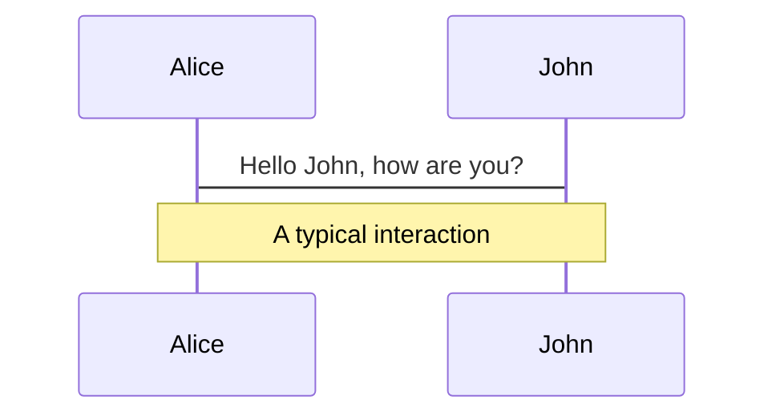
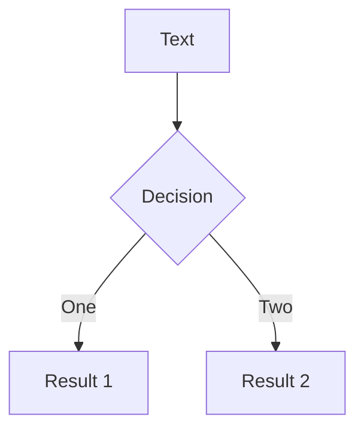
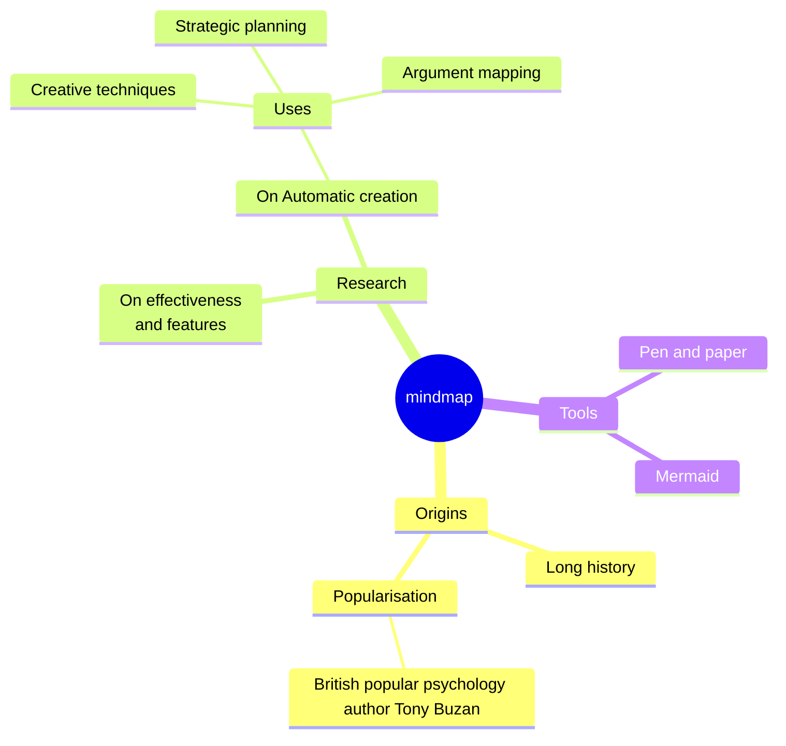
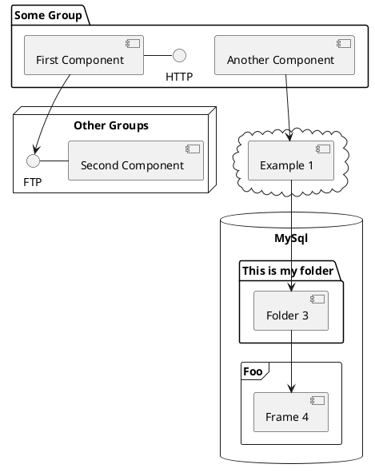

<LightOrDark>
  <template #light>
    
  </template>
  <template #dark>
    
  </template>
</LightOrDark>

<br/>

## Prettier: 让代码美得毫不费力

代码格式化的最佳伙伴

<div @click="$slidev.nav.next" class="mt-12 py-1" hover:bg="white op-10">
  Press Space for next page <carbon:arrow-right />
</div>

<div class="abs-br m-6 text-xl">
  <a href="https://github.com/IllegalCreed/SlideStack" target="_blank" class="slidev-icon-btn">
    <carbon:logo-github />
  </a>
</div>

<!--
大家好！今天我们要聊的是 Prettier——一个让你的代码瞬间变美、毫不费力的工具。
它是怎么做到的？为什么值得一试？让我们马上开始！
-->

---
transition: fade-out
---

# 什么是 Prettier？

Prettier 是帮助我们按主流标准统一代码风格的格式化神器

- “固执己见”的风格，极简配置自带规则，告别争论
- 支持 Web 开发常用语言：`JS`、`TS`、`CSS` 等
- 集成编辑器插件，一键格式化轻松搞定
  <br>
  <br>

<div v-click>

```js {none|1,2|}{at:2}
// 未格式化
function hello(name){console.log("Hello,"+name);return name}

// 格式化后
function hello(name) {
  console.log("Hello, " + name);
}
```

</div>

<div v-click="'+3'" text-xs>

*Read more about* [*What is Prettier?*](https://prettier.io/docs/)

</div>

<style>
h1 {
  background-color: #2B90B6;
  background-image: linear-gradient(45deg, #4EC5D4 10%, #146b8c 20%);
  background-size: 100%;
  -webkit-background-clip: text;
  -moz-background-clip: text;
  -webkit-text-fill-color: transparent;
  -moz-text-fill-color: transparent;
}
</style>

<!--
Prettier 是什么？

它是一个帮我们把代码风格统一到主流标准的利器，简单又好用。

它的配置非常少，自带一套规则，开箱即用，不需要我们反复调整。

它支持 Web 开发中常见的语言，比如 JavaScript、CSS 等等。

更棒的是，搭配编辑器插件，保存一下，代码就自动变得整齐漂亮。

就像这个例子，乱糟糟的代码瞬间焕然一新。
-->

---
transition: fade-out
---

# Prettier 核心规则

美化代码，逻辑如一

- 缩进一致，层次分明
- 换行合理，长代码更清晰
- 引号统一，风格无争议
- 空格规范，细节更整齐
  <br>
  <br>

<div v-click>

````md magic-move {at:2}
```js
const greet=(name)=>{const words={prefix:"Hello",suffix:"welcome"};return words.prefix+name+words.suffix}
```

```js
const greet = (name) => {
  const words = {
    prefix: "Hello",
    suffix: "welcome"
  };
  return words.prefix +
    name +
    words.suffix;
}
```
````

</div>

<div v-click="'+2'" text-xs>

*Read more about* [*rationale*](https://prettier.io/docs/rationale/)

</div>

<style>
h1 {
  background-color: #2B90B6;
  background-image: linear-gradient(45deg, #4EC5D4 10%, #146b8c 20%);
  background-size: 100%;
  -webkit-background-clip: text;
  -moz-background-clip: text;
  -webkit-text-fill-color: transparent;
  -moz-text-fill-color: transparent;
}
</style>

<!-- 
Prettier 的核心规则是什么？ 

它让代码更美观，但保证逻辑始终如一。 

[click] 比如这段代码，输入时缩进混乱、引号混杂、空格随意，还挤在一行，

[click] Prettier 格式化后，缩进整齐、换行清晰、引号统一、空格规范， 但函数的功能一点没变，只是变得更好看。 
-->

---
layout: two-cols-header
transition: fade-out
layoutClass: gap-x-16
---

# 安装与运行 Prettier

快速上手，轻松格式化

::left::

- **安装**:  
  ```bash
  pnpm add -D -E prettier
  ```
  <p text-xs text-gray>

  `-E` *表示精确版本，锁定依赖, 避免依赖升级导致团队间版本不一致。*

  </p>

- **运行**: 
  ```bash
  pnpm exec prettier . --write
  ```
  <p text-xs>
  
  格式化当前目录所有文件

  </p>

::right::

<div v-click>

- **CLI 常见指令**

  - 检查格式：`--check`
  - 指定配置文件：`--config .prettierrc`
  - 忽略配置文件：`--no-config`
  - 指定文件全名：`--stdin-filepath x.js`
  - 忽略未知类型：`--ignore-unknown`

<br>

</div>

<div v-click>

- **API 调用**

```js
import * as prettier from "prettier";

prettier.format(source, options)
```

</div>

::bottom::

<div v-click text-xs text-right>

*Read more about* [*install*](https://prettier.io/docs/install/)

</div>

<style>
h1 {
  background-color: #2B90B6;
  background-image: linear-gradient(45deg, #4EC5D4 10%, #146b8c 20%);
  background-size: 100%;
  -webkit-background-clip: text;
  -moz-background-clip: text;
  -webkit-text-fill-color: transparent;
  -moz-text-fill-color: transparent;
}
</style>

<!-- 
Prettier 的安装和运行超简单！ 

用 pnpm 安装，`-D` 表示开发依赖

`-E` 锁定精确版本，避免意外升级。 

然后运行 `pnpm exec prettier . --write`，就能一键格式化所有文件。 

[click] CLI 还支持检查格式、指定配置、忽略未知文件等实用选项。 

[click] 想更灵活？可以用 API，像 `prettier.format` 直接在代码里调用！ 

-->

---
layout: image-right
transition: fade-out
image: https://cover.sli.dev
---

# Prettier 配置

个性化你的格式化规则

### 配置文件

<br>

- **格式**: `JSON`, `YAML`, `JS` 等  
- **默认文件**: `.prettierrc`

<div v-click>

```json
{
  "singleQuote": true,
  "semi": false,
  "tabWidth": 2,
  "printWidth": 80,
  "arrowParens": "avoid"
}
```

<p class="text-sm text-gray text-right">

*非必要不修改*

</p>

</div>

<br>

<div v-click text-xs text-right>

*Read more about* [*options*](https://prettier.io/docs/options/)

</div>

<style>
h1 {
  background-color: #2B90B6;
  background-image: linear-gradient(45deg, #4EC5D4 10%, #146b8c 20%);
  background-size: 100%;
  -webkit-background-clip: text;
  -moz-background-clip: text;
  -webkit-text-fill-color: transparent;
  -moz-text-fill-color: transparent;
}
</style>

<!-- 
Prettier 的配置让你可以个性化格式化规则。

配置文件可以用 JSON、YAML 或 JS 格式，默认是 `.prettierrc`。 

[click] 这里展示了一个简单配置：用单引号、不加分号、缩进 2 个空格、行宽80，还有箭头函数括号的处理。 

[click] 想了解更多？右下角有完整选项文档链接！ 
-->

---
level: 2
---

# Shiki Magic Move

Powered by [shiki-magic-move](https://shiki-magic-move.netlify.app/), Slidev supports animations across multiple code snippets.

Add multiple code blocks and wrap them with <code>````md magic-move</code> (four backticks) to enable the magic move. For example:

````md magic-move {lines: true}
```ts {*|2|*}
// step 1
const author = reactive({
  name: "John Doe",
  books: [
    "Vue 2 - Advanced Guide",
    "Vue 3 - Basic Guide",
    "Vue 4 - The Mystery",
  ],
});
```

```ts {*|1-2|3-4|3-4,8}
// step 2
export default {
  data() {
    return {
      author: {
        name: "John Doe",
        books: [
          "Vue 2 - Advanced Guide",
          "Vue 3 - Basic Guide",
          "Vue 4 - The Mystery",
        ],
      },
    };
  },
};
```

```ts
// step 3
export default {
  data: () => ({
    author: {
      name: "John Doe",
      books: [
        "Vue 2 - Advanced Guide",
        "Vue 3 - Basic Guide",
        "Vue 4 - The Mystery",
      ],
    },
  }),
};
```

Non-code blocks are ignored.

```vue
<!-- step 4 -->
<script setup>
const author = {
  name: "John Doe",
  books: [
    "Vue 2 - Advanced Guide",
    "Vue 3 - Basic Guide",
    "Vue 4 - The Mystery",
  ],
};
</script>
```
````

---

# Components

<div grid="~ cols-2 gap-4">
<div>

You can use Vue components directly inside your slides.

We have provided a few built-in components like `<Tweet/>` and `<Youtube/>` that you can use directly. And adding your custom components is also super easy.

```html
<Counter :count="10" />
```

<!-- ./components/Counter.vue -->
<Counter :count="10" m="t-4" />

Check out [the guides](https://sli.dev/builtin/components.html) for more.

</div>
<div>

```html
<Tweet id="1390115482657726468" />
```

<Tweet id="1390115482657726468" scale="0.65" />

</div>
</div>

<!--
Presenter note with **bold**, *italic*, and ~~striked~~ text.

Also, HTML elements are valid:
<div class="flex w-full">
  <span style="flex-grow: 1;">Left content</span>
  <span>Right content</span>
</div>
-->

---
class: px-20
---

# Themes

Slidev comes with powerful theming support. Themes can provide styles, layouts, components, or even configurations for tools. Switching between themes by just **one edit** in your frontmatter:

<div grid="~ cols-2 gap-2" m="t-2">

```yaml
---
theme: default
---
```

```yaml
---
theme: seriph
---
```


</div>

Read more about [How to use a theme](https://sli.dev/guide/theme-addon#use-theme) and
check out the [Awesome Themes Gallery](https://sli.dev/resources/theme-gallery).

---

# Clicks Animations

You can add `v-click` to elements to add a click animation.

<div v-click>

This shows up when you click the slide:

```html
<div v-click>This shows up when you click the slide.</div>
```

</div>

<br>

<v-click>

The <span v-mark.red="3"><code>v-mark</code> directive</span>
also allows you to add
<span v-mark.circle.orange="4">inline marks</span>
, powered by [Rough Notation](https://roughnotation.com/):

```html
<span v-mark.underline.orange>inline markers</span>
```

</v-click>

<div mt-20 v-click>

[Learn more](https://sli.dev/guide/animations#click-animation)

</div>

---

# Motions

Motion animations are powered by [@vueuse/motion](https://motion.vueuse.org/), triggered by `v-motion` directive.

```html
<div
  v-motion
  :initial="{ x: -80 }"
  :enter="{ x: 0 }"
  :click-3="{ x: 80 }"
  :leave="{ x: 1000 }"
>
  Slidev
</div>
```

<div class="w-60 relative">
  <div class="relative w-40 h-40">
    
    
    
  </div>

  <div
    class="text-5xl absolute top-14 left-40 text-[#2B90B6] -z-1"
    v-motion
    :initial="{ x: -80, opacity: 0}"
    :enter="{ x: 0, opacity: 1, transition: { delay: 2000, duration: 1000 } }">
    Slidev
  </div>
</div>

<!-- vue script setup scripts can be directly used in markdown, and will only affects current page -->
<script setup lang="ts">
const final = {
  x: 0,
  y: 0,
  rotate: 0,
  scale: 1,
  transition: {
    type: 'spring',
    damping: 10,
    stiffness: 20,
    mass: 2
  }
}
</script>

<div
  v-motion
  :initial="{ x:35, y: 30, opacity: 0}"
  :enter="{ y: 0, opacity: 1, transition: { delay: 3500 } }">

[Learn more](https://sli.dev/guide/animations.html#motion)

</div>

---

# LaTeX

LaTeX is supported out-of-box. Powered by [KaTeX](https://katex.org/).

<div h-3 />

Inline $\sqrt{3x-1}+(1+x)^2$

Block
$$ {1|3|all}
\begin{aligned}
\nabla \cdot \vec{E} &= \frac{\rho}{\varepsilon_0} \\
\nabla \cdot \vec{B} &= 0 \\
\nabla \times \vec{E} &= -\frac{\partial\vec{B}}{\partial t} \\
\nabla \times \vec{B} &= \mu_0\vec{J} + \mu_0\varepsilon_0\frac{\partial\vec{E}}{\partial t}
\end{aligned}
$$

[Learn more](https://sli.dev/features/latex)

---

# Diagrams

You can create diagrams / graphs from textual descriptions, directly in your Markdown.

<div class="grid grid-cols-4 gap-5 pt-4 -mb-6">









</div>

Learn more: [Mermaid Diagrams](https://sli.dev/features/mermaid) and [PlantUML Diagrams](https://sli.dev/features/plantuml)

---
foo: bar
dragPos:
  square: -16,-159,0,0
---

# Draggable Elements

Double-click on the draggable elements to edit their positions.

<br>

###### Directive Usage

```md

```

<br>

###### Component Usage

```md
<v-drag text-3xl>
  <div class="i-carbon:arrow-up" />
  Use the `v-drag` component to have a draggable container!
</v-drag>
```

<v-drag pos="663,206,261,_,-15">
  <div text-center text-3xl border border-main rounded>
    Double-click me!
  </div>
</v-drag>


###### Draggable Arrow

```md
<v-drag-arrow two-way />
```

<v-drag-arrow pos="67,452,253,46" two-way op70 />

---
src: ./pages/imported-slides.md
hide: false
---

---

# Monaco Editor

Slidev provides built-in Monaco Editor support.

Add `{monaco}` to the code block to turn it into an editor:

```ts {monaco}
import { ref } from "vue";
import { emptyArray } from "./external";

const arr = ref(emptyArray(10));
```

Use `{monaco-run}` to create an editor that can execute the code directly in the slide:

```ts {monaco-run}
import { version } from "vue";
import { emptyArray, sayHello } from "./external";

sayHello();
console.log(`vue ${version}`);
console.log(
  emptyArray<number>(10).reduce(
    (fib) => [...fib, fib.at(-1)! + fib.at(-2)!],
    [1, 1]
  )
);
```

---
layout: center
class: text-center
---

# Learn More

[Documentation](https://sli.dev) · [GitHub](https://github.com/slidevjs/slidev) · [Showcases](https://sli.dev/resources/showcases)

<PoweredBySlidev mt-10 />
