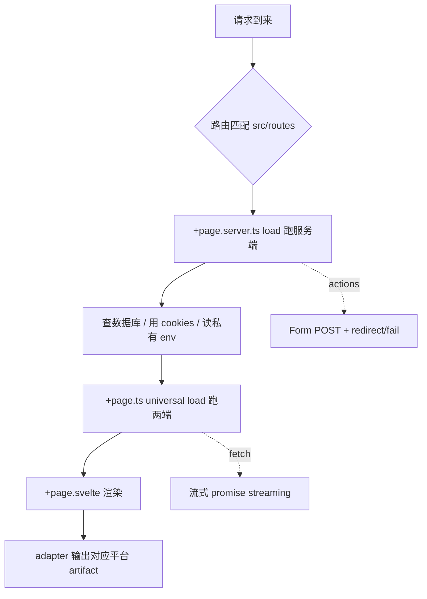
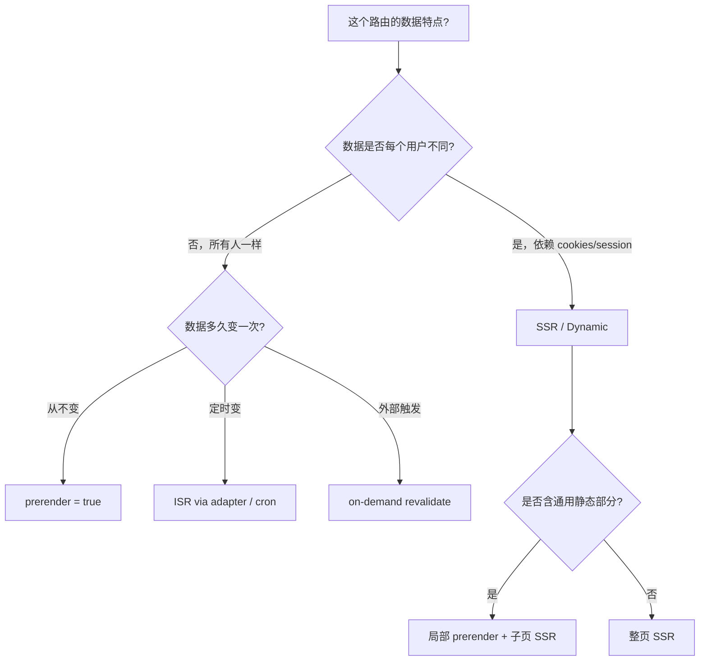

<div class="flex justify-center items-center gap-4">
  <logos:svelte-icon class="text-7xl" />
</div>

<br/>

## SvelteKit：Svelte 圈的元框架

Adapter 驱动的 SSR / SSG / SPA 全栈方案，Svelte 5 runes 时代的官方推荐起点

<div @click="$slidev.nav.next" class="mt-12 py-1" hover:bg="white op-10">
  Press Space for next page <carbon:arrow-right />
</div>

<div class="abs-br m-6 text-xl">
  <a href="https://github.com/IllegalCreed/SlideStack" target="_blank" class="slidev-icon-btn">
    <carbon:logo-github />
  </a>
</div>

<!--
今天聊 SvelteKit 2。

Svelte 官方维护的元框架，跟 Next.js 之于 React、Nuxt 之于 Vue 是一个生态位。
最大特色是 Adapter 模型：同一份代码，换个 adapter 就能跑 Node / Vercel / Cloudflare / 静态。
搭配 Svelte 5 的 runes，是当前 Svelte 全栈应用的事实起点。
-->

---
transition: fade-out
---

# 什么是 SvelteKit？

Svelte 官方维护的元框架，把 UI 库升级成「全栈应用框架」

<v-click>

- **文件路由**：`src/routes/` 目录映射 URL，`+page.svelte` 是页面
- **Server / Universal Load**：服务端拉数据 + 客户端导航复用，零 API 样板
- **Form Actions**：HTML 表单原生提交 + `use:enhance` 渐进增强
- **多渲染模式**：每个路由独立设置 SSR / SSG / SPA / PPR-like 流式
- **Adapter 模型**：换 adapter 即可部署 Node / Vercel / Cloudflare / 静态站
- **基于 Web 标准**：`Request` / `Response` / `FormData` / `URL` 不造轮子
- **Svelte 5 first-class**：runes（`$state` / `$derived` / `$effect`）原生集成
- **HMR + Vite**：开发体验对齐 Vite，启动秒级、热更新无状态丢失

</v-click>

<br>

<div v-click text-xs>

_Read more about_ [_SvelteKit_](https://svelte.dev/docs/kit)

</div>

<style>
h1 {
  background-color: #ff3e00;
  background-image: linear-gradient(45deg, #ff3e00 10%, #ff8a00 90%);
  background-size: 100%;
  -webkit-background-clip: text;
  -moz-background-clip: text;
  -webkit-text-fill-color: transparent;
  -moz-text-fill-color: transparent;
}
</style>

---
transition: slide-up
level: 2
---

# 定位与生态

SvelteKit 在 Svelte 生态的位置 + 与原生 Svelte / 其他元框架的关系

<v-clicks>

- **谁在用**：Apple Music Web、IKEA、ChatGPT 部分前端、Cloudflare Dashboard、1Password 部分页面
- **背后团队**：Svelte 核心团队（Rich Harris 在 Vercel）+ Vercel 赞助
- **跟 Svelte 关系**：Svelte 是 UI 库（编译器 + 运行时）；SvelteKit 是把它升级成框架
- **新特性首发地**：snippet / runes 与 SvelteKit load / hooks 深度配合
- **不是唯一选择**：Svelte 也能用 Vite + svelte-spa-router 起 SPA，但全栈一律 SvelteKit
- **学习路径**：Svelte 5 基础 → SvelteKit 文件约定 → load / actions → adapter 部署
- **适合做**：SaaS 全栈 / 内容站 / 仪表盘 / 多模式混合站点
- **不适合**：纯静态简单博客（Astro 更轻）/ 需要 RSC 风格组件流（Next.js 才有）

</v-clicks>

---
transition: slide-up
---

# 版本里程碑

| 版本 | 时间 | 关键特性 |
|---|---|---|
| **1.0 beta** | 2022.4 | 公开 beta，基于 Vite + Svelte 3 |
| **1.0** | 2022.12 | 正式 1.0，确立 `+page.svelte` 文件约定 |
| **1.20** | 2023.6 | snapshots、`afterNavigate` 改进 |
| **2.0** | 2023.12 | **error/redirect 不再 throw、top-level promise 改成 await、cookie 强制 path** |
| **2.5** | 2024.2 | reroute hook、PageState 类型 |
| **2.12** | 2024.10 | **`$app/state`** 替代 `$app/stores`，runes 化 |
| **2.20+** | 2025 | shallow routing、transport hook、experimental remote functions |

<v-click>

**今天主要讲 SvelteKit 2 + Svelte 5 runes**。1.x 路线已停更，新项目一律 2.x。

</v-click>

---
transition: slide-up
---

# 心智模型：一句话总结

**Svelte 组件 + 文件路由 + 服务端 load + Form Actions + Adapter 部署**



<v-click>

对比 Next.js / Nuxt：

| 维度 | SvelteKit 2 | Next.js 16 | Nuxt 4 |
|---|---|---|---|
| 默认组件 | Svelte SSR + hydrate | RSC | SSR Vue |
| 数据获取 | `load()` + `fetch` | `await fetch` + RSC | `useFetch` |
| 部署 | Adapter（自选） | Vercel-first | Nitro preset |
| 自动导入 | 显式 import | 显式 | 全自动 |

</v-click>

---
transition: slide-up
---

# 项目结构速览

```
my-app/
├── src/
│   ├── routes/                  ← 路由 + 页面 + 接口
│   │   ├── +layout.svelte       ← 根布局
│   │   ├── +page.svelte         ← 首页 /
│   │   └── about/+page.svelte   ← /about
│   ├── lib/                     ← 共享代码，$lib 别名
│   │   └── server/              ← 仅服务端可见（防泄漏）
│   ├── params/                  ← URL 参数 matcher
│   ├── hooks.server.ts          ← 服务端钩子
│   ├── hooks.client.ts          ← 客户端钩子
│   ├── hooks.ts                 ← 通用 hooks（reroute / transport）
│   ├── app.html                 ← HTML 模板（%sveltekit.head% 占位）
│   ├── app.d.ts                 ← App.Error / App.Locals / App.PageState 类型
│   ├── error.html               ← 兜底错误页（handle / +server 抛错时）
│   └── service-worker.ts        ← 可选 PWA
├── static/                      ← 原样输出（robots.txt 等）
├── svelte.config.js             ← SvelteKit 配置（adapter / alias / paths）
└── vite.config.ts               ← Vite + sveltekit() 插件
```

---
transition: slide-up
---

# 快速开始

```bash
# 官方脚手架（sv create 取代了 npm create svelte）
npx sv create my-app
cd my-app
pnpm install
pnpm dev -- --open
```

<v-clicks>

`sv create` 交互式选项：

- **Template**：SvelteKit demo / SvelteKit minimal / Svelte library
- **TypeScript**：JS / JSDoc / TS（推荐）
- **Add-ons**：ESLint、Prettier、Vitest、Playwright、Tailwind、Storybook、Drizzle、Lucia、Paraglide、mdsvex、Storybook

```bash
# 项目已存在时往上加集成
npx sv add tailwindcss vitest playwright
```

后续所有 demo 默认 TypeScript + Vitest + Playwright + Tailwind 这个组合。

</v-clicks>

---
transition: slide-up
---

# 文件约定速通：`+` 开头的特殊文件

```
src/routes/blog/[slug]/
├── +page.svelte           ← 页面 UI
├── +page.ts               ← Universal load（两端都跑）
├── +page.server.ts        ← Server-only load + actions
├── +layout.svelte         ← 该目录及子目录共享布局
├── +layout.ts             ← Layout universal load
├── +layout.server.ts      ← Layout server load
├── +error.svelte          ← 错误兜底（最近一层）
└── +server.ts             ← API endpoint（GET / POST / ...）
```

<v-clicks>

| 文件 | 跑在哪 | 用途 |
|---|---|---|
| `+page.svelte` | 客户端 + SSR | 渲染 UI |
| `+page.ts` | 服务端 + 客户端导航 | 通用数据加载 |
| `+page.server.ts` | 仅服务端 | DB / 私有 env / cookies / **actions** |
| `+layout.svelte` | 客户端 + SSR | 共享外壳（导航栏 / footer）|
| `+server.ts` | 仅服务端 | RESTful endpoint，导出 HTTP 方法 |
| `+error.svelte` | 客户端 + SSR | 错误页（向上冒泡找最近的）|

</v-clicks>

---
transition: slide-up
---

# 第一个页面 + 数据加载

```ts
// src/routes/blog/[slug]/+page.server.ts —— Server-only load
import { error } from '@sveltejs/kit'
import * as db from '$lib/server/database'
import type { PageServerLoad } from './$types'

export const load: PageServerLoad = async ({ params }) => {
  const post = await db.getPost(params.slug)
  if (!post) error(404, 'Post not found')   // 2.0 起不用 throw
  return { post }
}
```

```svelte
<!-- src/routes/blog/[slug]/+page.svelte -->
<script lang="ts">
  import type { PageProps } from './$types'
  let { data }: PageProps = $props()   // Svelte 5 runes：$props 解构
</script>

<article>
  <h1>{data.post.title}</h1>
  <p>{data.post.content}</p>
</article>
```

<v-click>

`./$types` 是 SvelteKit 根据文件名 + 路由参数自动生成的类型，永远不要手写 `params` 类型。

</v-click>

---
transition: slide-up
---

# 路由形态：动态 / 通配 / 可选

```
src/routes/
├── blog/[slug]/+page.svelte           → /blog/:slug 动态段
├── docs/[...path]/+page.svelte        → /docs/* rest 通配
├── shop/[[category]]/+page.svelte     → /shop 和 /shop/foo 都匹配（可选）
├── (marketing)/                       → 路由组（括号不进 URL）
│   ├── about/+page.svelte             → /about
│   └── pricing/+page.svelte           → /pricing
└── (app)/                             → 另一组 layout
    └── dashboard/+page.svelte         → /dashboard
```

<v-clicks>

**Param matchers** —— 加约束让 `[id=int]` 只匹配数字：

```ts
// src/params/int.ts
import type { ParamMatcher } from '@sveltejs/kit'

export const match: ParamMatcher = (param) => /^\d+$/.test(param)
```

```
src/routes/user/[id=int]/+page.svelte   → 仅匹配 /user/123
```

不匹配的 URL 走 404，不会落到组件里再判断。

</v-clicks>

---
transition: slide-up
---

# Layout 嵌套机制

```svelte
<!-- src/routes/+layout.svelte —— Root Layout -->
<script lang="ts">
  import type { LayoutProps } from './$types'
  let { children }: LayoutProps = $props()
</script>

<nav>...</nav>
{@render children()}    <!-- 必写！否则子页面不显示 -->
<footer>...</footer>
```

```svelte
<!-- src/routes/dashboard/+layout.svelte —— 嵌套 layout -->
<script lang="ts">
  let { children, data } = $props()
</script>

<aside>Sidebar</aside>
<main>{@render children()}</main>
```

<v-click>

**关键点**：

- 子 Layout 自动嵌入父 Layout 的 `{@render children()}` 位置
- **导航时只重渲染受影响层**，未变的 Layout 保留状态（输入框文本、滚动位置）
- 多套独立 Layout：用 Route Groups `(marketing)/+layout.svelte` + `(app)/+layout.svelte`
- Root Layout 必须，自动包 `app.html` 模板

</v-click>

---
transition: slide-up
---

# Universal Load vs Server Load

| 维度 | `+page.ts` (Universal) | `+page.server.ts` (Server) |
|---|---|---|
| 运行位置 | SSR + 客户端导航 | 仅服务端 |
| 能访问 DB / 私有 env / `cookies` | ❌ | ✅ |
| 返回值序列化 | 不限（含 class / function）| 必须 devalue 可序列化 |
| 客户端导航代价 | 直接跑 | 一次 fetch 拉 JSON |
| 典型用途 | 公共 API + 自定义类 | DB / Auth / Secret |

```ts
// 同时存在时：server 先跑，结果作为 universal 的 data 参数
// +page.server.ts
export const load = async () => ({ secret: process.env.SECRET })

// +page.ts
export const load = async ({ data, fetch }) => {
  const res = await fetch('/api/public')
  return { ...data, public: await res.json() }
}
```

<v-click>

**经验**：能用 server load 就用 server load，少一次客户端数据序列化往返。

</v-click>

---
transition: slide-up
---

# load 函数参数全景

```ts
import type { PageServerLoad } from './$types'

export const load: PageServerLoad = async (event) => {
  const {
    params,        // { slug: 'hello' }
    url,           // URL 实例，url.searchParams.get('q')
    route,         // { id: '/blog/[slug]' }
    fetch,         // 增强 fetch：相对路径 + 自动传 cookies
    setHeaders,    // SSR 设置 response 头
    parent,        // await parent() 拿父 layout load 数据
    depends,       // depends('app:posts') 声明自定义失效 key
    cookies,       // (server only) cookies.get('token')
    locals,        // (server only) handle 钩子塞的 per-request 状态
    request,       // (server only) Web 标准 Request
    platform,      // (server only) adapter 平台对象（Cloudflare 等）
  } = event
}
```

<v-clicks>

- `parent()` 用来组合父 layout 的数据（注意：会触发父 load 重跑链路）
- `depends('key')` + `invalidate('key')` 实现手动失效
- `setHeaders({ 'cache-control': 'max-age=60' })` 仅 SSR 生效

</v-clicks>

---
transition: slide-up
---

# 流式 promise：先返框架，慢数据后流入

```ts
// src/routes/+page.server.ts
export const load = async () => {
  return {
    // 立即 await，关键数据
    post: await loadPost(),
    // 不 await，promise 流式传到客户端
    comments: loadComments(),
  }
}
```

```svelte
<!-- src/routes/+page.svelte -->
<script>
  let { data } = $props()
</script>

<h1>{data.post.title}</h1>

{#await data.comments}
  <p>评论加载中...</p>
{:then comments}
  {#each comments as comment}
    <p>{comment.body}</p>
  {/each}
{:catch err}
  <p>加载失败：{err.message}</p>
{/await}
```

<v-click>

类似 Next.js 的 Suspense + Streaming：先回 HTML 让用户看到框架，慢请求 resolve 后流式补 DOM。

</v-click>

---
transition: slide-up
---

# Form Actions：默认表单提交

```ts
// src/routes/login/+page.server.ts
import { fail, redirect } from '@sveltejs/kit'
import type { Actions } from './$types'

export const actions: Actions = {
  default: async ({ request, cookies }) => {
    const data = await request.formData()
    const email = data.get('email') as string
    const password = data.get('password') as string

    const user = await authenticate(email, password)
    if (!user) {
      return fail(400, { email, error: '账号或密码错误' })
    }

    cookies.set('session', user.token, { path: '/' })   // 2.0 起 path 必填
    redirect(303, '/dashboard')   // 2.0 起不用 throw
  },
}
```

```svelte
<!-- src/routes/login/+page.svelte -->
<script>
  let { form } = $props()
</script>

<form method="POST">
  <input name="email" value={form?.email ?? ''} />
  <input name="password" type="password" />
  {#if form?.error}<p class="error">{form.error}</p>{/if}
  <button>登录</button>
</form>
```

---
transition: slide-up
---

# Form Actions：`use:enhance` 渐进增强

```svelte
<script lang="ts">
  import { enhance } from '$app/forms'
  let { form } = $props()
  let pending = $state(false)
</script>

<form
  method="POST"
  use:enhance={() => {
    pending = true
    return async ({ result, update }) => {
      pending = false
      await update()   // 默认行为：刷新 form prop + 失效 load 数据
    }
  }}
>
  <input name="email" />
  <input name="password" type="password" />
  <button disabled={pending}>
    {pending ? '登录中...' : '登录'}
  </button>
</form>
```

<v-click>

**关键点**：

- 无 JS 时 → 普通 HTML 表单 POST（progressive enhancement）
- 有 JS 时 → 拦截 submit 走 fetch，避免整页刷新
- `use:enhance` 不传参 → 模拟浏览器原生行为；传函数 → 自定义结果处理
- 文件上传必须 `enctype="multipart/form-data"`（2.0 起强制）

</v-click>

---
transition: slide-up
---

# 命名 Action：同页多表单

```ts
// src/routes/posts/+page.server.ts
import type { Actions } from './$types'

export const actions: Actions = {
  create: async ({ request }) => {
    const data = await request.formData()
    await db.posts.create({ title: data.get('title') as string })
    return { success: true, action: 'create' }
  },
  delete: async ({ url }) => {
    const id = url.searchParams.get('id')!
    await db.posts.delete(id)
    return { success: true, action: 'delete' }
  },
}
```

```svelte
<form method="POST" action="?/create">
  <input name="title" />
  <button>新建</button>
</form>

<form method="POST" action="?/delete&id={post.id}">
  <button>删除</button>
</form>
```

<v-click>

action="?/name" 用 URL 查询定位调哪个；不能同时有 `default` 和 named action。

</v-click>

---
transition: slide-up
---

# 渲染模式：prerender / ssr / csr

```ts
// 在 +page.ts / +layout.ts / +server.ts 内 export
export const prerender = true       // 构建时生成静态 HTML
export const ssr = true             // 是否服务端渲染（默认 true）
export const csr = true             // 是否客户端 hydrate（默认 true）
export const trailingSlash = 'never'  // 'never' | 'always' | 'ignore'
```

<v-clicks>

**三种典型组合**：

| 场景 | prerender | ssr | csr | 等价 |
|---|---|---|---|---|
| **博客 / 文档** | `true` | `true` | `true` | SSG + hydration |
| **传统 SSR** | `false` | `true` | `true` | 请求时渲染 |
| **SPA** | `false` | `false` | `true` | 纯客户端 |
| **极简静态** | `true` | `true` | `false` | 零 JS（适合内容站）|

页级配置会覆盖父 layout；root layout 设默认值最经济。

</v-clicks>

---
transition: slide-up
---

# 渲染策略决策树



<v-click>

**实战速记**：

- 内容站首页 / 文档 → `prerender = true`
- 博客 / 产品列表 → 多数 prerender + 个别 SSR（按需）
- 仪表盘 / 个人页 → SSR（默认）
- 离线小工具 → `ssr = false`（SPA）

</v-click>

---
transition: slide-up
---

# Adapter 模型：一份代码多平台部署

```js
// svelte.config.js
import adapter from '@sveltejs/adapter-auto'   // 自动识别 Vercel / Netlify / CF

export default {
  kit: {
    adapter: adapter(),
  },
}
```

<v-clicks>

| Adapter | 平台 | 特性 |
|---|---|---|
| **adapter-auto** | 自动（Vercel/Netlify/CF/Azure）| 零配置，看 env 推断 |
| **adapter-node** | 自有 Node 服务 / Docker / K8s | 完整 SSR，`build/index.js` 启动 |
| **adapter-vercel** | Vercel | ISR / Edge / Image 优化 |
| **adapter-cloudflare** | CF Workers / Pages | 全球边缘 + KV / R2 / D1 |
| **adapter-netlify** | Netlify Functions / Edge | Forms / Identity 集成 |
| **adapter-static** | 静态 CDN（GitHub Pages 等）| 纯 SSG，不支持运行时 |

**生产建议**：自己部署用具体 adapter（明确依赖），别用 auto；CI 镜像里能省一次 adapter 探测。

</v-clicks>

---
transition: slide-up
---

# adapter-node：Docker 部署

```js
// svelte.config.js
import adapter from '@sveltejs/adapter-node'

export default {
  kit: {
    adapter: adapter({
      out: 'build',           // 输出目录
      precompress: true,      // 预生成 br / gzip
      envPrefix: 'PUBLIC_',
    }),
  },
}
```

```dockerfile
# Dockerfile
FROM node:20-alpine AS build
WORKDIR /app
COPY . .
RUN npm ci && npm run build && npm prune --production

FROM node:20-alpine
WORKDIR /app
COPY --from=build /app/build ./build
COPY --from=build /app/node_modules ./node_modules
COPY --from=build /app/package.json .
EXPOSE 3000
CMD ["node", "build"]
```

<v-click>

启动后默认监听 `PORT=3000`，可用 `BODY_SIZE_LIMIT` / `ORIGIN` / `PROTOCOL_HEADER` 等环境变量调参。

</v-click>

---
transition: slide-up
---

# adapter-static：纯静态站 + SPA fallback

```js
// svelte.config.js
import adapter from '@sveltejs/adapter-static'

export default {
  kit: {
    adapter: adapter({
      pages: 'build',
      assets: 'build',
      fallback: '200.html',   // SPA fallback（找不到的路由走客户端路由）
      precompress: false,
      strict: true,            // 找不到可 prerender 的路由直接报错
    }),
  },
}
```

```ts
// src/routes/+layout.ts —— SPA 模式必备
export const ssr = false       // 关 SSR
export const prerender = true  // root 还是 prerender 一次（生成 200.html）
```

<v-clicks>

**SPA 模式取舍**：

- 优点：零服务端，任何静态托管（CF Pages / GH Pages / S3）都能用
- 缺点：首屏多个 RTT（HTML → JS → 数据），SEO 较弱，必需 JS
- 折中：尽量 prerender 静态页 + 个别动态走 SPA fallback

</v-clicks>

---
transition: slide-up
---

# `+server.ts`：纯 API endpoint

```ts
// src/routes/api/posts/+server.ts
import { json } from '@sveltejs/kit'
import type { RequestHandler } from './$types'

export const GET: RequestHandler = async ({ url }) => {
  const posts = await db.posts.findMany({
    take: Number(url.searchParams.get('limit') ?? 10),
  })
  return json(posts)
}

export const POST: RequestHandler = async ({ request }) => {
  const body = await request.json()
  const post = await db.posts.create({ data: body })
  return json(post, { status: 201 })
}
```

```ts
// src/routes/api/posts/[id]/+server.ts —— 动态参数
export const DELETE: RequestHandler = async ({ params }) => {
  await db.posts.delete(params.id)
  return new Response(null, { status: 204 })
}
```

<v-click>

支持的方法：`GET` / `POST` / `PUT` / `PATCH` / `DELETE` / `OPTIONS` / `HEAD`。基于 Web 标准 Request/Response，没有自创类型。

</v-click>

---
transition: slide-up
---

# Hooks：服务端拦截 + 全局错误

```ts
// src/hooks.server.ts
import type { Handle } from '@sveltejs/kit'
import { sequence } from '@sveltejs/kit/hooks'

const auth: Handle = async ({ event, resolve }) => {
  const token = event.cookies.get('session')
  event.locals.user = token ? await getUser(token) : null
  return resolve(event)
}

const securityHeaders: Handle = async ({ event, resolve }) => {
  const response = await resolve(event)
  response.headers.set('X-Frame-Options', 'DENY')
  return response
}

export const handle = sequence(auth, securityHeaders)

export const handleError = async ({ error, event }) => {
  console.error('[server]', error)
  // 上报 Sentry / Datadog
  return { message: '服务器开了点小差', code: 'INTERNAL' }
}
```

<v-click>

`event.locals` 是 per-request 容器，类型在 `src/app.d.ts` 的 `App.Locals` 接口定义；下游 load 直接 `locals.user` 取用。

</v-click>

---
transition: slide-up
---

# Universal Hooks：reroute + transport

```ts
// src/hooks.ts —— 客户端 + 服务端共用
import type { Reroute, Transport } from '@sveltejs/kit'

// 国际化 URL → 内部路由
export const reroute: Reroute = ({ url }) => {
  const map: Record<string, string> = {
    '/de/ueber-uns': '/about',
    '/fr/a-propos': '/about',
  }
  return map[url.pathname]
}

// 让 load 函数能透传自定义类型（默认只支持 devalue 可序列化）
class Vector { constructor(public x: number, public y: number) {} }

export const transport: Transport = {
  Vector: {
    encode: (v) => v instanceof Vector && [v.x, v.y],
    decode: ([x, y]) => new Vector(x, y),
  },
}
```

<v-click>

`reroute` 不改 URL，只改路由匹配；用户看到的还是原 URL。`transport` 解决「server load 返回 Date / Set / 自定义类时浏览器拿不到原型」的问题。

</v-click>

---
transition: slide-up
---

# Svelte 5 runes + SvelteKit

```svelte
<!-- +page.svelte：用 runes 接 load 数据 -->
<script lang="ts">
  import { page } from '$app/state'      // 2.12+ 推荐
  import type { PageProps } from './$types'

  // $props：解构 load 返回值
  let { data, form }: PageProps = $props()

  // $derived：自动派生
  const wordCount = $derived(data.post.content.split(' ').length)

  // $state：本地交互状态
  let liked = $state(false)

  // $effect：副作用（导航完成后）
  $effect(() => {
    document.title = data.post.title
  })
</script>

<h1>{data.post.title}（{wordCount} 词）</h1>
<button onclick={() => (liked = !liked)}>
  {liked ? '♥' : '♡'} 当前路由：{page.url.pathname}
</button>
```

<v-click>

`page` / `navigating` / `updated` 来自 `$app/state`（runes 化）；老项目里的 `$app/stores` 已 deprecated 但仍可用。

</v-click>

---
transition: slide-up
---

# `$app/state` vs `$app/stores`

```svelte
<!-- ❌ 老写法（Svelte 4 / store API） -->
<script>
  import { page } from '$app/stores'
</script>
<p>{$page.url.pathname}</p>

<!-- ✅ 新写法（Svelte 5 + SvelteKit 2.12+） -->
<script>
  import { page } from '$app/state'
</script>
<p>{page.url.pathname}</p>
```

<v-clicks>

| 维度 | `$app/stores` | `$app/state` |
|---|---|---|
| 反应式 | Svelte stores（`$` 前缀订阅）| Runes（`$state`/`$derived` 友好）|
| 引入 | SvelteKit 1.0 | SvelteKit 2.12 |
| 状态 | Deprecated（仍可用）| 推荐 |
| 类型 | `Readable<Page>` | `Page`（直接是对象）|

**迁移**：把 `$page.url` 改成 `page.url`，去掉 `$`。`navigating` / `updated` 同理。

</v-clicks>

---
transition: slide-up
---

# 环境变量四象限

```ts
// 1. $env/static/public —— 构建期注入客户端，必须 PUBLIC_ 前缀
import { PUBLIC_API_URL } from '$env/static/public'

// 2. $env/static/private —— 构建期注入服务端
import { DATABASE_URL } from '$env/static/private'

// 3. $env/dynamic/public —— 运行时读，客户端可见
import { env } from '$env/dynamic/public'
console.log(env.PUBLIC_API_URL)

// 4. $env/dynamic/private —— 运行时读，仅服务端
import { env } from '$env/dynamic/private'
console.log(env.DATABASE_URL)
```

<v-clicks>

**选择矩阵**：

| 维度 | static | dynamic |
|---|---|---|
| 取值时机 | 构建期 | 运行时 |
| Tree-shake | ✅ 死代码消除 | ❌ |
| 容器化部署 | 重新构建 | 改 env 重启即可 |
| prerender | ✅ 可用 | ❌ 报错 |

**经验**：能 static 就 static（Docker 多环境共用镜像才用 dynamic/private）。

</v-clicks>

---
transition: slide-up
---

# 错误处理：error / +error.svelte / app.d.ts

```ts
// src/app.d.ts —— 自定义错误形状
declare global {
  namespace App {
    interface Error {
      message: string
      code?: string
      id?: string         // 用于客服追踪
    }
  }
}
export {}
```

```ts
// src/routes/posts/[id]/+page.server.ts
import { error } from '@sveltejs/kit'

export const load = async ({ params }) => {
  const post = await db.posts.find(params.id)
  if (!post) error(404, { message: '文章不存在', code: 'POST_NOT_FOUND' })
  return { post }
}
```

```svelte
<!-- src/routes/+error.svelte —— 兜底错误页 -->
<script>
  import { page } from '$app/state'
</script>

<h1>{page.status}</h1>
<p>{page.error?.message}</p>
{#if page.error?.id}
  <small>错误 ID：{page.error.id}</small>
{/if}
```

---
transition: slide-up
---

# Shallow Routing：弹窗不换路由

```svelte
<!-- src/routes/photos/+page.svelte -->
<script lang="ts">
  import { pushState } from '$app/navigation'
  import { page } from '$app/state'
  import Modal from './Modal.svelte'

  function open(photo) {
    pushState('', { selected: photo })   // URL 不变，state 入栈
  }
</script>

{#each photos as photo}
  <button onclick={() => open(photo)}>
    
  </button>
{/each}

{#if page.state.selected}
  <Modal
    photo={page.state.selected}
    close={() => history.back()}
  />
{/if}
```

<v-click>

`pushState` / `replaceState` 来自 `$app/navigation`。在 `src/app.d.ts` 声明 `App.PageState` 拿到完整类型。**踩坑**：刷新页面 state 丢失，业务上要兜底（比如从 URL search param 恢复）。

</v-click>

---
transition: slide-up
---

# SvelteKit 2.0 升级要点（从 1.x 来）

<v-clicks>

- **error / redirect / fail 不再 throw**：直接 `error(404, 'Not found')` 即可，编译器知道函数永不返回
- **cookie 必须传 path**：`cookies.set('k', 'v', { path: '/' })`，否则报错
- **top-level promise 不再自动 await**：load 返回 `{ x: promise }`，promise 走 streaming；要阻塞必须 `await` 或 `Promise.all`
- **goto() 不支持外链**：跳外站用 `window.location.href`
- **path 默认相对**：解决 SSR / 客户端路径不一致问题
- **dynamic env 不能在 prerender 用**：prerender 路由必须 `$env/static/*`
- **文件上传 form 必须 enctype="multipart/form-data"**：JS-free 提交才能拿到 file
- **vitePreprocess 从 @sveltejs/vite-plugin-svelte 引入**（不再从 @sveltejs/kit/vite 导出）
- **Node 18.13+ / Svelte 4+ / Vite 5+ / TS 5+**

</v-clicks>

---
transition: slide-up
---

# 生态对比：SvelteKit vs Next vs Nuxt vs Astro

| 维度 | SvelteKit 2 | Next.js 16 | Nuxt 4 | Astro 5 |
|---|---|---|---|---|
| 基础 | Svelte 5 | React 19 | Vue 3 | 多框架混搭 |
| 路由 | `src/routes/` | `app/` | `pages/` | `pages/` |
| 默认 | SSR + hydrate | RSC | SSR Vue | Islands |
| 数据 | `load()` + `fetch` | `await fetch` + RSC | `useFetch` | `getStaticPaths` |
| 部署 | Adapter 多平台 | Vercel-first | Nitro 30+ preset | 静态 + Adapter |
| 包体积 | **极小** | 大 | 中 | 小 |
| 学习曲线 | 中 | 高（RSC/Cache）| 中 | 低 |
| 招聘市场 | 小 | **最大** | 中 | 小 |

---
transition: slide-up
---

# 选型决策矩阵

| 场景 | 推荐 |
|---|---|
| **团队熟 React + 重 RSC / Cache** | Next.js 16 |
| **团队熟 Vue + 重自动导入** | Nuxt 4 |
| **团队熟 Svelte / 看重包体积 / DX** | **SvelteKit 2** |
| **博客 / 营销站 / 多框架混搭** | Astro 5 |
| **小型项目快上线 / 单人** | SvelteKit 或 Astro |
| **复杂数据图层（GraphQL / RPC）** | SvelteKit + tRPC / Houdini |
| **跨端（Web + Mobile）** | SvelteKit + Capacitor / Tauri |

<v-click>

> 💡 **关键判断**
>
> 团队主语言决定 80% 的选型。Svelte 圈选 SvelteKit 没有竞品（svelte-spa-router 只适合纯 SPA）。
> 要做静态站 / 内容站可以再看一眼 Astro，否则 SvelteKit 全场景覆盖。

</v-click>

---
transition: slide-up
---

# 常见踩坑（一）：SSR 状态共享

> 💡 **核心原则**
>
> 服务端 module-level 变量 **会跨用户共享**，绝对不能存用户数据。

```ts
// ❌ 危险：所有用户共享同一个 user
let user
export const load = async () => ({ user })
export const actions = {
  default: async ({ request }) => {
    user = await request.formData()   // Alice 提交，Bob 也能看见
  },
}
```

<v-clicks>

```ts
// ✅ 正确：用 cookies + locals 隔离 per-request
// hooks.server.ts
export const handle = async ({ event, resolve }) => {
  const token = event.cookies.get('session')
  event.locals.user = token ? await getUser(token) : null
  return resolve(event)
}

// +page.server.ts
export const load = async ({ locals }) => ({ user: locals.user })
```

`event.locals` 是 SvelteKit 提供的 per-request 容器，**永远用它存请求级状态**。

</v-clicks>

---
transition: slide-up
---

# 常见踩坑（二）：Hydration mismatch

<v-clicks>

- **服务端和客户端首次渲染不一致**：常见于 `Date.now()` / `Math.random()` / `localStorage` / 时区差异
  - 修法 1：把动态部分放 `$effect` 里（hydrate 后才跑）
  - 修法 2：组件外层加 `{#if browser}` 包（`import { browser } from '$app/environment'`）
- **直接读 `window` / `document`**：SSR 期没有
  - `if (browser) window.foo`，或者放 `$effect`
- **stale 数据**：mutation 后没 `invalidate` 或 `invalidateAll`，UI 不更新
  - Server action 默认走 `update()` 帮你 invalidate，纯 fetch 调 API 要手动 `invalidate('app:key')`
- **load 里写 store**：服务端 store 跨用户污染（前述 SSR 状态陷阱）
  - load 只 return 数据，store / 全局状态用 context API
- **prerender + dynamic env**：构建期没值会报错
  - 用 `$env/static/*` 或把页面改成 SSR

</v-clicks>

---
transition: slide-up
---

# 常见踩坑（三）：load 依赖 / fetch / form

<v-clicks>

- **parent() 误用**：子 load 调 `parent()` 会建立依赖；父 layout 数据变化会重跑子 load，性能差
  - 真要透传父数据，子组件直接读 `data` prop 即可（layout data 自动合并）
- **fetch 默认带 cookies**：服务端调外网 API 时可能泄漏 session
  - 用 `handleFetch` hook 拦截，剥掉敏感 header
- **action 返回 stale data**：`use:enhance` 默认 `await update()` 会 invalidate；自定义 callback 忘了调，UI 不刷新
- **action 不能跨页面 redirect 到 200**：用 `redirect(303, '/')` 是 POST→GET 模式，状态码要 303 / 302 / 301
- **`use:enhance` 文件上传**：form 必须 `enctype="multipart/form-data"`（2.0 起强制）
- **`form` prop 在导航后清空**：故意行为，跨页面要自己持久化（cookies / db）
- **streaming promise 不能 await**：`return { data: promise }` 不能 `await promise` —— 一旦 await 就变阻塞

</v-clicks>

---
transition: slide-up
---

# 常见踩坑（四）：部署 / adapter

<v-clicks>

- **adapter-auto 生产不可控**：CI 镜像里可能因依赖识别失败装错 adapter，**明确选 adapter-node / vercel / cloudflare**
- **adapter-static 不支持 SSR / actions / +server**：选错 adapter 会构建时报错（`strict: true` 帮你早发现）
- **prerender 找不到链接**：`crawl: true` 默认从 `/` 开始爬，孤立路由要在 `entries` 显式列出
- **CF Workers CPU 限制**：单次请求 50ms CPU 上限，大 SSR 计算会超；用 KV / D1 / R2 卸载
- **Vercel 函数大小**：单函数 50MB 上限，依赖过大要拆 `external` 或换 adapter-node
- **环境变量在 dynamic adapter 改了不生效**：static env 是构建期写死，要 dynamic env 才能运行时改
- **adapter-node `ORIGIN` 必填**：CSRF 防护需要，不设会拒 POST；反代后头还要配 `PROTOCOL_HEADER` / `HOST_HEADER`

</v-clicks>

---
transition: slide-up
---

# 性能优化清单

<v-clicks>

- **能 `prerender = true` 就 prerender**：内容站 / 文档 / 营销页全 prerender
- **page options 用 root layout 一次设全**：避免每个页面重复声明
- **`+page.server.ts` 优先**：少一次数据序列化往返
- **流式 promise 拆 fallback**：先回壳子后流入慢数据
- **`setHeaders({ 'cache-control': ... })`**：SSR 响应也能上 CDN
- **`adapter-vercel` ISR / `adapter-cloudflare` cache API**：CDN 层缓存
- **Svelte 5 编译器自动 memo**：runes 模型下手写 memo 多此一举
- **`<svelte:options runes={true}>`**：组件强制 runes 模式
- **图片优化**：用 `@sveltejs/enhanced-img` 或 unpic-img（Sharp 自动压缩 + AVIF / WebP）
- **bundle 分析**：`vite build` 自带 stats，或 `rollup-plugin-visualizer`
- **service worker**：`src/service-worker.ts` 自动注册，配合 `$service-worker` 模块拿到资源清单

</v-clicks>

---
transition: slide-up
---

# 测试

```bash
npx sv add vitest playwright
```

```ts
// vitest.config.ts —— sv add 自动生成
import { defineConfig } from 'vitest/config'
import { sveltekit } from '@sveltejs/kit/vite'

export default defineConfig({
  plugins: [sveltekit()],
  test: {
    workspace: [
      { test: { name: 'client', environment: 'jsdom', include: ['**/*.svelte.test.ts'] } },
      { test: { name: 'server', environment: 'node', include: ['**/*.test.ts'] } },
    ],
  },
})
```

<v-clicks>

**层次划分**：

- **单元**：Vitest + `@testing-library/svelte`（组件 / hooks / 纯函数）
- **load / actions**：直接当 async 函数测，mock `event` 即可
- **E2E**：Playwright（官方首选，sv add 一键装）
- **组件库**：Storybook（sv add 也能装）

</v-clicks>

---
transition: slide-up
---

# 鉴权：Better Auth / Lucia / Auth.js

```ts
// src/lib/server/auth.ts —— Better Auth 示例
import { betterAuth } from 'better-auth'
import { drizzleAdapter } from 'better-auth/adapters/drizzle'
import { db } from './db'

export const auth = betterAuth({
  database: drizzleAdapter(db),
  emailAndPassword: { enabled: true },
  socialProviders: { github: { clientId: '...', clientSecret: '...' } },
})
```

```ts
// src/hooks.server.ts
import { svelteKitHandler } from 'better-auth/svelte-kit'
import { auth } from '$lib/server/auth'

export const handle = ({ event, resolve }) =>
  svelteKitHandler({ event, resolve, auth })
```

<v-click>

**主流选择**：

- **Better Auth**：sv add 一键装，类型安全，社区新秀（2025 起势头最猛）
- **Lucia**：轻量，需自己实现 session 存储
- **Auth.js**：来自 NextAuth，多 provider 多
- **自己撸**：cookies + bcrypt + JWT，最灵活

</v-click>

---
transition: slide-up
---

# 数据库：Drizzle / Prisma / Kysely

```ts
// src/lib/server/db.ts —— Drizzle 示例
import { drizzle } from 'drizzle-orm/postgres-js'
import postgres from 'postgres'
import { DATABASE_URL } from '$env/static/private'

const client = postgres(DATABASE_URL)
export const db = drizzle(client)
```

```ts
// +page.server.ts
import { db } from '$lib/server/db'
import { posts } from '$lib/server/schema'
import { eq } from 'drizzle-orm'

export const load = async ({ params }) => {
  const [post] = await db.select().from(posts).where(eq(posts.slug, params.slug))
  return { post }
}
```

<v-clicks>

| 工具 | 风格 | 适合 |
|---|---|---|
| **Drizzle** | SQL builder + 类型推断 | SvelteKit 官方推荐，sv add 一键 |
| **Prisma** | ORM + schema-first | 复杂关系 + migration 强 |
| **Kysely** | 类型化 SQL builder | 极致 TS 体验 |
| **Lucia / Pothos** | RPC / GraphQL | 复杂数据图 |

</v-clicks>

---
transition: slide-up
---

# 何时不选 SvelteKit

<v-clicks>

- **团队全是 React** → Next.js / Remix（招聘市场考虑）
- **团队全是 Vue** → Nuxt
- **重 RSC / Cache Components 范式** → Next.js 才有等价能力
- **纯静态简单博客 / 文档** → Astro 5 / VitePress 更轻
- **需要细粒度 Islands 控制** → Astro 是 islands 设计的祖师爷
- **强约定 + DI + 大型企业团队** → Angular 在电信 / 银行仍主流
- **依赖 React Native 跨端** → Expo + Next.js 链路最顺
- **现有 React 组件库重度依赖** → 迁移成本高，继续 React 系
- **目标平台只有 Cloudflare Workers** → SvelteKit / Hono / Astro 都行，看团队语言

</v-clicks>

---
transition: slide-up
---

# 经验法则

<v-clicks>

- **能 prerender 就 prerender**——静态资产 CDN 秒回，SEO + 性能双赢
- **server load 优于 universal load**——少一次序列化往返
- **Form Actions 优于自建 API**——progressive enhancement 免费送
- **`use:enhance` 默认行为基本够用**——别一上来就自定义 callback
- **`event.locals` 存请求级状态**——绝对不要 module-level 变量存用户数据
- **`$lib/server/` 放敏感代码**——SvelteKit 自动阻止被 client import
- **`+error.svelte` + `App.Error` 类型化**——错误信息有 ID 便于客服追溯
- **Adapter 选具体的**——`adapter-auto` 只适合 prototype，生产明确指定
- **环境变量优先 static**——构建期 tree-shake，部署期不可改才用 dynamic
- **Sentry / OpenTelemetry 第一天装**——SSR 错误栈不友好，必须监控

</v-clicks>

---
transition: slide-up
---

# 学习路径

<v-clicks>

**第 1 周：基础**
- Svelte 5 runes（`$state` / `$derived` / `$effect` / `$props`）→ snippet 语法
- 跟着 [Svelte 官方 tutorial](https://svelte.dev/tutorial) 走一遍

**第 2 周：SvelteKit 核心**
- 文件约定（`+page` / `+layout` / `+server` / `+error`）→ load function
- Form Actions → `use:enhance` → progressive enhancement
- Hooks（handle / handleError / reroute）

**第 3 周：渲染 + 部署**
- prerender / ssr / csr 三选 → adapter 选型 → 部署 Vercel / Cloudflare
- 流式 promise → Suspense 风格 UX
- 环境变量四象限 → 鉴权（Better Auth）

**第 4 周+：进阶**
- Drizzle / Prisma 数据层 → Sentry 监控 → Playwright E2E
- shallow routing → service worker → i18n（Paraglide）
- Storybook 组件库 → mdsvex 内容站

</v-clicks>

---
layout: center
class: text-center
---

# 总结

适合：Svelte 项目要 SSR / SSG / SPA 任意切换、多平台部署

不需要：纯 React/Vue 团队（用 Next/Nuxt）；纯静态简单博客（Astro 更轻）

<div class="mt-8 text-2xl">
  <carbon:document /> <a href="https://svelte.dev/docs/kit" target="_blank">svelte.dev/docs/kit</a>
</div>

<div class="mt-4">
  <carbon:logo-github /> <a href="https://github.com/sveltejs/kit" target="_blank">sveltejs/kit</a>
</div>

<div class="mt-4">
  <carbon:play /> <a href="https://learn.svelte.dev" target="_blank">learn.svelte.dev</a>
</div>
