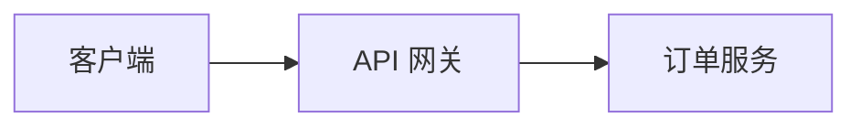

## 技术写作

把「会做」变成「能教会别人」的能力

<div @click="$slidev.nav.next" class="mt-12 py-1" hover:bg="white op-10">
  Press Space for next page <carbon:arrow-right />
</div>

<div class="abs-br m-6 text-xl">
  <a href="https://github.com/IllegalCreed/SlideStack" target="_blank" class="slidev-icon-btn">
    <carbon:logo-github />
  </a>
</div>

<!--
技术写作是工程师影响力的放大器。
-->

---
transition: fade-out
---

# 技术写作是什么

把技术知识转化为**他人能理解、能使用**的文档

- **降低上手成本**：清晰 API 文档零摩擦集成
- **决策可追溯**：ADR 记录「为什么这么设计」
- **变更可追踪**：规范 CHANGELOG 让升级有预期
- **知识沉淀传承**：不依赖「活文档」（唯一懂的人）

> 写不清楚往往是没想清楚——写作倒逼理解深度

<!--
技术写作不是附加任务，是核心工程实践。
-->

---

# 五类核心文档

| 类型 | 受众 | 关键产物 |
|---|---|---|
| API 文档 | 集成者 | OpenAPI spec |
| 架构文档 | 团队/新人 | 设计文档 + ADR |
| README | 所有人 | 项目门面 |
| CHANGELOG | 使用者 | 变更记录 |
| 技术博客 | 社区/同行 | 经验外溢 |

> README 30 秒决定别人是否用你的项目

<!--
五类文档覆盖工程师写作的主要场景。
-->

---

# Docs as Code

把文档用**与代码相同的工具和流程**管理

| 维度 | 传统文档 | Docs as Code |
|---|---|---|
| 格式 | Word/Wiki | Markdown 纯文本 |
| 版本 | 文件系统 | Git 同库 |
| 评审 | 邮件/口头 | Pull Request |
| 发布 | 手动复制 | CI/CD 自动 |
| 测试 | 无 | 死链/拼写/lint |

> 写文档与写代码是同一拨人，才能同步演进

<!--
Docs as Code 让文档与产品同步演进。
-->

---

# API 文档与 OpenAPI

一份机器可读 spec 描述整个 API，多处使用

```yaml
openapi: 3.1.0
paths:
  /orders/{id}:
    get:
      parameters:
        - name: id
          in: path
          required: true
```

**一份 spec 驱动整个生态**

- Redoc / Swagger UI（交互文档）
- openapi-generator（SDK/桩）
- Schemathesis（契约测试）

> spec 是单一真相源，文档/mock/测试自动同步

<!--
OpenAPI 让 API 文档成为单一真相源。
-->

---

# README 工程

项目门面——读者 30 秒内决定是否继续

**必备结构**

- 一句话价值主张（是什么 + 为什么用）
- 可复制的快速开始（复制即跑）
- 徽章（构建/版本/覆盖率/License）
- 截图/GIF（CLI/GUI 展示效果）

> README 本质是「说服别人用」的营销文档

<!--
README 写得像内部备忘录的项目很难被采用。
-->

---

# CHANGELOG + Conventional Commits

**Keep a Changelog** 六类变更标准

| 类别 | 含义 | type |
|---|---|---|
| Added | 新增功能 | `feat` |
| Changed | 现有变更 | BREAKING |
| Fixed | bug 修复 | `fix` |
| Security | 安全修复 | — |

**自动化链路**

```
Conventional Commits → commitlint 校验
  → semantic-release 自动生成 CHANGELOG + 打 tag
```

> `feat`→MINOR、`fix`→PATCH、BREAKING→MAJOR

<!--
规范提交信息让 CHANGELOG 自动生成、版本可追踪。
-->

---

# 架构文档与 ADR

完整架构文档结构：目标 → 背景 → 设计 → 权衡 → 风险

**ADR（轻量级决策记录）**

```markdown
# ADR-007: 订单服务采用事件溯源
## 状态  已接受
## 背景  需完整审计轨迹
## 决策  状态变更存为不可变事件
## 后果  正:可回放 / 负:最终一致
```

- 放 `docs/adr/`，编号递增
- 状态演进：提议→接受→废弃→替代

> 架构文档描述整体，ADR 记录单个关键决策

<!--
ADR 与架构文档互补，让决策可追溯。
-->

---

# Diagrams as Code

传统画图痛点：无法 diff、易过时、难协作

| 工具 | 风格 | 最适合 |
|---|---|---|
| Mermaid | Markdown 内嵌 | README/Wiki 图 |
| PlantUML | Java DSL | 标准 UML |
| D2 | 现代声明式 | 演示级架构图 |

**Mermaid（GitHub 原生渲染）**

````markdown

````

> 图源文件放代码仓库，随代码 PR 评审

<!--
图即代码让架构图可 diff、可版本化。
-->

---

# 写作三原则

**受众先行**（最核心）——写给谁看决定怎么写

| ❌ 被动 | ✅ 主动 |
|---|---|
| 「错误被系统返回」 | 「系统返回错误」 |
| 「配置应该被修改」 | 「修改配置」 |

- **主动语态**：更清晰、更短、责任明确
- **术语一致**：同一概念全篇同一个词
- **简洁**：列表优于段落，加粗关键信息

> 写前先问：读者是谁？已知什么？需知什么？

<!--
受众先行是技术写作最核心的原则。
-->

---

# SemVer 语义化版本

三段式版本号传达变更性质

```
MAJOR.MINOR.PATCH
  1   .  2  .  3
```

| 位 | 何时 +1 | 含义 |
|---|---|---|
| MAJOR | 不兼容变更 | 使用者必须改代码 |
| MINOR | 兼容新功能 | 升级安全 |
| PATCH | bug 修复 | 行为修复 |

> 版本号本身成为变更摘要，与 CHANGELOG 联动

<!--
SemVer 让版本号传达变更性质。
-->

---

# 文档质量保障

好文档五要素（writethedocs）

| 要素 | 含义 | 如何保证 |
|---|---|---|
| 可发现 | 读者能找到 | 导航/搜索/SEO |
| 可读 | 找到能读懂 | 受众先行 |
| 准确 | 内容正确 | 代码评审 |
| 及时 | 与产品同步 | Docs as Code |
| 连贯 | 风格一致 | 术语表 |

**CI 自动化检查**：死链、拼写、lint、构建

> AI 辅助写作须人工核实，易产生「幻觉」

<!--
好文档五要素 + CI 检查保障文档质量。
-->

---
layout: center
class: text-center
---

# 小结

技术写作 = 把隐性知识显性化

**Docs as Code · OpenAPI · Keep a Changelog · 受众先行**

[Write the Docs](https://www.writethedocs.org/) · [Keep a Changelog](https://keepachangelog.com/) · [Conventional Commits](https://www.conventionalcommits.org/)

<!--
技术写作让个人经验变成团队资产。
-->
